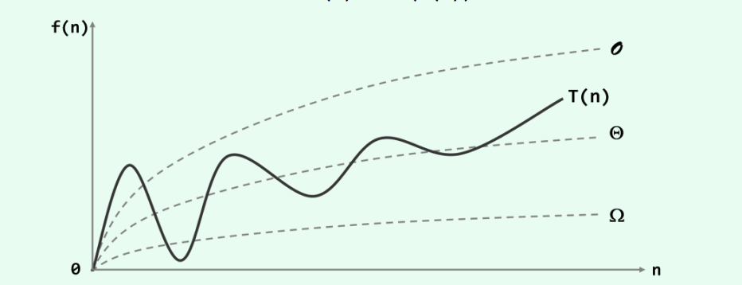
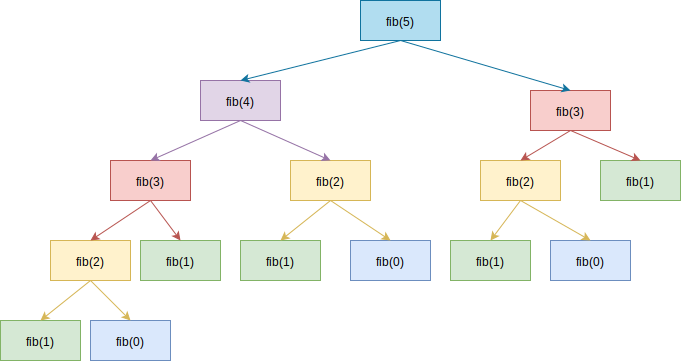
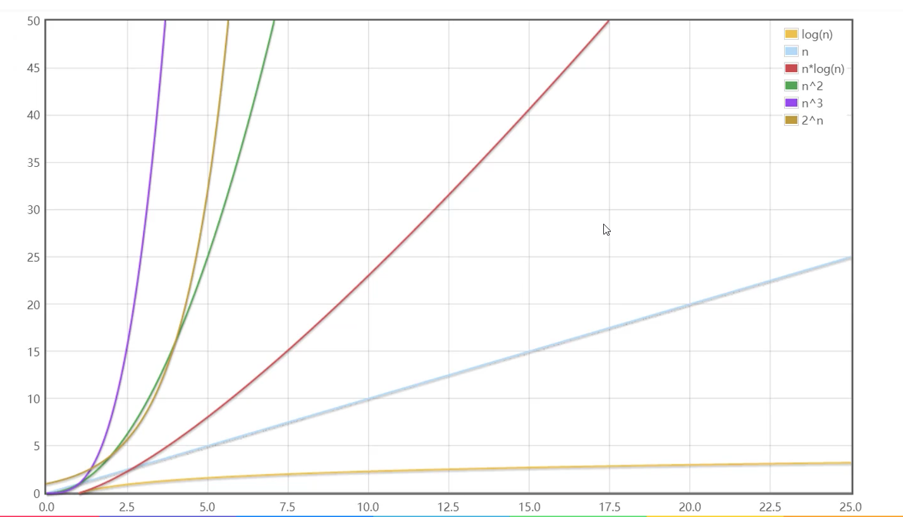

# 03-大 O 表示法

## 一 大 $O$ 表示法概念

### 1.1 大$O$中的几个记号

**将算法中基本操作的执行次数作为算法时间复杂度的度量**，所以大 $O$ （big-O notation）并不表示具体的运行时间，而是用来比较操作次数，以指出算法运行时间的增速。

大$O$中有两个记号：

- 大 Ω 记号：算法的最好情况，所以 T(n)一般介于 Ω(g(n)) 与 O(f(n)) 之间。
- 大 Θ 记号：算法恰好出现了 g(n) = f(n) 的情况

大 $O$ 表示法一般采用最差情况下的运行时间。

如果存在正的常数 c 和函数 g(n)，对任意 n>>2，有 T(n) > c \* g(n)，即认为：在 n 足够 大后，g(n)给出了 T(n)的一个下界，记为：

```txt
T(n) = Ω(g(n))
```

如果存在正的常数 c1 和 c2，以及函数 h(n)，对任意 n>>2，有 c1*h(n) < T(n) < c2* h(n)，即认为：在 n 足够大后，h(n)给出了 T(n)的一个确界，记为：

```txt
T(n) = Θ(g(n))
```

三者关系如图：  


### 1.2 推导大 $O$ 阶方法

常用的推导大 O 阶的步骤：

- 1、用 常数 1 取代运行时间中的所有加法常数
- 2、在修改后的运行次数函数中，只保留最高阶项
- 3、如果最高阶项目存在且不是 1，则去除与这个项相乘的常数
- 4、得到结果就是大 O 阶

示例：

```txt
# 对于规模为n的算法，其执行次数为：
T(n) = 3n + 1

# 其时间复杂度为
T(n) = O(n)
```

**规律总结**：

- 加法规则：多项相加，只保留最高阶的项，且系数变为 1
- 乘法规则：多项相乘，都保留

示例：

- $n^3 + 999n$：$O(n^3)$
- $n^3 + n^2log_2n$：$O(n^3) + O(log_2n)$

### 1.3 递归算法的推导

对于递归算法，假设退出递归时执行的次数为 A，那么递归算法整体的执行次数是一个分段函数：

当 n 满足了边界条件时：$T(n)=A$

当 n 不满足边界条件时：$T(n)=A+T(n-1)$

示例：下列递归算法用于计算数组前 n 个元素的值

```c++
int rsum(int arr[], int n) {
    if(n <= 0){
        return 0;
    }
    return rsum(arr, n - 1) + arr[n - 1];
}
```

因为 n <= 0 比较，return 0 返回，是 2 次操作，所以 A=2，其程序执行次数为：

$$
T(n)=
\begin{cases}
2,n\leq0\\
2+T(n-1),n>0\\
\end{cases}
$$

现在推导其执行次数，得到其复杂度为$O(n)$：

```txt
T(n) = 2 + T(n-1)
     = 2 + 2 + T(n-2)      = 2*2 + T(n-2)
     = 2 + 2 + 2 + T(n-3)  = 2*3 + T(n-3)
     ...
     = 2n + T(0)
     = 2n + 2
```

## 二 常见大 O 阶

### 2.1 常数阶 $O(1)$ 和线性阶 $O(n)$

常数阶：算法的效率与输入的规模无关，即不会随着 n 的变化而变化，而线性阶的算法其复杂度随着 n 的增大进行线性增长。如之前提到的计算 1 到 n 之间的正整数和的两种方式：

```c++
// 第一种算法，时间复杂度为 O(n)
int sum(int n) {
    int sum = 0;
    for (int i = 1; i <= n; i++) {
        sum += i;
    }
    return sum;
}

// 第二种算法，时间复杂度为 O(1)
int sumByGauss(int n) {
    int sum = n * (n + 1) / 2; // 执行了1次和，1次乘，1次除，这些常数都可以忽略不计
    return sum;
}
```

**总结 1：顺序执行的代码只影响常数项，可以忽略**

### 2.2 平方阶 $O(n^2)$

循环的时间复杂度为 O(n)，那么循环嵌套的复杂度如下所示为：O(m \* n)：

```c++
void fn(){
    int m = 100;
    int n = 100;
    for (int i = 0; i < m; i++) {
        for (int j = 0; j < n; j++) {
            // 时间复杂度为O(1)的程序序列
        }
     }
}
```

> 循环的时间复杂度等于循环体的复杂度乘以该循环运行的次数。

再看一个例子：

```c++
void fn(){
    int n = 100
    for (int i = 0; i < n; i++) {
        for (int j = i; j < n; j++){
            // 时间复杂度为O(1)的程序序列
        }
     }
}
```

上述算法总执行次数为： `n + (n-1) + (n-2) + ... + 1`，即 `n*(n+1)/2`，拆开后得到：$n^2/2 + n/2$，最终时间复杂度为：$n^2$。

**总结 2：循环中，只需要挑选循环的一个基本操作分析它的执行次数与 n 的关系即可**

**总结 3：多层循环嵌套下，只需要关注最深层循环循环了几次！**

### 2.3 指数阶 $O(2^n)$

示例：斐波那契数列，后一项为前两项之和，如：0 1 1 2 3 5 8...，求第 n 项目。

```c++
// 斐波那契数列递归算法
int fib(int n) {
    if (n <= 1) {
        return n;
    }
    return fib(n - 1) + fib(n - 2);
}

/*
计算其时间复杂度: T(0) = 2,T(1) = 2，后面的 O(1) 表示其他运算
T(n) = T(n - 1) + T(n - 2) + O(1)
     = O(1.618 ^ n)     1.168是黄金分割，T(n) 约为 2^n
*/
```

当然也有更直观的运算方式： $1+2+4+8 = 2^4-1$，即 $0.5*2^n-1$



```c++
// 递归算法其实都可以规划为循环，斐波那契数列还有下面的算法，不难发起其时间复杂度为 O(n)
int fib2(int n) {
    if (n <= 1) {
        return n;
    }

    int first = 0;
    int second = 1;
    for (int i = 0; i < n - 1; i++) {
        int sum = first + second;
        first = second;
        second = sum;
    }
    return second;
}
```

### 2.4 对数阶

首先理解中学数学中的对数。对数的运算其实是幂运算的逆运算，如下所示：

示例：`T(n) = lgn + 1`，执行次数是对数计算的

```c++
void fn(n int){
    for (int i = n; i > 1; i /= 2) {
        // 执行lgn次
    }
}
```

由于每次 count 乘以 2 以后，距离 n 更近了一分，即有多少 2 相乘后大于 n，则会退出循环，$2^x=n$得到$x=log_2n$，其时间复杂度为：$O(log_2n)$，在编程中简写为：`O(log n)`。

### 2.5 旅行商问题

O(n!)的时间极长，主要用来解决计算机领域中的旅行商问题，其计算时间增加的异常快，且改进可能性较低。

示例：现在有一位旅行商，需要前往 5 个城市，而且要确保行程最短，那么就需要将 5 个城市的所有排序方式的长度和都计算一次，要执行 120 次操作，城市数目增加到 6 个时是 720 次，到了 7 个就要执行 5040 次！

那么到了 n 个城市，就要执行 n!(n 的阶乘)次操作才能计算出结果，所以运行时间为 O(n!)，也称为阶乘时间。

## 三 总结常见的时间复杂度

**常见的时间复杂度**（从快到慢）：

| 执行次数         | 阶           | 非正式称呼 | 对应算法   |
| ---------------- | ------------ | ---------- | ---------- |
| 12               | $O(1)$       | 常数阶     | 普通运算   |
| $5log_2n+20$     | $O(log_2n)$  | 对数阶     | 二分查找法 |
| 2n+3             | $O(n)$       | 线性阶     | 简单查找   |
| $5log_2n+2n$     | $O(nlog_2n)$ | O(nlogn)阶 |            |
| $3n^2+2n+1$      | $O(n^2)$     | 平方阶     | 选择排序   |
| $5n^3+3n^2+2n+1$ | $O(n^3)$     | 立方阶     |            |
| $2^n$            | $O(2^n)$     | 指数阶     |            |
| n 阶乘           | $O(n!)$      | 阶乘       | 旅行商问题 |
| $n^n$            | $O(n^n)$     |            |            |

常用的时间复杂度顺序口诀——**常对幂指阶**：
$O(1)<=O(log_2n)<=O(n)<=O(nlog_2n)<=O(n^2)<=O(n^3)<=O(2^n)<=O(n!)<O(n^n)$



延伸：我们可以使用极限来比较复杂度的阶，如：

- $\lim\limits_{n\rightarrow\infty}\frac{log_2n}{n} = 0$：意味着 n 趋于无穷大时，n 比$log_2n$变大的速度快的多
- $\lim\limits_{n\rightarrow\infty}\frac{n^2}{2^n} = 0$：意味着 n 趋于无穷大时，$n^2$ 比$2^n$变大的速度快的多

## 四 空间复杂度计算

### 4.1 空间复杂度的运算

空间复杂度的计算要注重 malloc、free 时动态分配的空间。假设一个递归函数：

```c++
int fact(int n){
    if(n < 0){
        return 1;
    }
    return n * fact(n - 1);
}
```

递归使用了一个调用栈结构，每递归一层都要往调用栈中加入一个工作记录，工作记录为形式参数 n、函数返回值、返回地址，即 3 个存储单元，递归深度是 n，所需的空间就是 3n，空间复杂度就是 3n。

空间复杂度有以下几种情形：

- 常量空间 $O(1)$：存储空间固定，与输入的规模无关
- 线性空间 $O(n)$：存储空间是一个线性集合如数组，集合大小与输入规模 n 成正比
- 二维空间 $O(n^2)$：分配的空间是一个二维数组集合，集合的长度、宽度与输入规模 n 成正比
- 递归空间 $O(n)$：计算机在运行递归代码时，会专门分配一块内存，存储方法调用栈，递归越深，入栈元素越多，到达结束条件时，方法出栈。执行递归操作所需要的内存空间和递归的深度成正比，纯粹递归操作的空间复杂度也是线性的，如果递归深度是 $n$，那么其空间复杂度就是 $O(n)$。

贴士：递归程序中，偶尔也会有不断递归下，每轮需要的空间是非线性的，比如每轮调用需要申请一个数组，只有数组的长度递减结束后才结束递归，则可能递归的空间复杂度就是 $O(n^2)$。
