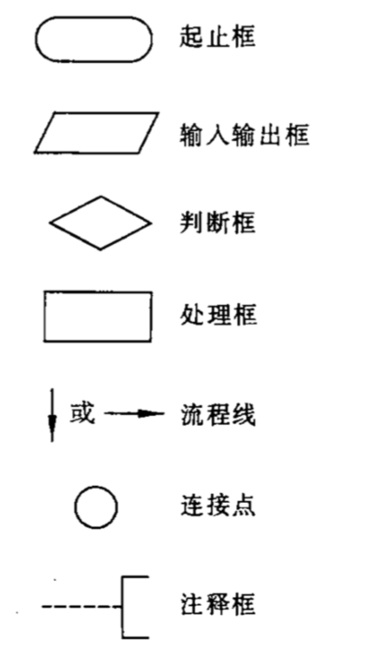
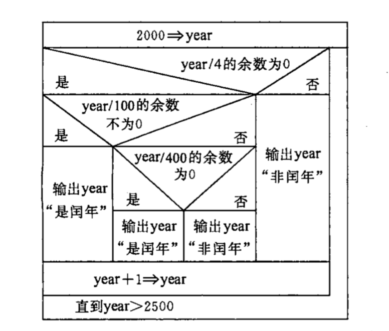

## 说明

数据结构章节在编程领域非常重要，不仅仅是学术问题，所以该章节内容已经位于日常工作的笔记之中：  

[数据结构与算法](https://github.com/overnote/algorithm)  

上述数据结构使用的笔记伪代码为Go语言，Go是新时代的C语言，在很多地方比C语言简洁通用，且拥有指针，与C版本数据结构理解相通。  

当然本笔记也提供了C语言版本的代码：https://github.com/overnote/algorithm/tree/master/sources/c

## 程序

**程序**：一组计算机能识别和执行的指令。  

**程序设计**：每一条指令使计算机执行特定的操作，只要让计算机执行这个程序，计算机就会自动执行各条指令。为了使计算机系统能够实现各种功能，需要成千上万的程序，这些程序大多由软件开发人员根据需求设计好的。  

一个程序主要包括两方面：
- 对数据的描述，即数据结构（data structure）
- 对操作的描述，即算法（algorithm）

著名计算机科学家沃思提出了一个公式：
```
算法 + 数据结构 = 程序
```

## 计算机语言

#### 计算机语言常识

计算机工作基于二进制，只能识别由0和1组成的指令。在早期，计算机指令长度是16，即16个二进制数，如`1011111000000000`。  

**机器指令**（machine instruction）：计算机能直接识别和接受的二进制代码。  

**机器语言**（machine language）：机器指令的集合。  

**符号语言**（symbolic language）：机器语言不符合人类语言习惯，复杂难学，人们用一些符号和数字来表示一个指令，如`ADD`代表加，这样的语言叫做符号语言。  

**汇编程序**（）：计算机不能识别符号语言，需要汇编程序把这些符号语言指令转换为机器指令。 

**汇编语言/符号汇编语言**（symbolic assember language/assembler language）：一般一条符号语言的指令对应转换为一条机器指令，转换的过程为“代真”/“汇编”，因此符号语言又成为符号汇编语言或者汇编语言。  

**低级语言**（low level language）：不同型号的计算机的机器语言和汇编语言互不通用，因为其完全依赖于具体计算机的特性，由于贴近金酸剂，汇编语言被称为低级语言。  

**高级语言**（high level language）：为了克服低级语言缺点，20世纪50年代，第一个高级语言诞生--Fortran。高级语言功能强大，且不依赖于机器。  

**源程序**（source program）：使用高级语言书写的程序。  

**目标程序**（object program）：编译软件将源程序转换为机器指令后的程序。目标程序可以被计算机执行得到运行结果。  

#### 高级语言的发展历程

阶段一：非结构化语言，如BASIC,FORTRAN等
- 编程风格随意，没有严格的语言规范要求
- 程序流程可以随意跳转

阶段二：结构化语言，如C语言
- 程序拥有良好的结构：顺序/选择/循环
- 程序流程不可以随意跳转，程序总是从上往下执行

阶段三：面向对象语言，如Java，VB
- 用来处理大规模软件开发问题

## 程序设计的任务

程序设计是从确定任务到得到结果，写出文档的全过程，一般要经历以下结果阶段：
- 问题分析
- 设计算法
- 编写程序
- 对源程序进行编辑，编译，连接，获得可执行程序
- 运行程序，分析结果
- 编写程序文档

## 程序与算法的表示方法

#### 表示法一：自然语言表示法

用人类的语言来表述程序与算法，这显然是有困难的。

#### 表示法二：流程图 以及三种基本结构

标准协会ANSI规定了一些常用的流程图符号，如下所示：  


比如判断一个年份是否是闰年，使用流程图表示：

  

1966年，Bohra和Jacopini提出了三种基本结构来表示良好算法的基本单元：
- 顺序结构
- 选择结构：又成分支结构、选取结构
- 循环结构：又称重复结构，包括while型，until型两种

#### 表示法三：N-S流程图

1973年，美国学者I.Nassi和B.Shneiderman提出：去掉箭头流程线，算法都卸载矩形框内，且可以形成不同的从属框，这便是N-S流程图。  

判断闰年的N-S流程图：  


#### 表示法三：伪代码

示例：
```
begin
    1 => t
    2 => i
    while i <=5 {
        t * i => t
        i + 1 => i
    }
    print t
end
```

#### 表示法四：计算机语言表示

这就是纯粹的使用C、C++、Java、Go等语言来实现算法了。


## 结构化程序设计方法

一个结构化的程序就是用计算机语言表示的结构化算法，使用了上述3种基本结构组成的程序必然是结构化程序。这样的程序便于编写、阅读、维护。  

通常使用以下方法保证得到结构化程序：
- 自顶向下
- 逐步细化
- 模块化设计
- 结构化编码

