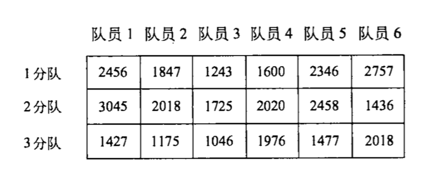

## 一 一维数组

#### 1.1 一维数组定义

数组是一组有序数据的集合，具备以下特性：
- 各个数据的排列有一定的规律，下标代表数据在数组中的序号
- 数组中每个元素都属于同一个数据类型，不能把不同类型的数据放在同一个数组中

数组的定义：`类型符 数组名[常量表达式];`
```c
// 定义一个整型数组a，拥有10元元素
int a[10];          // 数组下标从0开始，最大值为 a[9]
int b[3+5];         // 该定义方式合法 
```

不合法的定义：
```c
int n;
int a[n];           // C语言不允许对数组的大小做动态定义
```

在非主函数的函数中，数组长度可以是变量或者非常量表达式：
```c
void fn(int n) {
    int a[2 * n];   // 这是一个可变长数组，注意不能使用static修饰
}
```

#### 1.2 一维数组初始化

```c
int a[5] = {0};     // 未赋值部分自动设为0
int b[5] = {0,1};   // 只给一部分赋值，没赋值的默认为0
int c[5] = {0,1,2,3,4}
int c[] = {0,1,2,3,4,5} // 给全部元素赋值时，可以不指定数组长度
```

## 二 二维数组

二维数组常称为矩阵（matrix），常用行（column）和列（row）的形式表示，如图所示：  

  

定义：`类型说明符 数组名[常量表达式][常量表达式]`
```c
float arr1[3][6];           // 第1维有3个元素，第2维有6个元素
```

注意：二维数组的元素在内存中人人干事连续线性存放的，不是抽象出来的矩阵形象。

二维数组初始化：
```c
int a[3][2] = {{1,2},{5,6},{9,7}};
int b[3][2] = {1,2,5,6,7,9};            // 效果和上一行一致，但是表述不清晰
int c[3][4] = {{1},{5},{9}};            // 也可以部分赋值，其余自动为0
```

## 三 字符数组

#### 3.1 字符数组定义

C语言没有字符串类型，字符串是存放在字符型数组中的。  

定义方式：
```c
char c[5];
// 也可以使用整型数组
int b[5];
b[0] = 'a';             
```

在实际开发中，人们关心的往往是字符串的有效长度而不是字符数组的长度，例如定义一个租房穿数组长度为100，实际有效字符只有40个，为了表示字符串的实际长度，C语言规定了一个“字符串结束标志”，以字符`'\0'`作为结束标志，即计入数组中第10个元素第一次出现字符`'\0'`，那么该数组的有效字符为9个，这9个元素组成了字符串。  

C会自动在字符数组的末尾添加`'\0'`，假如一个字符串`"C program"`有9个字符，在C语言的字符数组中，占据10个字节。  

贴士：`'\0'`在ASCII码中是一个空操作符，正好在C中可以代表什么都不做。  

字符数组的输出：
```c
// 输出方式一
char c[] = {"china"};
printf("%s\n", c1);         // 遇到结束符自动停止，不会输出结束符，即使其长度大于字符串实际长度，也只会输出到第一个结束符

// 输出方式二：使用格式符"%c"，一个一个输出
```

#### 3.2 常见字符串处理函数

```c
// 输出字符串
char str1[] = {"chaina\n beijing"};
puts(str1);      // 转义字符会被转义

// 输入 符串
char str2[];
gets(str2);      // 返回str2的起始地址

// 连接字符串，注意 str1必须足够大，以存放str2
strcat(str1, str2);

// 赋值字符串，注意第一个参数要足够大，且必须是数组名形式，参数二可以是变量也可以是字符串常量
char str3[10],str4[] = "china";
strcpy(str3, str4);     

// 比较字符串是否相等
strcmp(str1, str2);

// 获取字符串长度
strlen(str1);

// 转换为小写
strlwr(str1);

// 转换为大写
strupr(str2);
```