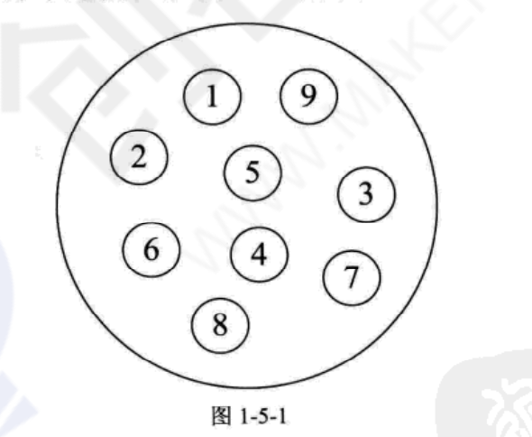
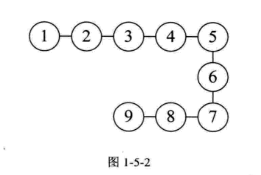
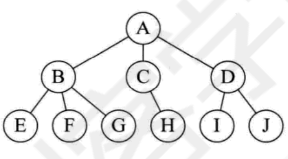
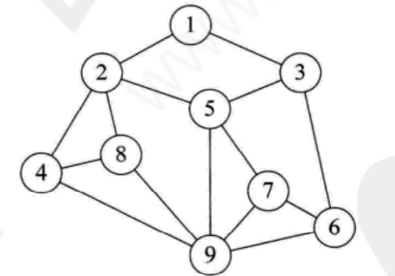

## 一 数据结构概念

在实际开发中，往往需要将许多数据分门别类处理，我们需要为这些数据开辟存储空间进行存储。不同类数据往往存储的要求不一致，当数据存储进一个变量后，有些需求要求能够快速查找出某个单独的数据，有些需求要求能够快速存储。根据这些需求而生成的不同数据存储容器我们称之为数据结构，我们最熟知的数据结构就是数组。  

数据结构：相互之间存在一种或多种特定关系的数据集。开发中常见的数据结构有：数组、双向链表、二叉树等等。  

附录：
```
其他术语（摘自严蔚敏《数据结构》、唐发根《数据结构》）：
数据（data）：  对客观事物的符号表示，在计算机科学中是指所有能输入到计算机必改被计算机程序所处理的符号的总称
数据元素（data element）：数据的基本单位，在计算机程序中通常作为一个整体进行考虑和处理。一个数据元素可以由若干个数据项（data item）组成，
                        例如一本书的书目为一个数据元素，书目信息中每项书名、作者为一个数据项。数据项是数据不可分割的最小单位。
数据对象（data object）：性质相同的数据元素的集合，是数据的一个子集
数据结构（data stucture）：相互之间存在一种或多种特定关系的数据元素的集合。在任何问题中，数据元素都不是孤立存在的，而是数据元素之间存在着某种联系，这些关系成为结构。
```

## 二 数据结构的逻辑结构

#### 2.1 何谓逻辑结构

逻辑结构：数据对象中各个元素之间的相互关系。  

逻辑结构有四种：
- 集合结构：结构中的数据元素之间除了同属于一个集合外，无其他关系
- 线性结构：结构中的数据元素之间存在着一对一的关系
- 树形结构：结构中的数据元素之间存在着一对多的关系
- 图形结构：结构中的数据元素之间存在着多对多的关系，也称为网状结构

#### 2.2 逻辑结构之 集合结构

集合结构中的数据元素除了同属于一个集合外，它们之间没有任何关系。即各个元素之间是完全平等的，彼此之间只有一个关系：同属于一个集合。



#### 2.3 逻辑结构之 线性结构

线性结构中的数据元素之间是一对一关系。



#### 2.4 逻辑结构之 树形结构

树形结构中的数据元素之间是一对多关系。




#### 3.5 逻辑结构之 图形结构

图形结构中的数据元素之间是多对多关系。



## 三 数据结构的物理结构

#### 3.1 何谓数据结构的物理结构

物理结构：数据的逻辑结构在计算机中的真实存储形式，即数据结构在计算机中的表示（映像），也称为存储结构。物理结构既包括元素本身的表示，也包括元素关系的表示。

在第三节说了很多数据的逻辑结构，这些逻辑结构是要在物理结构中实现的，否则也就失去了逻辑的意义。  

贴士：
```
在计算机中表示信息的最小单位是二进制数的一个位（bit），若干位组合形成的位串可以标识一个数据元素，如一个字符长度的位串表示整数，8位二进制数表示一个字符等等，通常称这个位串为元素（element）或者结点（node）。  
当数据元素由若干数据项组成时，位串中对应于各个数据项的子位串称为数据域（data field）。
```

物理结构（元素的关系）在计算机中有两种不同的表示方法：
- 顺序映像，其存储结构称为顺序存储结构
- 非顺序映像，其存储结构称为链式存储结构

#### 3.2 物理结构之 顺序结构

顺序结构是把数据元素存放在连续的存储单元里，其数据间的逻辑关系和物理关系是一致的。


最经典的顺序结构就是数组了，数组中的元素都是依次摆放的。

#### 3.3 物理结构之 链式结构

顺序结构无法解决插队等问题，很多数据要求存储的结构具有变化性。比如在银行办理业务时，按顺序结构领了排队号码，但是在等待期间，你自己是可以随处走动的。那么形容人在等待时期的一系列动作数据的存储，就需要链式结构。


#### 3.4 物理结构和逻辑结构关系

逻辑结构是面向问题的：实际业务中，我们需要什么样的数据结构，要根据业务出发选择合适的结构。  

物理结构是面向计算机的：选型了逻辑结构后，还需要将这些数据按照逻辑结构规范存储进计算机中。

## 四 抽象数据类型

#### 4.1 抽象数据类型概念

抽象数据类型（Abstract Data Type，即ADT）是指一个数据模型以及定义在该模型上的一组操作。  

定义格式如下：
```
ADT 抽象数据类型名 {
    数据对象：<数据对象的定义>
    数据关系：<数据关系的定义>
    基本操作：<基本操作的定义>
}ADT抽象数据类型名
```
