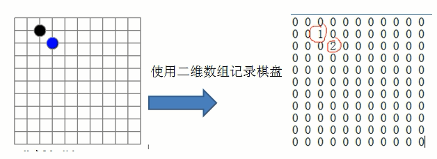

## 一 数组概念

数组是最简单的数据结构之一，基本所有的语言都提供了数组，这里就不再对数组进行详细介绍了。    

但是我们必须要知道，在早期的语言中，数组并不支持在运行期间改变大小，必须预定义数组的容量，比如C语言，一些近代语言如Java,JS是支持数组的动态定义的，即长度可变，所以数组可以分为：
- 静态数组：编译时确定数组的长度，为了防止空间不足，所以尽量将数组的长度定义的大点，但是容易造成内存浪费
- 动态数组：不需要在编译时确定长度，而是在运行过程中确定。

数组本质上是在物理上一组连续的内存上存储的数据，属于顺序存储结构。

## 二 稀疏数组

#### 2.1 问题的引入

如下所示的五子棋程序，有存盘退出和续上盘的功能：  


如果使用二维数组来存储，就会如右侧所示存储很多为0的浪费空间。  

#### 2.2 稀疏数组存储数据

当一个数组中大部分元素为0，或者为同一个值的数组时，可以使用稀疏数组来保存该数组，其处理方式为：
- 记录数组一共有几行几列，有多少个不同的值
- 把具有不同值的元素的行列/值记录在一个小规模数组中

如图所示：  


图中的row/，col，val分别代表有多少行，多少列，对应值，其中第一条数据6，7，10存储了左侧数据总计有6行，7列，10个不同值。  

#### 2.3 原始数组转换为稀疏数组

```go
type Node struct {
	row int
	col int
	val int
}

func NewSparseArray(arr [11][11]int) []Node{

	var sa []Node
	n := Node{
		row: len(arr),
		col: len(arr[0]),
		val: 0,
	}
	sa = append(sa, n)

	for i1, v1 := range arr {
        for i2, v2 := range v1 {
            if v2 != 0 {
                n := Node{
                    row : i1,
                    col : i2,
                    val : v2,
                }
                sa = append(sa ,n)
            }
        }
	}

	return sa
}

// 打印原始数组
func ShowOrigin(arr [11][11]int) {
	for i1, v1 := range arr {
        for i2, v2 := range v1 {
            fmt.Printf("%d|%d=%d\t", i1, i2, v2)
        }
        fmt.Println()
    }
}

// 打印稀疏数组
func ShowSparse(n []Node) {
	fmt.Println(n)
}

// 稀疏数组转普通数组
func TransToArray(n []Node) (arr [11][11]int){
    for i, v := range n {
        if i == 0 {
            continue
        }
        arr[v.row][v.col] = v.val
	}
	return
}
```
