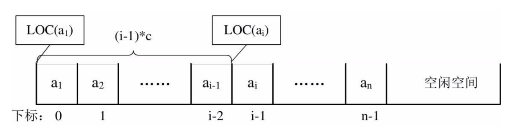

## 一 顺序表

#### 1.1 存储方式 

线性表只是一种逻辑结构，在物理上它的存储可以是顺序的也可以是链式的，顺序表就是用一段地址连续的存储单元依次存储线性表的数据元素。如图所示：  


#### 1.2 随机存取结构

假设一个线性表占据了c个存储单元，那么线性表中第`i+1`个数据元素的存储位置，第`i`个数据元素存储位置三者之间的关系(LOC是获取存储位置的函数)：  

LOC(a<sub>i+1</sub>) = LOC(a<sub>i</sub>) + c  

同样，对于第i个数据元素a<sub>i</sub>的存储位置可以由a<sub>1</sub>推算：  

LOC(a<sub>i</sub>) = LOC(a<sub>1</sub>) + (i - 1) * c   

如图所示：
  

通过上述公式，可以随时计算线性表中任意位置的地址，不管是最后一个还是第一个，都是相同的时间，那么我们队线性表位置的存入和取出数据，对于计算机来说都是相等的时间，是一个常数，用时间复杂度来表示的话，其存取时间性能为O(1)，通常将具备这一特点的存储结构称为随机存取结构。  

#### 1.3 顺序表的修改 存取 

插入：  
   

删除：  
   

如果元素插入到最后一个位置，或者删除最后一个位置，那么之前的数据元素无需排序，此时是最好的情况，时间复杂度为O(1)，因为不需要移动元素。  

如果是其他情况，则所有的数据元素都要进行移动，这个时间复杂度为O(n)。  

总结：
- 顺序结构存储的线性表，在存、读数据时，时间复杂度是O(1)，因为是一段连续的内存，直接可以通过索引获得
- 顺序结构存储的线性表，插入和删除时，时间复杂度都是O(n)，因为需要重新移动位置

#### 1.4 顺序结构存储方式实现

在Go语言中，有数组和切片两种较为常见的数据结构，数组的长度不可变，切片的长度可变（因为切片底层是一个数组和指针），使用数组与切片都可以模拟顺序结构线性表。但是由于线性表非常灵活（可以理解为JS中的数组，万能的），为了表现顺序存储数据在插入数据时，数据的移动性，笔者采用Go的数组方式模拟线性表的顺序存储结构。  

当然是用数组也带来了一些问题，Go是静态类型语言，需要确定数组中元素的类型，我们这里统一设定数组的元素都为int类型，且元素的个数为一个固定值100。  

贴士：
- 当然由于上述Go数组的各种限制，生成的线性表具有很大的局限性，在Go语言中，笔者推荐线性表使用切片描述。  
- 制作各种属性与方法时候，要注意其私有性与公有性，尽量私有属性，并以方法形式提供给外部


## 二 顺序表实现

#### 1.2 顺序表定义

```
顺序表对象  
    SequenList {                        # 伪代码，模拟一个对象
        size                            # 顺序表的长度
        length                          # 顺序表元素的个数
        data                            # 顺序表的数据
    }

顺序表方法    
    NewSequenList()            			# 初始化一个顺序表
    IsEmpty()            				# 判断顺序表是否为空
	Append()							# 从顺序表末尾添加元素
	Insert(index)						# 从顺序表某个位置添加元素
    ...
```

#### 1.3 顺序表实现

```go
// 线性表结构体对象		由于Go没有泛型，这里很难实现：调用者传递一个数组参数的方式New一个SequenList，只能定死如下一个整型数组
type SequenList struct {
	size int									// 该线性表最大容量
	length int									// 该线性表最大长度
	data [10]int								// 线性表内数据，这里为了演示默认设置为10长度的int数组，所有元素默认为0(Go的0值机制)
}

// 创建线性表实例    按笔者认为这里应该传入一个泛型数组，通过泛型数组来更高抽象顺序表	
func NewSequenList() *SequenList {
	
	var arr [10]int

	return &SequenList{
		size: 10,
		length: 0,
		data: arr,
	}
}

// 打印线性表
func (sl *SequenList)Show() {
	fmt.Println(sl)
}

// 插入元素：从末尾append一个数据
func (sl *SequenList)Append(data int)  error{

	// 判断空间是否已满
	if sl.IsFull() {
		return errors.New("SequenList overflow")
	}

	sl.data[sl.length] = data
	sl.length++

	return nil
}

// 插入元素：任意位置插入元素
func (sl *SequenList)Insert(index int, data int) error {

	if sl.IsFull() {
		return errors.New("SequenList overflow")
	}

	if index < 0 || index > sl.length {
		return errors.New("index overflow")
	}

	// 这里如果按照正序循环则书写极其麻烦,从最后一位开始往后移动很简便
	for i := sl.length; i >= index; i-- {	

		if i == sl.length {					// 如果是在末尾插入 时间复杂度为O(1)
			sl.data[i] = data
			break
		}

		sl.data[i] = sl.data[i - 1]
	}

	sl.length++
	return nil
}

// 删除元素：从末尾pop一个数据
func (sl *SequenList)Pop() (int, error) {

	if sl.IsEmpty() {
		return 0, errors.New("SequenList is empty")
	}

	e := sl.data[sl.length - 1]
	sl.data[sl.length - 1] = 0
	sl.length --
	return e, nil
}

// 获取顺序表长度
func (sl *SequenList)Length() int{
	return sl.length
}

// 判断顺序表是否已满
func (sl *SequenList)IsFull() bool {
	if sl.length == sl.size {
		return true
	}
	return false
}

// 判断顺序表是否为空方法
func (sl *SequenList)IsEmpty() bool {
	if sl.length == 0 {
		return true
	}
	return false
}

// 获取顺序表容量
func (sl *SequenList)Size() int{
	return sl.size
}

```


