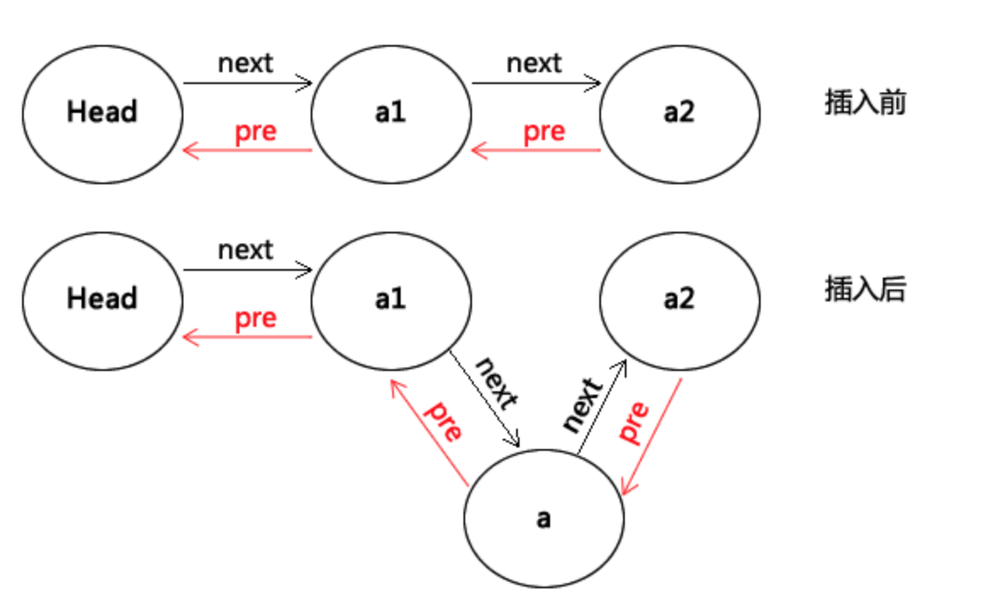

## 一 双向链表的引出

在单链表中，有了next指针，使得查找下一个节点的时间复杂度为O(1)，但是如果要查找上一个节点的话，最坏的时间复杂度就是O(n)，因为每次都要从头开始遍历查找。  

在单链表的每个节点中，额外设置一个纸箱前驱节点的指针，这样就能实现复杂度为O(1)的查询前驱节点。  

双向链表的操作：


## 二 双向链表的实现

```go
 // 节点对象
 type node struct {
	 data interface{}
	 prev *node			
	 next *node					
 }
 
 // 双向链表对象
 type DoublyList struct {
	 head *node					// 双向链表头节点，其数据域是链表长度
	 tail *node					// 双向链表表尾
 }
 
 // 创建双向链表
 func New() *DoublyList {
	 head := &node{
		 0,
		 nil,
		 nil,
	 }
	 next := &node{
		 nil,
		 head,
		 nil,
	 }
	 head.next = next
	 return &DoublyList{
		 head,
		 next,
	 }
 }
 
 // 增加：末尾添加
 func (dl *DoublyList) Append(data interface{}) error{

	if data == nil {
		return errors.New("data is nil")
	}

	var len int = 0
	len = dl.head.data.(int)

	insertNode := &node{data, nil, nil,}					// 要插入的节点

	if dl.Length() == 0 {									// 空链表
		insertNode.prev = dl.head
		dl.head.next = insertNode
		dl.tail = insertNode
	} else {
		insertNode.prev = dl.tail
		dl.tail.next = insertNode
		dl.tail = insertNode
	}

	len++
	dl.head.data = len
	 return nil
 }
 
 // 增加：任意位置插入结点
 func (dl *DoublyList) Insert(index int, data interface{}) error{
 
	 var len int = 0
	 len = dl.head.data.(int)
 
	 if index < 1 || index > len {
		 return errors.New("index overflow")
	 }
 
	 var err error

	 if len == index {						// 如果是末尾插入
		err = dl.Append(data)
		return err
	 }

	 beforeNode := dl.head
	 afterNode := dl.head.next
	 insertNode := &node{data, nil, nil}
 
	 for i := 0; i < index - 1; i++ {
		 beforeNode = beforeNode.next		// 找到要插入的位置的前置元素
		 afterNode = afterNode.next
	 }
 
	 insertNode.prev = beforeNode
	 insertNode.next = beforeNode.next
	 beforeNode.next = insertNode
	 afterNode.prev = insertNode
 
	 len ++
	 dl.head.data = len
 
	 return nil
 
 }
 
 // 删除：删除指定位置结点
 func (dl *DoublyList) Delete(index int) (interface{}, error) {
 
	 var len int = 0
	 len = dl.head.data.(int)
 
	 if index <= 0 || index > len {
		 return nil,errors.New("index overflow")
	 }

	 var delData interface{}				// 被删除元素的数据
	 beforeNode := dl.head					// 被删除元素的前驱节点
	 afterNode := dl.head.next.next			// 被删除元素的后继结点

	 if index == len {
		delData = dl.tail.data
		dl.tail.prev.next = nil
		dl.tail = dl.tail.prev
		len--
		dl.head.data = len
		return delData, nil
	 }
 
	 for i := 0; i < index - 1; i++ {
		 beforeNode = beforeNode.next
		 afterNode = afterNode.next
	 }
 
	 delData = beforeNode.next.data
	 beforeNode.next = afterNode
	 afterNode.prev = beforeNode
 
	 len--
	 dl.head.data = len
 
	 return delData, nil
 }

func (dl *DoublyList) Length() int {
	var len int = 0
	len = dl.head.data.(int)
	return len
}
 
 // 打印链表
 func (dl *DoublyList) Show() {

	if dl.Length() == 0 {
		fmt.Println("list is empty")
		return
	}

	currentNode := dl.head.next
	for i := 0 ; i < dl.Length(); i ++ {
		if i == dl.Length() - 1{
			fmt.Println(currentNode.data)
		} else {
			fmt.Print(currentNode.data, " ")
		}
		currentNode = currentNode.next
	}
 }
```