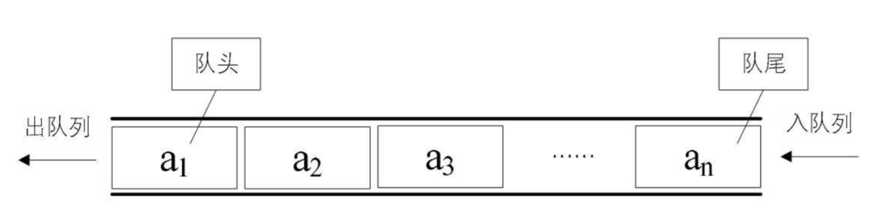
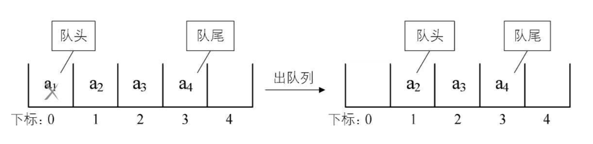
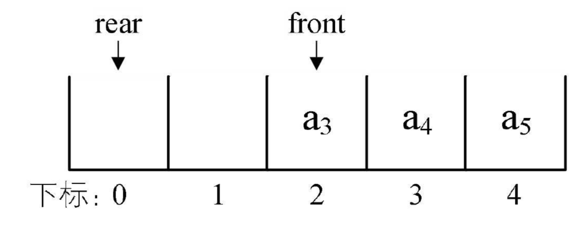
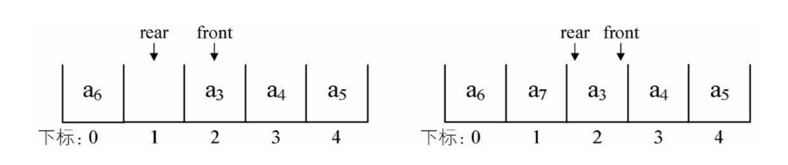
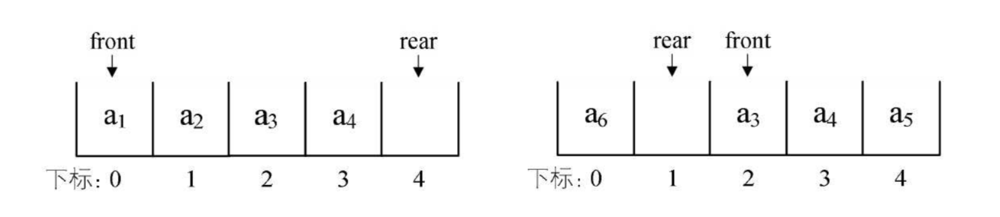

## 一 队列

队列也是特殊的线性表，遵循FIFO（先进先出）规则，即在尾部添加元素，并从顶部移除元素，最新添加的元素必须排在队列的末尾。  



在现实中最常见的队列就是排队，键盘的输入到显示器上的输出等。  

## 二 队列的顺序存储

由于队列也是线性表，队列也有顺序存储和链式存储两种方式。  

顺序存储的入队操作：只是给数组数据最后一位添加一个元素，不需要移动任何数据，时间复杂度是O(1)  
  

顺序存储的出队操作：队列所有元素都要往前移动，以保证队头正确性，此时时间复杂度为O(n)
  

上述思想和现实生活的表现也一致，比如一群人排队买票，前面的人买好了离开，则后面的人都要向前移动一步，补充空位。  

然而在开发中，出队时，队列的元素其实并不一定要移动，只要将队头的位置移动下即可，此时出队性能将会大幅增加：    
   

为了避免当只有一个元素时，队头和队尾会重合，处理起来变得很麻烦，引入两个指针，front指向队头，rear指向队尾，当front等于rear时，队列不是还剩一个元素，而是空队列，如下图  
  

但是随之而来诞生了新问题：出队a1，a2，移动front指针即可，如果再入队a5，rear指针就会移动到数组之外了....  
 

在上述案例中，还有更崩溃的问题：接着入队时，数组就要越界了，但是明明数组的0和1索引位置是空的，我们称这个现象是假溢出。  

## 三 循环队列

为了解决顺序存储队列的不足，笔者推荐使用循环队列。假溢出的解决办法就是：后面满了，再从头开始，也就是头尾相接的循环，这种头尾相接的顺序存储结构队列即循环队列。  

如图所示，当a5入队时，rear指针到达索引0位置：  
 

接着入队a6，如下左侧所示，入队a7，则rear指针和front指针重合，即front=rear，如图所示：
 

在这个条件下，我们如何判定数组是满了还是空队列呢？  
答案：我们给队列保留一个元素空间，当front=rear时，队列为空，当队列满时，数组中还有一个空闲单元，也就是说我们不允许上图出现的情况，而是将队列变满的情况设定为下图：  

 

在这种情况下，rear可能比front大，也可能比front小，其相差一个位置就是满的情况，但是也有可能是相差整个一圈，那么如果队列最大尺寸为size，队列满的条件就是：

```
(rear + 1) % size == front

// 有一种情况：rear>front时，队列长度是rear-front，rear<front时，队列长度是 (size-front) + (0 + rear)，因此通用长度公式为：
(rear - front + size) % size
```

循环队列代码如下：
```go

// 循环队列对象
type SeqQueue struct {
	data []interface{}
	size int				// 容量
	front int				// 头指针
	rear int 				// 尾指针
}

// 创建循环队列
func New(size int) *SeqQueue {
	return &SeqQueue{
		make([]interface{}, size),
		size,
		0,
		0,
	}
}

// 判断队列是否为空
func (sq *SeqQueue) IsEmpty() bool{
	if sq.front == sq.rear || sq.data[sq.rear - 1] == nil {
		return true
	}
	return false
}

// 获取循环队列长度
func (sq *SeqQueue) Length() int {
	if sq.IsEmpty() {
		return 0
	}
	return (sq.rear - sq.front + sq.size) % sq.size
}

// 清空循环队列
func (sq *SeqQueue) Clear() {
	sq.front = 0
	sq.rear = 0
	sq.data = nil
}

// 获取头结点
func (sq *SeqQueue) Head() interface{} {
	if sq.IsEmpty() {
		return nil
	}
	return sq.data[sq.front]
}

// 新增
func (sq *SeqQueue) Push(data interface{}) error{
	if (sq.rear + 1) % sq.size == sq.front {
		return errors.New("queue is full")
	}
	sq.data[sq.rear] = data
	sq.rear = (sq.rear + 1) % sq.size
	return nil
}

// 删除
func (sq *SeqQueue) Delete() interface{} {
	if sq.IsEmpty() {
		fmt.Println("queue is empty")
		return nil
	}
	e := sq.data[sq.front]
	sq.data[sq.front] = nil
	sq.front = (sq.front + 1) % sq.size
	return e
}
```

## 四 链式存储队列

队列的链式存储结构，其实就是线性表的单链表，只不过它只能尾进头出，称之为链队列。一般可以将队头指针指向连队列的头节点，队尾指针指向终端节点。  

空队列时，front和rear都指向头结点。  


空队列时，front和rear都指向头节点。  

```go
// 队列结点
type node struct {
	data interface{}
	next *node
}

// 链式队列对象
type LinkedQueue struct {
	front *node
	rear *node
	length int
}

// 创建队列
func New() *LinkedQueue {
	return &LinkedQueue{
		nil,
		nil,
		0,
	}
}

// 新增
func (lq *LinkedQueue) Push(data interface{}) {
	insertNode := &node{
		data,
		nil,
	}
	lq.rear.next = insertNode
	lq.rear = insertNode
	lq.length++
}

// 删除
func (lq *LinkedQueue) Delete() interface{} {

	if lq.IsEmpty() {
		fmt.Println("queue is empty")
		return nil
	}

	node := lq.front.next
	lq.front.next = node.next
	lq.length--

	if node == lq.rear {
		lq.front = lq.rear
	}

	return node
}

// 判断队列是否为空
func (lq *LinkedQueue) IsEmpty() bool{
	if lq.front == lq.rear {
		return true
	}
	return false
}

// 获取队列长度
func (lq *LinkedQueue) Length() int {
	return lq.length
}

// 清空队列长度
func (lq *LinkedQueue) Clear() {
	if lq.IsEmpty() {
		return
	}
	lq.front = lq.rear
	lq.length = 0
}
```