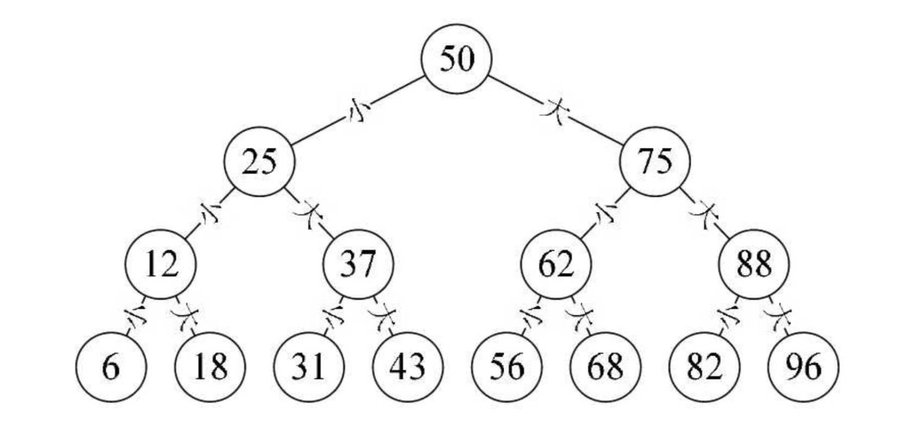
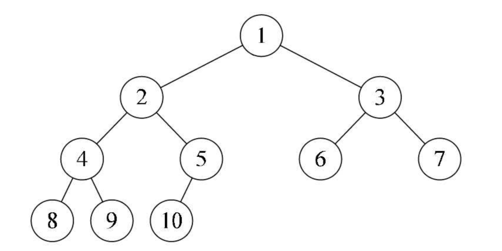

## 一 二叉树定义

如果从1-100内选出一个数，让你猜选中的是哪个，每次猜测会被告知所猜之数是大了还是小了，共有7次机会猜测，一定可以猜出是多少吗？  

答案是肯定的，使用折半查找法：    
  

以上的树形案例其实是个二叉树：
- 每个节点最多有两个子树，即不存在度大于2的节点
- 左子树和右子树是有顺序的，不能任意颠倒
- 即使树种某个节点只有一棵子树，也要区分它是左子树还是右子树

二叉树有五种形态：
- 空二叉树
- 只有一个根节点
- 根节点只有左子树
- 根节点只有右子树
- 根节点既有左子树又有右子树

一些特殊的二叉树：
- 斜树：有左斜树，右斜树。比如左斜树只有左侧节点，其实是一种线性结构了，节点的个数就是二叉树的深度
- 满二叉树：既左右都是完好的二个孩子节点，依次递推。
- 完全二叉树：一个二叉树有n个节点，如果编号i的节点与同样深度的满二叉树中编号为i的节点位置相同，则为完全二叉树

完全二叉树如图：  


注意：完全二叉树并不一定是满的。  

完全二叉树的特点：
- 叶子=节点只能出现在最下2层
- 最下层的叶子一定鸡枞在左边连续位置
- 倒第二层，如果有叶节点，一定在右边连续位置
- 如果节点度为1，则该节点只有孩子节点，不存在只有右子树的情况
- 同样节点数的二叉树，完全二叉树深度最小


## 二 二叉树的特性  

特性1-每层节点数：二叉树的第i（i>=1）层上至多有2<sup>i-1</sup>个节点  

特性2-全部节点数：深度为k（k>=1）的二叉树至多有2<sup>k</sup>-1个节点

特性3-n0 = n2 + 1：二叉树的终端节点数（叶节点数）为n0，度为2的节点数为n2，该树总节点数为：n0=n2 + 1(n1为度为1的节点数)

```
推导过程：
    一棵二叉树，除了叶节点，剩下的就是度为1或2的节点，n0是终端节点数，n1是度为1的节点数，n2是度为2的节点数
    总节点数：n = n0 + n1 + n2  如下图所示，ABCD为度2的节点，FGHIJ为度0叶节点，E为度1节点，总数为10
    换个角度，根节点的连接线只有分支出去，没有分支进入，所以分支总线=节点总数-1，如图为9： 4*2 + 1*1 = 9
    即：分支总数=n-1=n1 + 2n2，即：
    n = n0 + n1 +n2 = n1 + 2n2 + 1

```


特性4：具有n个节点的完全二叉树深度为|log<sub>2</sub>n+1|

```
推导过程：
    深度为k的满二叉树，节点数n一定是2的k次方-1，其深度为log2(n+1)
    完全二叉树的叶节点只会出现在最下面的两层，如下图所示
```


特性5：一个有n个节点的完全二叉树，节点按照层序编号（1层到n层，每层从左到右），任一节点i(1<=i<=n)
- 如果i=1，则节点i是二叉树的根，无双亲
- 如果i>1，其双亲是节点
- 如果2i>n，则节点i无左孩子，节点i为叶节点，否则其左孩子是节点2i
- 如果2i+1>n，则节点i无右孩子，否则其右孩子是节点2i+1

