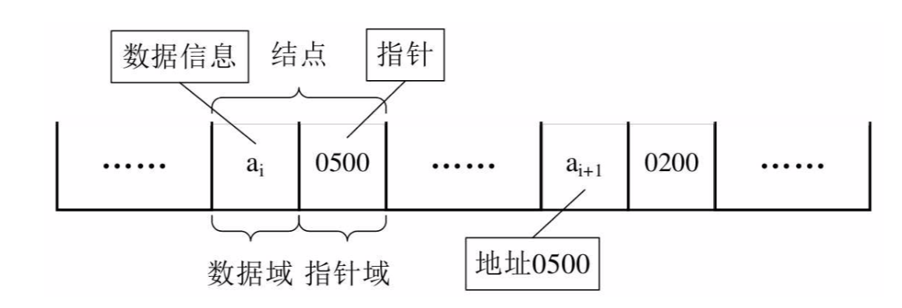
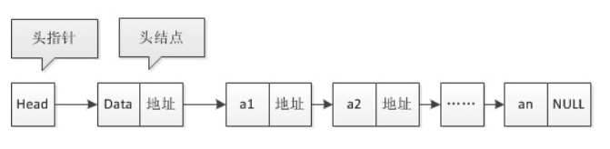

## 一 链表

#### 1.1 数组和顺序表的缺点

数组并不是存储数据的最佳数据结构。在很多编程语言中，数组的长度是固定的，所以当数组已被数据填满时，再要加入新的元素就会非常困难。  

在数组中，添加和删除元素也很麻烦，因为需要将数组中的其他元素向前或向后移动。   

贴士：JS中的数组并不存在上述问题，使用splice()方法不需要再访问数组中的其他元素了，因为在JS中数组被实现成了对象，也因此与其他语言相比，JS的数组效率极低。

同样,顺序表也存在插入和删除时需要移动大量数据的问题。  

#### 1.2 链表概述  

上述问题出现的原因是：所有的元素存储位置都是相邻的，中间没有缝隙，也就不能快速插入，同样，删除后留下的空隙也需要弥补上。  

线性表的链式存储可以用一组任意的存储单元存储数据元素，这组存储单元可以是连续的，也可以是不连续的。这意味着，这些数据元素可以存在内存未被占用的任意位置。当然，这样也会随之而来一些问题：除了要存储数据元素信息外，还要存储它的后继元素的存储地址。  

  

#### 1.2 链表的节点

链表的组成：
- 数据域：存储数据元素信息
- 指针域：存储直接后继的位置
- 节点(Node)：数据域和指针域组成的数据元素a<sub>i</sub>的存储映像

n个Node链接成了一个链表，即是线性表的链式存储结构。  

  

#### 1.3 头指针与头节点

线性表都有头有尾，链表中的第一个Node不存储元素数据，只存储第一个具体元素的指针地址，称为头指针，之后的每一个Node，其实都是上一个后继指针指向的位置。链表的最后一个Node，不存在后继，这个节点的指针域为空。   

  


但是为了方便对链表进行操作，有时候会在单链表的第一个节点前附设一个结点，称为头节点。头节点的数据域一般不存储任何信息，或者存储如线性表的长度等附加信息。头节点的指针域存储指向第一个节点的指针，如图所示：   

  
  

头指针：
- 指向第一个节点的指针，若链表有头节点，则指向头节点
- 头指针具备标识作用，常用头指针冠以链表的名字
- 无论链表是否为空，头指针均不为空，是必要元素

头节点：
- 为了操作的统一设立，放在第一个节点之前，一般没有实际意义
- 有了头结点，对第一节点前插入，删除第一节点等操作会更加简便
- 头节点不是链表必备元素 

## 二 理解单链表  

最简单的链表就是单链表了，其插入/删除操作不会干扰其他节点。  

但是如果我们不知道第i个结点的位置，单链表数据结构在插入和删除操作上，与线性表的顺序存储结构相比没有太大优势。一旦知道精确的位置，无论插入多少个元素，找到第i位置的指针复杂度为O(n)，但是插入只是简单的移动指针，时间复杂度都是O(1)，而顺序表，每次移动都是O(n)。  

总结：对于插入或者删除数据越频繁的操作，单链表的效率优势越明显。

## 三 单链表Go实现

#### 3.1 单链表结构
```
单链表对象  
	LinkedList {
		Node{数据, next}          	# next是下一个元素的指针
	}

常见操作方法    
    New()          					# 初始化一个单链表
    IsEmpty()            			# 判断单链表是否为空
    Append()               			# 在单链表末尾插入元素
	...
```

#### 3.2 单链表实现

```go
// 节点对象，存储单链表上某个节点数据
type node struct {
	data interface{}			// 数据域
	next *node					// 指针域
}

// 单链表对象：存储头节点即可，当然也有做法是直接将头结点视为单链表对象
type LinkedList struct {
	head *node					
}

// 创建单链表
func New() *LinkedList {
	head := &node{0, nil}		// 头节点存储链表中元素的个数
	return &LinkedList{
		head,
	}
}

// 判断空
func (ll *LinkedList)IsEmpty() bool {
	return ll.head.next == nil
}

// 增加：末尾添加
func (ll *LinkedList) Append(data interface{}){

	insertNode := &node{data, nil}					// 要插入的节点
	var len int = 0
	len = ll.head.data.(int)

	// 查询最后一个节点
	lastNode := ll.head.next
	if lastNode == nil {							// 第一次添加
		ll.head.next = insertNode
		len ++
		ll.head.data = len
		return
	}

	for lastNode.next != nil {						// 不是第一次添加
		lastNode = lastNode.next
	}
	lastNode.next = insertNode
	len ++
	ll.head.data = len

	return
}

// 增加：任意位置插入结点
func (ll *LinkedList) Insert(index int, data interface{}) error{

	var len int = 0
	len = ll.head.data.(int)

	if index < 1 || index > len {
		return errors.New("index overflow")
	}

	beforeNode := ll.head
	appendNode := &node{data, nil}

	for i := 0; i < index - 1; i++ {
		beforeNode = beforeNode.next		// 找到要插入的位置的前置元素
	}

	appendNode.next = beforeNode.next
	beforeNode.next = appendNode

	len ++
	ll.head.data = len

	return nil

}

// 删除：删除指定位置结点
func (ll *LinkedList) Delete(index int) (interface{}, error) {

	var len int = 0
	len = ll.head.data.(int)

	if index < 0 || index >= len {
		return nil,errors.New("index overflow")
	}

	currentNode := ll.head
	var beforeNode *node
	var delData interface{}					// 被删除的数据

	for i := 0; i < index; i++ {
		beforeNode = currentNode
		currentNode = currentNode.next
	}

	beforeNode.next = currentNode.next
	currentNode = nil

	len--
	ll.head.data = len

	return delData, nil
}

// 查询： 获取指定位置结点
func (ll *LinkedList) Node(index int) (interface{}, error) {

	var len int = 0
	len = ll.head.data.(int)

	if index < 0 || index >= len {
		return nil, errors.New("index overflow")
	}
	currentNode := ll.head
	for i := 0; i < index; i++ {
		currentNode = currentNode.next
	}
	return currentNode.data, nil
}
```