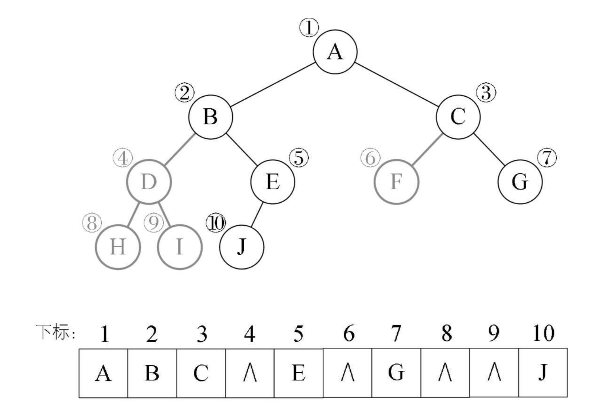
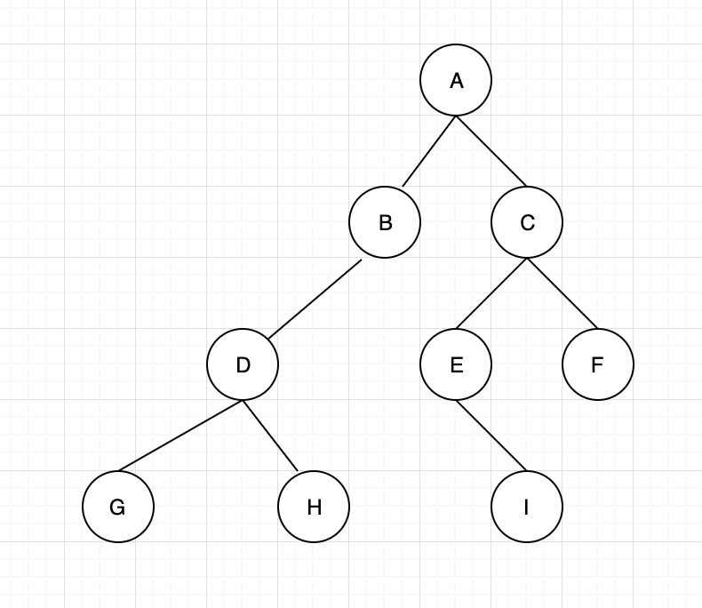

## 一 二叉树存储结构

树使用顺序存储是非常困难的，但是二叉树结构特殊，使用顺序存储也能实现。即：用一位数组存储二叉树中的节点和节点关系。  



图中4，6，8，9节点不存在。下方表格为存储的数组。 


顺序存储虽然能够表述二叉树，但是实用性不强，推荐使用链式存储，即二叉链表。

```go

```

## 二 二叉树的遍历

遍历一般是从根节点开始，当然我们也可以限制左右顺序遍历是从左开始，主要遍历方法有下列多种。  

 

- 前序遍历：从根节点开始，先前序遍历左子树，再前序遍历右子树，顺序为：ABDGH-CEIF
- 中序遍历：从根节点开始(不是访问根节点)，中序遍历根节点的左子树，然后访问根节点，中序遍历右子树：GDHBAE-ICF
- 后序遍历：从左到右先叶节点方式遍历左右子树，最后访问根节点：GHDBIEFCA
- 层序遍历：从树的第一层，即根节点开始访问，从上往下，从左到右遍历：ABCDEFGHI


