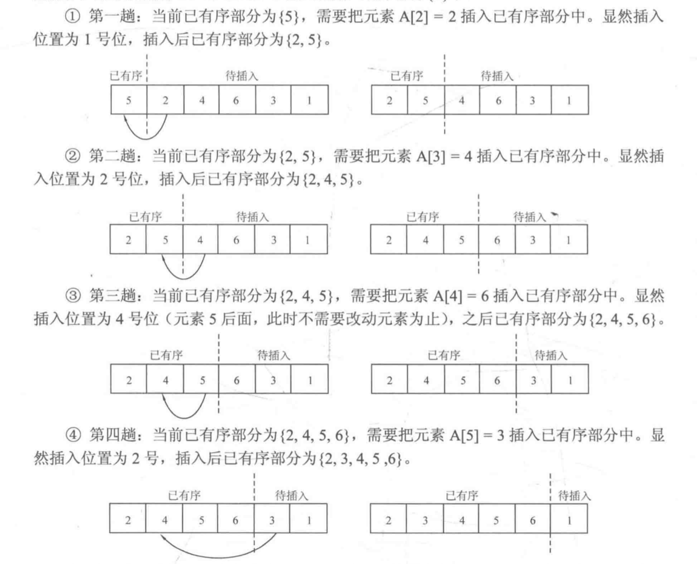

## 关于排序

很多算法都是数据经过排序后才管用，例如二分查找，鉴于此，很多语言也内置了排序。  

## 一 选择排序

选择排序：最简单的排序，对一个序列进行从小到大排序。如果序列A长度为n，则对序列进行n次循环，如果循环到i为最小元素，替换序列`A[i]`的值为该最小元素，即每趟操作选出待排序部分`[i,n]`中最小的元素，并与`A[i]`交换

```go
func selectSort(arr []int){

    length := len(arr)
    if length <= 1 {
        return
    }

	for i := 0; i <= length - 1; i++ {
		k := i
		for j := i; j <= length - 1; j++ {
			if (arr[j] <= arr[k]) {
				k = j
			}
		}
		// 每次外层一轮循环结束，执行交换
		temp := arr[i]
		arr[i] = arr[k]
		arr[k] = temp
	}
}
```

快速排序要检查n次，每次检查元素书目为1/2*n，其运行时间为O(n * 1/2 * n)，即O(n<sup>2</sup>)

## 二 冒泡排序

冒泡排序是进行两两数据对比，依次循环下去，如下所示，第一次循环过程：  

 

```go
func bubleSort(arr []int) {

	length := len(arr)
	if (length <= 1) {
		return
	}

	for i := 0; i < length - 1; i++ {
		for j := i + 1; j < length; j++ {
			if (arr[i] > arr[j]) {
				arr[i],arr[j] = arr[j],arr[i]
			}
		}
	}
}
```


## 三 插入排序

#### 3.1 直接插入排序

直接插入排序：序列`A[n]`，从i=1循环到n（即从第二个元素开始循环，循环到最后一个），每次循环到的元素与之前数据进行比对，按顺序插入，如下图所示，有数组`[5,2,4,6,3,1]`，进行直接插入排序，依次类推。    


```go
func insertSort(arr []int) {

    length := len(arr)
    if length <= 1 {
        return
	}
    
    // 从第2个下标开始遍历
	for i := 1; i <= length - 1; i++ {		
		temp := arr[i]
		j := i - 1
		for j >= 0 && temp < arr[j] {
			arr[j + 1] = arr[j]
			j--
		}
		if j + 1 != i {
			arr[j + 1] = temp
		}
	}
}
```

## 四 应用

C语言库函数qsort，C++的sort函数都提供了排序功能。Go的`sort`包也提供了排序功能。  

```go
	arr := []int{5,2,4,6,3,1}
	sort.Ints(arr)
	fmt.Println(arr)
```