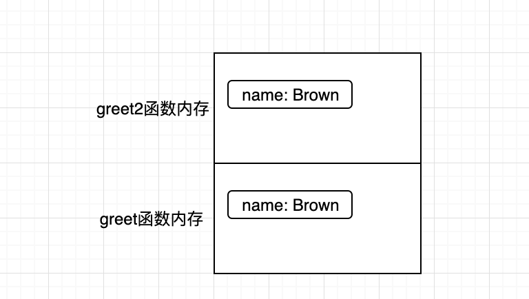
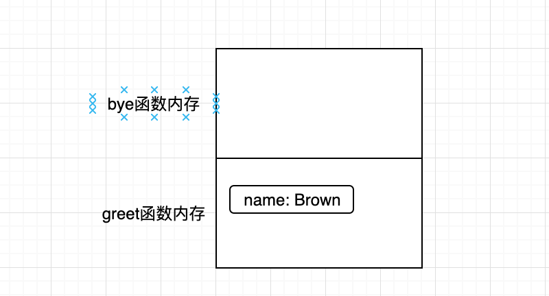
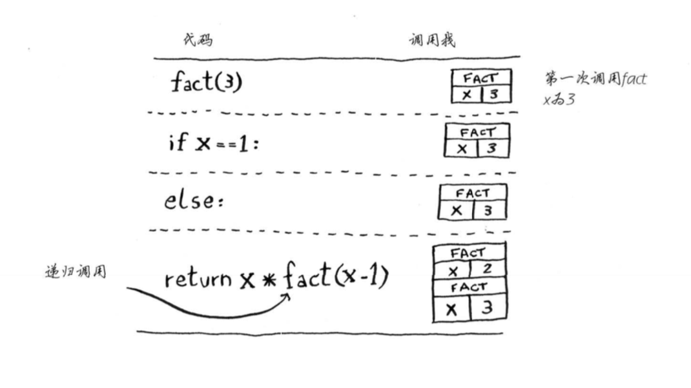
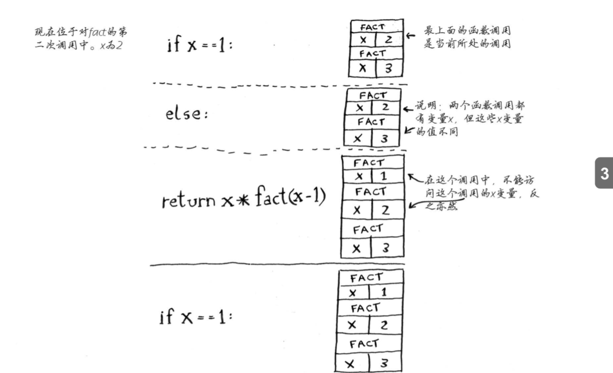
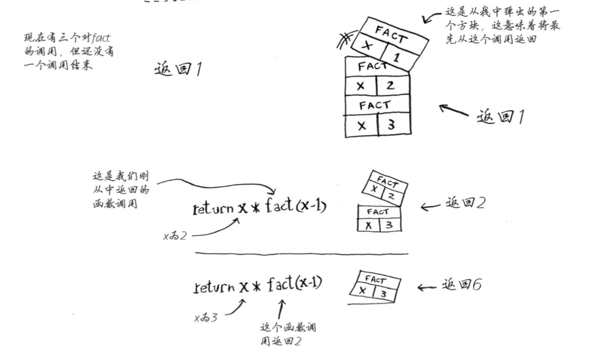

## 一 递归

编写递归函数时，必须告诉它何时停止递归，所以每个递归函数都有2部分：
- 基线条件：base case，指函数不再调用自己
- 递归条件：recursive case，指函数调用自己

```go
func countdown(i int){
	fmt.Println(i)
	if i >=0 {				// 递归条件
		i--
		countdown(i)
	} else {				// 基线条件
		return
	}
}
```

## 二 调用栈

栈是一种数据结构，遵循先进后厨的原则，计算机内部使用的栈一般称为调用栈（call stack）。

```go
package main

import "fmt"

func greet(name string) {
	fmt.Println("hello ", name)
	greet2(name)
	fmt.Println("getting ready to say bye...")
	bye()
}

func greet2(name string) {
	fmt.Println("How are you,  ", name)
}

func bye() {
	fmt.Println("Ok bye!")
}

func main() {
	greet("Brown")
}
```

我们在main函数中执行：`greet("Brown")`，此时内存会分配一块内存，并将这些变量保存起来，在执行时，继续执行greet2，这样依次保存起来，如图所示：  



当执行到bye函数时，会让greet2函数出栈，bye函数压栈：  

  

bye函数执行完毕后，只有greet函数自己，此时再将greet函数弹栈，整个调用结束。  

整个调用过程中，负责存储这些函数、并执行弹栈、压栈的数据结果叫做调用栈。  

切记：栈顶指出了当前执行到了什么地方！！！

## 三 递归调用栈

下面是一个计算阶乘的递归函数：fact(3)即 `3*2*1`。  

```go
func fact(x int) int {
    if x == 1 {
        return 1
    } else {
        return x * fact(x - 1)
    }
}
```

第一次调用fact函数，x为3：  

  


第二次调用：  

  

第三次调用：  

 