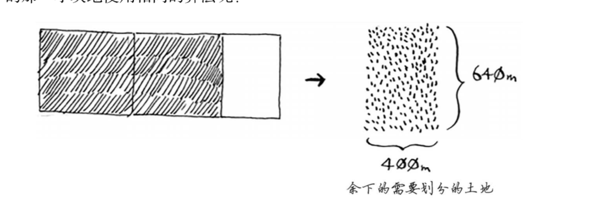
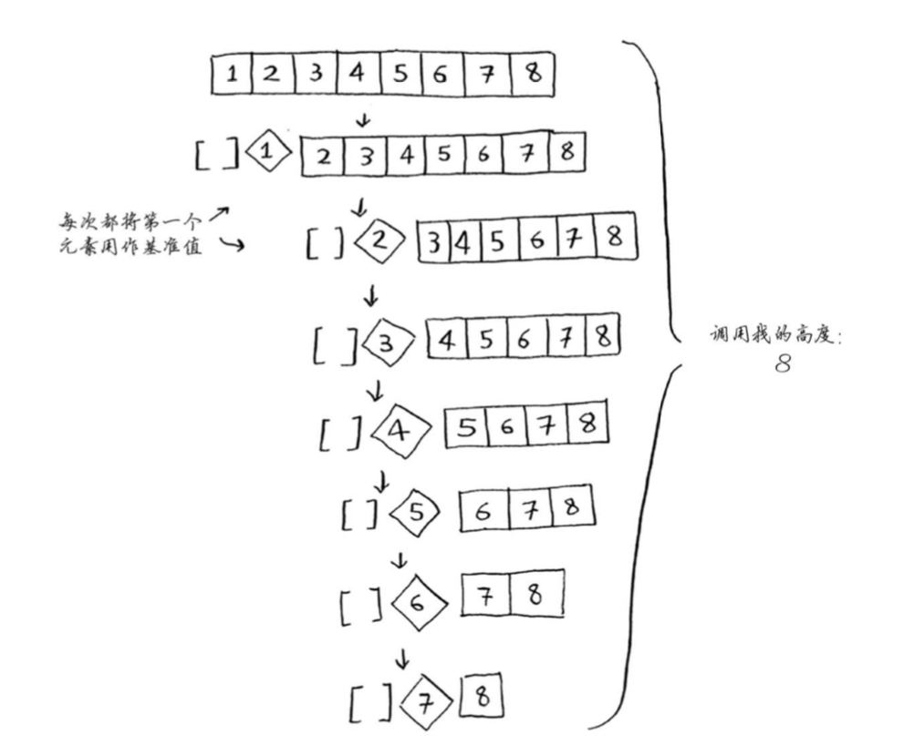
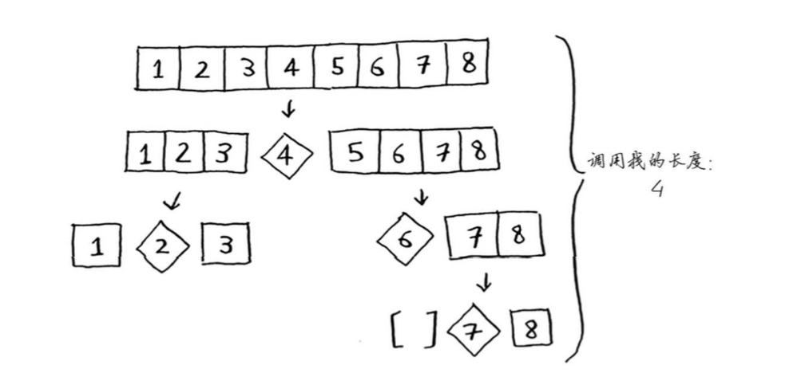

## 通过快排理解大O表示法

常见的大O运行时间图：
  

上图只是一个基本的描述，与实际出入很大。

快速排序在平均情况下运行时间为O(n log n)，但是最糟糕的情况下，运行时间为O(n<sup>2</sup>)  

还有一种算法合并排序（merge sort），其运行时间为O(n log n)，比快排更快，这里会产生一个疑问：为何不直接使用合并排序？  

假设有这样一个函数负责打印数组每个元素：
```go
func printItems(arr []int){
    for i := 0; i < len(arr) - 1; i++ {
        fmt.Println(arr[i])
    }
}
```

如果我们让这个函数每次打印前，延迟2秒执行：
```go
import (
	"fmt"
	"time"
)

func printItems2(arr []int){
    for i := 0; i < len(arr) - 1; i++ {
		time.Sleep(time.Second * 2)
        fmt.Println(arr[i])
    }
}
```

显然第一个函数的执行速度更快，但是他们在大O表示法中，时间复杂度都是O(n)，因为通常不考虑 2*n 的常量，因为在数据量很大时，常量对算法的影响越来越小，而快排被称为快速排序也是这个原因。  

快速排序的速度取决于基准值的选择，假设总是将第1个元素作为基准值，且要处理的数组也是有序的，选择第一个元素为基准，或者选择中间元素为基准的情况如下图所示。 

选择第一个元素为基准： 这是最糟糕的情况。 O(n<sup>2</sup>) 


选择靠中间的元素为基准：  这是最佳情况，O(n log n)
