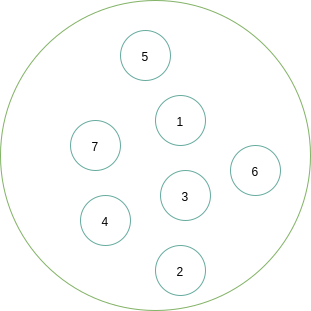

## 一 数据结构概念

在实际开发中，往往需要将许多数据分门别类处理，我们需要为这些数据开辟存储空间进行存储。不同类数据往往存储的要求不一致，当数据存储进一个变量后，有些需求要求能够快速查找出某个单独的数据，有些需求要求能够快速存储，根据这些需求而生成的不同数据存储容器我们称之为数据结构。开发中常见的数据结构有：数组、双向链表、二叉树等等。  

**数据结构（data structure）**：
> 相互之间存在一种或多种特定关系的数据集。    

数据结构的形式定义为：数据结构是一个二元组。
> Data_Structure = (D, S)           

D是数据元素的有限集，S是在D上的一种关系的有限集。如复数是一种数据结构：
```
    Complex = (C, R)    # C是包含两个实数的集合{c1, c2}，R = {P}，P是定义在集合C上的一种关系{<c1, c2>}，c1是复数的实部，c2是复数的虚部
```

## 二 结构与存储

### 2.1 逻辑结构

逻辑结构：
> 数据结构实例中的数据元素之间都存在着相互关系，构成了数据的结构，也称为逻辑结构。

常见的逻辑结构有四种：
- 集合结构：结构中的数据元素之间除了同属于一个集合外，无其他关系
- 线性结构：结构中的数据元素之间存在着一对一的关系
- 树形结构：结构中的数据元素之间存在着一对多的关系
- 图形结构：结构中的数据元素之间存在着多对多的关系，也称为网状结构

**集合结构**：元素之间完全平等，只有一个关系，即属于同一集合，如下图：  



**线形结构**：元素之间是一对一关系，包括数组、链表等常见数据结构，如下图所示：  


**树形结构**：元素之间是一对多关系，常见的数据结构有二叉树，如下图所示：    

  

**图形结构**：元素之间是多对多关系，常见的数据结构是图，如下图所示：  

 


### 2.2 物理结构

**物理结构**
> 数据的逻辑结构是在计算机中的真实存储形式，即数据结构在计算机中的表示（映像），也称为存储结构。

物理结构既包括元素本身的表示，也包括元素关系的表示。2.1中的逻辑结构是在物理结构中实现的，也就是说物理结构既表示了数据元素，也表示了数据元素的关系！  

如果逻辑结构不能在物理中实现，数据结构也就失去了意义！   

严本摘抄：
```
位bit）：是计算机中的最小单元，即二进制数的一位。

数据元素可以由若干位组合形成的位串表示，这个位串称为**元素**（element）或**结点**（node）。

当数据元素由若干数据项组成时，位串中对应于各个数据项的子位串称为**数据域**（data field）。  

所以结点也可以看作是数据元素在计算机中的映像。  
```

物理结构（元素的关系）在计算机中有两种不同的表示方法：
- 顺序映像，其存储结构称为顺序存储结构，特点是借助元素在存储器中的相对位置来表示数据元素之间的逻辑关系
- 非顺序映像，其存储结构称为链式存储结构，特点是利用元素存储地址的指针表示 数据元素之间的逻辑关系


**顺序结构**：把数据元素存放在连续的存储单元里，其数据间的逻辑关系和物理关系是一致的，最经典的顺序结构是数组，数组中的元素都是依次摆放的，如下所示：  

 

顺序结构无法解决插队等问题，很多数据要求存储的结构具有变化性。比如在银行办理业务时，按顺序结构领了排队号码，但是在等待期间，你自己是可以随处走动的。那么形容人在等待时期的一系列动作数据的存储，就需要链式结构。    

**链式结构**：

 

### 2.3 物理结构和逻辑结构关系

逻辑结构是面向问题的：实际业务中，我们需要什么样的数据结构，要根据业务出发选择合适的结构。  

物理结构是面向计算机的：选型了逻辑结构后，还需要将这些数据按照逻辑结构规范存储进计算机中。  

任何一个算法的设计取决于逻辑结构，其实现依赖于存储结构。  


### 三 抽象数据类型 

抽象数据类型ADT（Abstract Data Type)：
> 数据结构的数学数据模型以及定义在该模型上的一系列操作。    
> 抽象数据类型由三元组表示 (D, S, P)，D是数据对象，S是D上的关系集，P是对D的操作集

`严本`定义格式如下：
```
ADT 抽象数据类型名 {
    数据对象：<数据对象的定义>
    数据关系：<数据关系的定义>
    基本操作：<基本操作的定义>
}ADT 抽象数据类型名
```