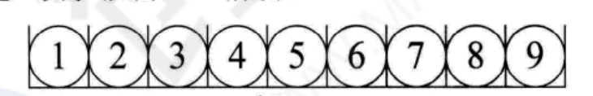

## 一 数据结构概念

在实际开发中，往往需要将许多数据分门别类处理，我们需要为这些数据开辟存储空间进行存储。不同类数据往往存储的要求不一致，当数据存储进一个变量后，有些需求要求能够快速查找出某个单独的数据，有些需求要求能够快速存储，根据这些需求而生成的不同数据存储容器我们称之为数据结构。开发中常见的数据结构有：数组、双向链表、二叉树等等。  

**数据结构（data structure）**：
> 相互之间存在一种或多种特定关系的数据集。    

数据结构的形式定义为：数据结构是一个二元组。
> Data_Structure = (D, S)           

D是数据元素的有限集，S是在D上的一种关系的有限集。如复数是一种数据结构：
```
    Complex = (C, R)    # C是包含两个实数的集合{c1, c2}，R = {P}，P是定义在集合C上的一种关系{<c1, c2>}，c1是复数的实部，c2是复数的虚部
```

## 二 结构与存储

#### 2.1 逻辑结构

逻辑结构：
> 数据结构实例中的数据元素之间都存在着相互关系，构成了数据的结构，也称为逻辑结构。

常见的逻辑结构有四种：
- 集合结构：结构中的数据元素之间除了同属于一个集合外，无其他关系
- 线性结构：结构中的数据元素之间存在着一对一的关系
- 树形结构：结构中的数据元素之间存在着一对多的关系
- 图形结构：结构中的数据元素之间存在着多对多的关系，也称为网状结构

集合结构：元素之间完全平等，只有一个关系，即属于同一集合，如下图：  


线形结构：元素之间是一对一关系，包括数组、链表等常见数据结构，如下图所示：  


树形结构：元素之间是一对多关系，常见的数据结构有二叉树，如下图所示：    

  

图形结构：元素之间是多对多关系，常见的数据结构是图，如下图所示：  

 


#### 2.2 物理结构

物理结构
> 数据的逻辑结构是在计算机中的真实存储形式，即数据结构在计算机中的表示（映像），也称为存储结构。

物理结构既包括元素本身的表示，也包括元素关系的表示。2.1中的逻辑结构是在物理结构中实现的，也就是说物理结构既表示了数据元素，也表示了数据元素的关系！
如果逻辑结构不能在物理中实现，数据结构也就失去了意义！   

贴士：
```
在计算机中表示信息的最小单位是二进制数的一个位（bit），若干位组合形成的位串可以标识一个数据元素，如一个字符长度的位串表示整数，8位二进制数表示一个字符等等，通常称这个位串为元素（element）或者结点（node）。  
当数据元素由若干数据项组成时，位串中对应于各个数据项的子位串称为数据域（data field）。
```

物理结构（元素的关系）在计算机中有两种不同的表示方法：
- 顺序映像，其存储结构称为顺序存储结构
- 非顺序映像，其存储结构称为链式存储结构

#### 3.2 物理结构之 顺序结构

顺序结构是把数据元素存放在连续的存储单元里，其数据间的逻辑关系和物理关系是一致的。



最经典的顺序结构就是数组了，数组中的元素都是依次摆放的。

#### 3.3 物理结构之 链式结构

顺序结构无法解决插队等问题，很多数据要求存储的结构具有变化性。比如在银行办理业务时，按顺序结构领了排队号码，但是在等待期间，你自己是可以随处走动的。那么形容人在等待时期的一系列动作数据的存储，就需要链式结构。


#### 3.4 物理结构和逻辑结构关系

逻辑结构是面向问题的：实际业务中，我们需要什么样的数据结构，要根据业务出发选择合适的结构。  

物理结构是面向计算机的：选型了逻辑结构后，还需要将这些数据按照逻辑结构规范存储进计算机中。


## 三 抽象数据类型


抽象数据类型ADT（Abstract Data Type)：
> 数据结构的具体数据模型以及定义在该模型上的一系列操作。    

定义格式如下：
```
ADT 抽象数据类型名 {
    数据对象：<数据对象的定义>
    数据关系：<数据关系的定义>
    基本操作：<基本操作的定义>
}ADT抽象数据类型名
```

其他术语附录：
```
数据（data）：输入到计算机中待处理的符号
数据元素（data element）：数据的基本单位，一个数据元素作为整体由若干个数据项组项（data element）：数据项是数据不可分割的最小单位。例如书作为数据元素，那么书的 水名 作者 出版日期 等是数据项。
数据对象（data object）：性质相同的数据元素的集合，是数据的一个子集
数据结构（data stucture）：相互之间存在一种或多种特定关系的数据元素的集合。
```

