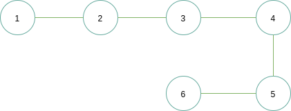
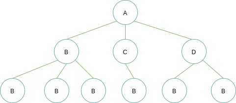
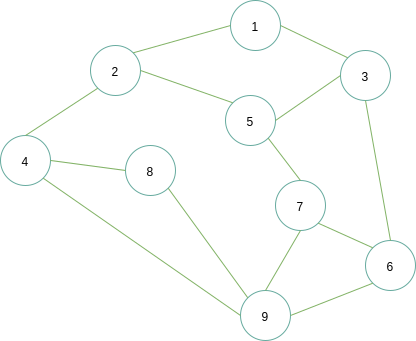
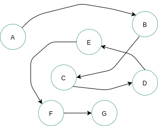

# 01-数据结构概述

## 一 数据的容器

在实际开发中，同一类型的数据，往往需要使用容器来进行存储，常见的容器有数组、集合等等。不同的容器在使用上往往带来不同的效果，比如有的容器可以支持快速查找出某个单独数据，如数组、哈希表，有的容器能够支持快速存储，如链表。根据不同需求而使用的不同的数据存储容器都可以称之为`数据结构`。

> **数据**：包括开发中的整数、浮点数等数值类数据，也包括日常中的文字、图形等数据。
> **数据元素**：数据的基本单位，比如一个字符串数据，其数据元素就是每个字符，比如一个学生表，每个学生就是数据元素。数据元素也可以称为元素、记录、结点、顶点。
> **数据项**：数据项是数据元素不可分割的最小单位，也称为属性、字段、域，包括类似性别、籍贯这样不可拆分的初等项，也包括成绩这样的组合项，例如可以拆分为物理成绩、化学成绩
> **数据结构** （data structure）：相互之间存在一种或多种特定关系的数据元素的集合。数据结构也分为动态、静态两种，比如数组这样的元素个数与元素之间的关系不变的是静态数据结构（static data structure），链表这样的元素个数和元素关系因为增删会发生改变的称为动态数据结构（dynamic data structure）
> **数据对象**：相同数据元素的集合，即一个封装体，既包含属性，也要包含动作

## 二 数据的存储

### 2.0 存储方式

数据在存储时候，可以通过`数据元素之间的关系`表示，比如存储为线性的结构、树形结构，这是一种逻辑上的关系，称为`逻辑结构`。

当然这些数据最终都要在磁盘上进行落地，这即是`物理结构`。

### 2.1 逻辑结构

> 逻辑结构：数据结构实例中的数据元素之间存在的相互关系

一般可以将逻辑结构划分为线性结构、非线性结构两大类，非线性结构一般包括树形、图形结构等，如下所示四种常见逻辑结构：

- 1、线性结构：结构中的数据元素之间存在着一对一的关系，如线性表、向量、栈、队列、优先队列、字典
- 2、集合结构：结构中的数据元素之间除了同属于一个集合外，无其他关系(与数学中的集合概念一致)，如并查集
- 3、树形结构：结构中的数据元素之间存在着一对多的关系，如二叉树
- 4、图形结构：结构中的数据元素之间存在着多对多的关系，也称为网状结构，如有向图

**线性结构**：**元素之间是一对一关系**，包括链表、队列、栈等常见数据结构，如下图所示：



线性结构具备下列特点：

- 必定存在唯一的一个`第一个元素`
- 必定存在唯一的一个`最后一个元素`
- 除第一个元素之外，其他数据元素均有唯一的前驱

**集合结构**：**元素之间完全平等，只有一个关系，即属于同一集合**，如下图：


**树形结构**：**元素之间是一对多关系**，常见的数据结构有二叉树、堆、并查集等，如下图所示：



**图形结构**：**元素之间是多对多关系**，常见的数据结构是邻接矩阵、邻接表等，如下图所示：



当然我们也可以直观的将数据结构划分为：线性结构（一对一关系，如链表），非线性关系（非一对一关系，如图、树）。

这些逻辑结构可以通过一个二元组来表示：

> Data_Structure = (D, S) 其中 D 是数据元素的有限集合，S 是在 D 中数据元素之间的关系集合。

线性结构的二元组示例：

```txt
D = {01, 02, 03, 04, 05}，
S = {<02,04>, <03,05>, <05,02>, <01,03>}
```

贴士：多元组用来描述确定成分的数学对象，即对象个数优先的序列。

### 2.2 存储结构

物理结构既要存储真实的数据，也要存储数据的逻辑关系，如果逻辑结构不能在物理中实现，数据结构也就失去了意义！

> 物理结构（存储结构）：物理结构是数据的逻辑结构在计算机中的真实存储形式，即数据结构在计算机中的表示（映像），也称为**存储结构**。

物理结构（元素的关系）在计算机中有两种不同的表示方法：

- 1、顺序映像：其存储结构称为`顺序存储结构`，特点是借助元素在存储器中的相对位置来表示数据元素之间的逻辑关系
- 2、非顺序映像：其存储结构称为`链式存储结构`，特点是利用元素存储地址的指针表示数据元素之间的逻辑关系

**顺序结构**：把数据元素存放在连续的存储单元里，其数据间的逻辑关系和物理关系是一致的，最经典的顺序结构是数组，数组中的元素都是依次摆放的，如下所示：


从上图看出，顺序结构可以利用索引快速查找某个位置的数据，但是无解决插入等问题，在插入一个数据时，为了保证数据的逻辑关系，则插入位置的后续元素都要进行后移一位！！

**链式结构**：



从上述看出，链式存储结构可以合理解决插入问题，只需要破坏插入位置的前后元素的关系即可，但是顺序结构失去了索引功能。

此外还有其他存储结构如：**索引存储**在存储元素时还要建立索引表，**散列存储**可以根据一个关键码直接得到存储地址。

总结：**顺序结构中：数据元素的 存储地址 就能直接的反应数据元素之间的逻辑关系了！而在链式存储结构中：需要利用结点之间的指针来间接反应数据元素之间的逻辑结构！**

### 2.3 物理结构和逻辑结构关系

逻辑结构是面向问题的：实际业务中，我们需要什么样的数据结构，要根据业务出发选择合适的结构。物理结构是面向计算机的：选型了逻辑结构后，还需要将这些数据按照逻辑结构规范存储进计算机中。

所以：数据的逻辑结构是独立于数据的存储结构的，而数据的存储结构则要依赖于数据的逻辑结构来实现。

任何一个算法的设计取决于逻辑结构，其实现依赖于存储结构。

### 三 数据的抽象数据类型

### 3.0 数据在计算机中的存储方式

在物理上，数据是以二进制位的形式存储在物理设备上的，这个`位（bit）`即二进制数 0、1 中的一位，是计算机的最小存储单元。

数据结构的数据元素是由若干位组合形成的位串表示，位串称为**元素**（element）或**结点**（node）。

当数据元素由若干数据项组成时，位串中对应于各个数据项的子位串称为**数据域**（data field）。所以结点也可以看作是数据元素在计算机中的映像。

### 3.1 抽象数据类型的表示

现在数据结构有了逻辑表现、存储表现，在代码层面需要依靠抽象数据类型 ADT（Abstract Data Type)来体现。

贴士：编程语言中内置的数据类型如：int、string、array 其实就是数据结构的存储映像实现，但是仅仅这些结构往往不足以使用，还需要自定义一些结构。

ADT 定义格式如下：

```txt
ADT 抽象数据类型名 {
    数据对象：<数据对象的定义>
    数据关系：<数据关系的定义>
    基本操作：<基本操作的定义>
}ADT 抽象数据类型名
```

基本操作往往是：创建、销毁、查找、插入、删除、排序。

**抽象数据类型**就是数据结构的数学数据模型以及定义在该模型上的一系列操作。与数据结构呼应，抽象数据类型可以由三元组表示：

```txt
# 其中D 是数据对象，S 是 D 上的关系集，P 是对 D 的操作集
(D, S, P)
```

严蔚敏《数据结构》中对线性表的抽象数据类型定义示例：

```txt
ADT List {
    数据对象：D = {a1 | a1 ∈ ElemSet, i = 1, 2, ...,n, n >= 0}
    数据关系：R1 = { <ai-1, ai > | ai-1, ai∈D， i=2,...n}           # 类似ai-1中i-1都是下标
    基本操作：
        InitList(&L)
            操作结果：构造一个空线性表L
        DestroyLit(&L)
            初始条件：线性表L已经存在
            操作结果：销毁线性表L
        ClearList(&L)
            初始条件：线性表L已经存在
            操作结果：重置L为空表
        ListEmpty(L)
            初始条件：线性表L已经存在
            操作结果：若L为空表，返回TRUE，否则返回FALSE
        ListLength(L)
            初始条件：线性表L已经存在
            操作结果：返回L中数据元素的个数
        GetElem(L, e, compare())
            初始条件：线性表L已经存在，1<=i<=ListLenth(L)
            操作结果：用e返回L中第i个数据元素的值
        LocateElem(L, e, compare())
            初始条件：线性表L已经存在，compare()是 数据元素判定函数
            操作结果：返回L中第1个与e满足关系compare()的数据元素位序，若这样的数据元素不存在，则返回0
        ProrElem(L, cur_e, &pre_e)
            初始条件：线性表L已存在
            操作结果：若cur_e是L的数据元素，且不是最后一个，则用pre_e返回它的前驱，否则操作失败，pre_e无定义
        NextElem(L, cur_e, &next)e)
            初始条件：线性表L已经存在
            操作结果：若cure_e是L的数据元素，且不是最后一个，则用next_e返回它的后继，否则操作失败，next_e无定义
        ListInsert(&L, i, e)
            初始条件：线性表L已经存在，1<=i<=ListLength(L)+1
            操作结果：在L中第i个位置之前插入新的数据元素e，L的长度加1
        ListDelete(&L, i, &e)
            初始条件：线性表L已经存在且非空，1<=i<=ListLength(L)
            操作结果：删除L的第i个数据元素，并用e返回其值，L的长度减1
        ListTraverse(L, visit())
            初始条件：线性表L已经存在
            操作结果：依次对L的每个数据元素调用函数visit()，一旦visit()失败，则操作失败
}ADT List
```
