# 01-数组概述

## 一 数组概念

> 数组（array）：有限个相同类型元素组成的有序集合

数组是最简单的数据结构之一，基本所有的语言都提供了原生的数组数据结构。

在大多数编程语言中，数组的长度都是固定的，且存储的元素类型也都是相同，索引从 0 开始。

数组存储结构如下所示：



**数组本质上是在物理上一组连续的内存上存储的数据（顺序存储），如果要移动一个元素，其相关元素也都需要一一移动**，如图所示：



一般可用数组的首元素来表示数组，元素在数组中的存储如下所示：



## 二 随机读取

> 随机读取：使用下标读取元素的方式

数组具备随机读取特性的数据操作，其时间复杂度为 O(1)，如数组的元素获取、更新。

## 三 数组的常见操作

数组的常见操作：

- 获取元素：`arr[index]`，时间复杂度为 O(1)
- 更新元素：`arr[index] = newElem`，时间复杂度为 O(1)
- 元素的插入与删除：由于数组元素紧紧相邻，插入/删除元素需要移动其周边元素一位，时间复杂度为 O(n)。不同编程语言为数组提供了不同的插入删除操作 API。

C 语言中数组的示例：

```c++
int a[5] = {0};     // 未赋值部分自动设为0
int b[5] = {0,1};   // 只给一部分赋值，没赋值的默认为0
int c[5] = {0,1,2,3,4}
int d[] = {0,1,2,3,4,5} // 给全部元素赋值时，可以不指定数组长度
```

由于数组采用的是一段连续的内存，元素之间紧紧挨着，如果元素插入到最后一个位置，或者删除最后一个位置，那么之前的数据元素无需排序，此时是最好的情况，时间复杂度为 O(1)，因为不需要移动元素。如果是其他情况，则所有的数据元素都要进行移动，这个时间复杂度为 O(n)。

如图所示，插入会造成插入位置后续元素一一后移一位：



同理删除元素也会造成所有后续元素的前移。

## 四 总结

数组适合读操作多、写操作少的场景，因为：

- 数组的优势：具备随机读取特性，可以在常量时间内访问元素
- 数组的劣势：插入、删除操作会造成大量元素被迫移动

**注意**：
数组创建完长度就固定，不可以再追加元素；长度是数组类型的一部分，因此`[3]int`与`[4]int`是不同的类型；数组之间的赋值是值的赋值，即当把一个数组作为参数传入函数的时候，传入的其实是该函数的副本，而不是他的指针。

## 附 其他编程语言中的数组

### Golang 中的数组

同大多语言的数组一样，Go 的数组长度定义后不可更改，长度使用 len() 获取。

```go
// 数组定义
var arr1 [10]int     //定义长度为10的整型数组，很少这样使用
arr2 [5]int := [5]int{1,2,3,4,5} //定义并初始化
arr3 := [5]int{1,2,3,4,5}   //自动推导并初始化
arr4 := [5]int{1,2}     //指定总长度，前几位被初始化，没有的使用零值
arr5 := [5]int{2:10, 4:11}   //有选择的初始化，没被初始化的使用零值
arr6 := [...]int{2,3,4}    //自动计算长度

// 数组的长度
len(arr)

// 数组元素获取操作会引发类型的变化，数组将会转化为 Go 中新的数据类型切片
arr[:]      // 代表所有元素
arr[:5]     // 代表前五个元素，即区间的左闭右开
arr[5:]     // 代表从第5个开始（不包含第5个）

// 数组遍历方式一：for 循环遍历
arr := [3]int{1,2,3}

for i := 0; i < len(arr); i++ {
 fmt.Println(arr[i])
}

// 数组遍历方式二：for-range 遍历
arr := [3]int{1,2,3}

for k, v := range arr {
 fmt.Println(k) //元素位置
 fmt.Println(v) //元素值
}
```

### JavaScript 中的数组

JS 的数组使用极其简单，元素由于其动态语言特性，数组的长度可变，元素数据类型也可以不相同，但是其内部原理比其他语言复杂，这里暂时只简单列出其使用：

```js
const arr1 = [1, 2, 3, 4]
const arr2 = new Array() // []
const arr3 = new Array(1, 2) //[1,2]

for (let i = 0; i < arr1.length; i++) {
  console.log(arr1[i])
}

arr3.map((item, index) => {
  console.log(index)
  console.log(item)
})
```
