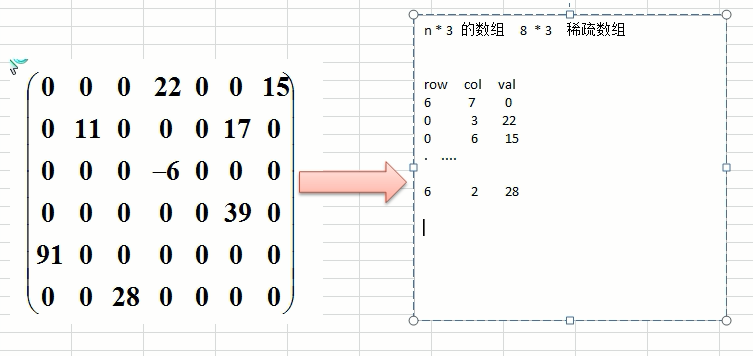

# 03-稀疏数组-定义

## 一 稀疏数组

### 1.1 问题的引入

如下所示的五子棋程序，有存盘退出和续上盘的功能：  


如果使用二维数组来存储，就会如右侧所示存储很多为 0 的浪费空间。

#### 1.2 稀疏数组存储数据

当一个数组中大部分元素为 0，或者为同一个值的数组时，可以使用稀疏数组来保存该数组，其处理方式为：

- 记录数组一共有几行几列，有多少个不同的值
- 把具有不同值的元素的行列/值记录在一个小规模数组中

如图所示：  


图中的 row，col，val 分别代表有多少行，多少列，对应值，其中第一条数据 6，7，10 存储了左侧数据总计有 6 行，7 列，10 个不同值。

## 二 稀疏数组实现

## 附 稀疏数组其他语言实现

### 稀疏数组 C++实现

### 稀疏数组 Go 实现

```go
/*
 *  稀疏数组
 */
package array

type SparseNode struct {
 row  int
 col  int
 val  interface{}
}

type SparseArray struct {
 data    []SparseNode
 lengthRow  int
 lengthCol   int
}

func NewSparseArray(originArr [][]interface{}) *SparseArray{

 var sparseArr []SparseNode

 for i1, v1 := range originArr {
        for i2, v2 := range v1 {
            if v2 != nil {
                tempNode := SparseNode{
                    row : i1,
                    col : i2,
                    val : v2,
                }
    sparseArr = append(sparseArr , tempNode)
            }
        }
 }

 return &SparseArray{
  data:    sparseArr,
  lengthRow:   len(originArr),
  lengthCol:   len(originArr[0]),
 }
}

// 稀疏数组转普通数组
func (sa *SparseArray)TransToArray() [][]interface{}{

 // 构建一个二维切片
 originArr := make([][]interface{},  sa.lengthRow)
 for k, _ := range originArr {
  resultArr := make([]interface{}, sa.lengthCol)
  originArr[k] = resultArr
 }

    for _, v := range sa.data {
  originArr[v.row][v.col] = v.val
 }
 return originArr
}
```
