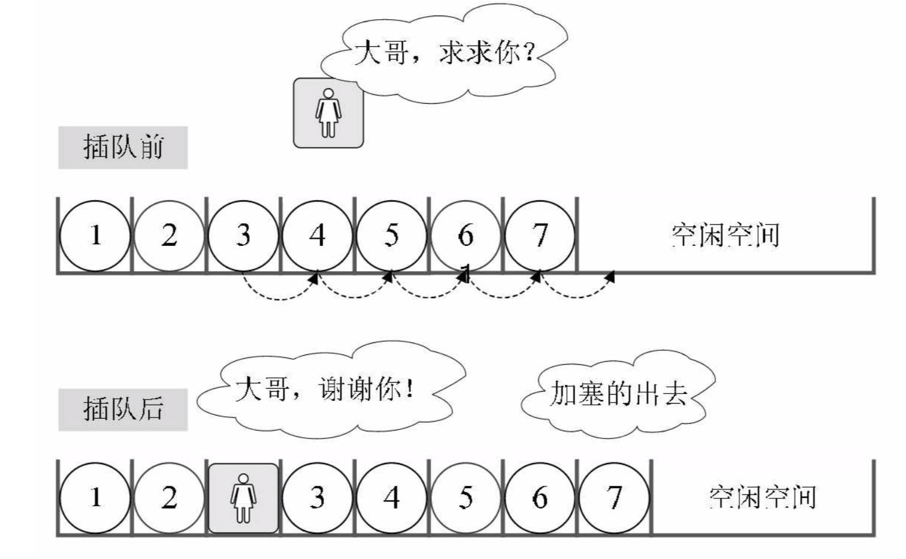
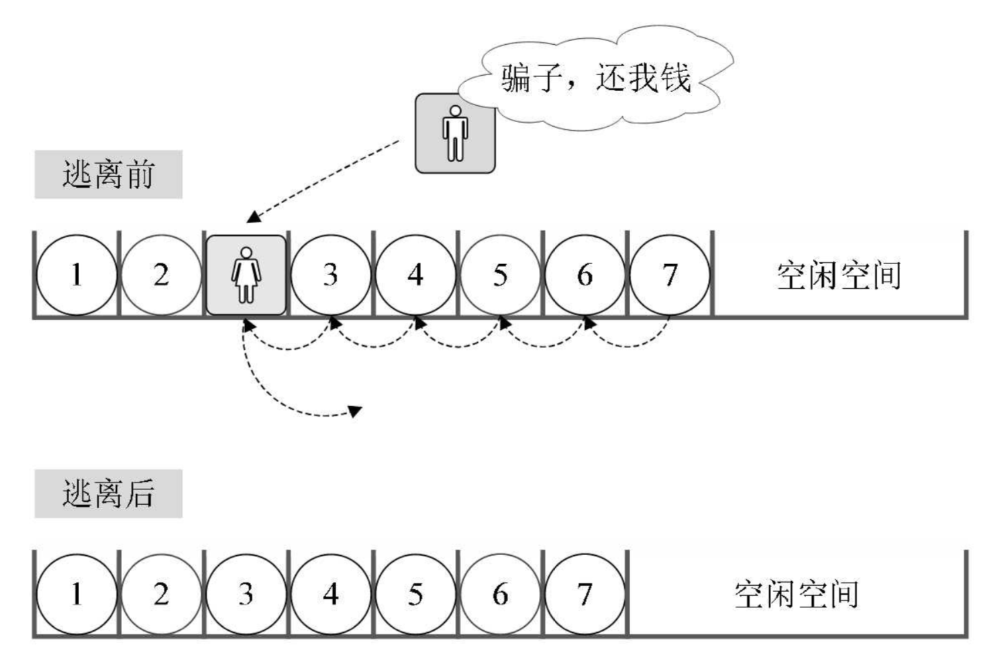

## 一 顺序表概述

线性表只是一种逻辑结构，在物理上它的存储可以是顺序的也可以是链式的。  

顺序表：
> 用一段地址连续的存储单元依次存储线性表的数据元素。  

如图所示：  

 

从上图可以看出，加入一个线性表占据了c个存储单元，那么第i个元素的存储位置为：  

LOC(a<sub>i</sub>) = LOC(a<sub>1</sub>) + (i - 1) * c   

通过上述公式，可以随时计算出顺序表中任意位置的地址，不管是最后一个还是第一个，都是相同的时间。  

顺序表的每一个数据元素的存储位置都和线性表起始位置相差一个和数据元素在线性表中的位序成正比的常熟。即只要确定了存储顺序表的起始位置，顺序表内人一个数据元素都可以随机存取，我们称这个中结构为随机存储结构。   

## 二 顺序表的存取 

插入：  
  

删除：  
    

如果元素插入到最后一个位置，或者删除最后一个位置，那么之前的数据元素无需排序，此时是最好的情况，时间复杂度为O(1)，因为不需要移动元素。如果是其他情况，则所有的数据元素都要进行移动，这个时间复杂度为O(n)。  

**总结**：
- 顺序表在修改、读入数据元素时，时间复杂度是O(1)，因为是一段连续的内存，直接可以通过索引获得。贴士：修改读入也即存取
- 顺序表在插入、删除数据元素时，时间复杂度是O(n)，因为需要重新移动位置

## 三 顺序表的实现

### 3.0 顺序表的抽象数据类型

在高级语言中，数组也具备随机存储的特性，因此通常使用数组来描述数据结构中的顺序存储结构，这里定义顺序表对象名为：SqList

### 3.1 C语言实现

线性表的长度可变，且需要的最大存储空间随问题的不同而不同，在C语言中可用动态分配的一维数组来实现顺序表。由于C没有面向对象思想，也会出现文件重复引入问题，笔者对对应函数都适当的加了对应数据结构前缀：

```c

```

### 3.2 Go语言实现

在Go语言中，有数组和切片两种较为常见的数据结构，数组的长度不可变，切片的长度可变（因为切片底层是一个数组和指针），使用数组与切片都可以模拟出顺序结构线性表。但是由于线性表要求长度可以不断增加，笔者这里使用切片来描述。  

```go
// 线性表结构体对象		由于Go没有泛型，这里很难实现：调用者传递一个数组参数的方式New一个SequenList，只能定死如下一个整型数组
type SequenList struct {
	size int									// 该线性表最大容量
	length int									// 该线性表最大长度
	data [10]int								// 线性表内数据，这里为了演示默认设置为10长度的int数组，所有元素默认为0(Go的0值机制)
}

// 创建线性表实例    按笔者认为这里应该传入一个泛型数组，通过泛型数组来更高抽象顺序表	
func NewSequenList() *SequenList {
	
	var arr [10]int

	return &SequenList{
		size: 10,
		length: 0,
		data: arr,
	}
}

// 打印线性表
func (sl *SequenList)Show() {
	fmt.Println(sl)
}

// 插入元素：从末尾append一个数据
func (sl *SequenList)Append(data int)  error{

	// 判断空间是否已满
	if sl.IsFull() {
		return errors.New("SequenList overflow")
	}

	sl.data[sl.length] = data
	sl.length++

	return nil
}

// 插入元素：任意位置插入元素
func (sl *SequenList)Insert(index int, data int) error {

	if sl.IsFull() {
		return errors.New("SequenList overflow")
	}

	if index < 0 || index > sl.length {
		return errors.New("index overflow")
	}

	// 这里如果按照正序循环则书写极其麻烦,从最后一位开始往后移动很简便
	for i := sl.length; i >= index; i-- {	

		if i == sl.length {					// 如果是在末尾插入 时间复杂度为O(1)
			sl.data[i] = data
			break
		}

		sl.data[i] = sl.data[i - 1]
	}

	sl.length++
	return nil
}

// 删除元素：从末尾pop一个数据
func (sl *SequenList)Pop() (int, error) {

	if sl.IsEmpty() {
		return 0, errors.New("SequenList is empty")
	}

	e := sl.data[sl.length - 1]
	sl.data[sl.length - 1] = 0
	sl.length --
	return e, nil
}

// 获取顺序表长度
func (sl *SequenList)Length() int{
	return sl.length
}

// 判断顺序表是否已满
func (sl *SequenList)IsFull() bool {
	if sl.length == sl.size {
		return true
	}
	return false
}

// 判断顺序表是否为空方法
func (sl *SequenList)IsEmpty() bool {
	if sl.length == 0 {
		return true
	}
	return false
}

// 获取顺序表容量
func (sl *SequenList)Size() int{
	return sl.size
}

```

### 3.3 JavaScript实现