 ## 一 链表

### 1.1 链表概述

回顾顺序表：  

顺序表的底层由数组实现，顺序表逻辑关系上的相邻元素在物理位置上也相邻，这让顺序白可以随机存取表中任一元素，但是在很多编程语言中，数组的长度是固定的，所以当数组已被数据填满时，再要加入新的元素就会非常困难。在数组中，添加和删除元素也很麻烦，因为需要将数组中的其他元素向前或向后移动。   

上述问题出现的原因是：所有的元素存储位置都是相邻的，中间没有缝隙，也就不能快速插入，同样，删除后留下的空隙也需要弥补上。  

链表：
> 用一组任意的存储单元存储线性表中的数据元素，其存储单元可以是连续的，也可以是不连续的

如图所示：  
   

总结：对于插入或者删除数据越频繁的操作，链表的效率优势越明显。  

### 1.2 链表的节点  

链表的定义意味着链表的数据元素可以利用内存中未被占用的任意位置，那么我们需要知道数据元素的前驱、后继时就无法像顺序表那样直接利用索引来查询了，所以在链表的数据结构中，除了要存储数据元素信息外，至少还要存储它的后继元素的存储地址。  

结点node：
> 链表中的每个数据元素a<sub>i</sub>，既要存储本身信息，也要存储后继信息，这两部分组成的数据元素a<sub>i</sub>称为结点（node）

一个节点包含两个域：
- 数据域：存储数据元素信息
- 指针域：存储直接后继的位置，指针域中存储的信息称为指针或者链

n个节点链结成了一个链表，即是线性表的链式存储结构。  

## 二 头指针域头结点

在顺序表中，我们申请了一个数组，并使用引用变量表示该数组，链表中这些无数的数据无法也需要一个引用数据来标识。头指针即是指向链表第一个元素的指针，沿着头指针可以直接查找到链表中的所有元素位置，所以可以在数据结构中使用头指针来表示链表。  

如下图所示：  
  
  


为了方便对链表进行操作，有时候会在单链表的第一个节点前附设一个结点，称为头节点。头节点的数据域一般不存储任何信息，或者存储如线性表的长度等附加信息。头节点的指针域存储指向第一个节点的指针。  

如图所示：   

 
  

头指针：
- 指向第一个节点的指针，若链表有头节点，则指向头节点
- 头指针具备标识作用，常用头指针冠以链表的名字
- 无论链表是否为空，头指针均不为空，是必要元素

头节点：
- 为了操作的统一设立，放在第一个节点之前，一般没有实际意义
- 有了头结点，第一节点前插入、删除第一节点等操作会更加简便
- 头节点不是链表必备元素 

## 三 单链表  

单链表：
> 链表的指针域中只包含一个指针域，即称为线性链表或者单链表

单链表的最后一个元素没有直接后继，即其指针为空。  

但是如果我们不知道第i个结点的位置，单链表数据结构在插入和删除操作上，与线性表的顺序存储结构相比没有太大优势。一旦知道精确的位置，无论插入多少个元素，找到第i位置的指针复杂度为O(n)，但是插入只是简单的移动指针，时间复杂度都是O(1)，而顺序表，每次移动都是O(n)。  

## 四 单链表抽象数据类型

**笔者语**：  
```
在链表的描述中，链表可以带头结点，也可以不带头结点，头结点是为了额外存储链表的一些信息、以及解决第一结点前插入问题所做的设计。  
笔者认为严本（严蔚敏《数据结构》）这样说是建立在C语言的基础上，C语言没有面向对象机制，链表的具体存储信息实现起来较为麻烦。
而在Go、JS等现代语言中，笔者认为我们完全可以不必纠结这些说法，链表对象本身就可以存储很多数据，内部附加一个对链表的头指针引用，即无需头结点。
而且带了头结点的链表，在循环上需要额外跳过头结点，增加了细节处理的复杂度，在处理具体业务时也会遇到困难，尤其是 约瑟夫环问题！
```

笔者非常不喜欢严本以及衍生教材的链表设计，并为链表做了新版的对象模型。结点名统一为Node，链表结构为LinkList，LinkList内部本身维护着一个头结点，这样就能避免很多上述的缺点。   

笔者的链表实现如图所示：  

 

贴士：当然严本的链表设计思路也有可取之处，尽量减少了不必要的存储空间。


