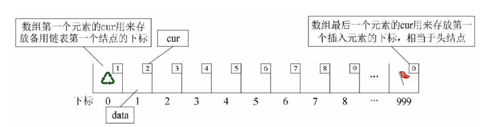

## 一 静态链表

#### 1.1 静态链表由来

有些编程语言没有指针的概念，单链表的实现就会出现困难。但是可以另辟蹊径，使用数组描述单链表及其元素，数组中每个元素都由data和cur表示，cur表示单链表中的next指针，存放该元素的后继在数组中的下标，我们把cur叫做游标，这种用数组描述的链表叫做静态链表，也叫游标实现法。  

#### 1.2 静态链表特点

- 方便插入数据，通常会把数组建立的大一些，以便有一些空闲空间可以便于插入时不溢出
- 数组的第一个和最后一个元素不存储数据，未被使用的数组元素称为备用链表。数组的第一个元素下标为0，其cur存储第一个结点的下标。 
- 非随机存取

  

## 二 静态链表实现  
```go
// 节点结构体
type node struct {
	data interface{}
	cur  int 				// 游标：为0时表示无指向
}

// 静态链表
type StaticList struct {
	data     []node
	size int
	length  int
}

func New(size int) (*StaticList, error){

	if size < 3 {
		return nil, errors.New("size overflow")
	}

	s := make([]node, size)

	for i := 0; i <= size-1; i++ {
		s[i].cur = i + 1
		if i == size - 1 {
			s[size-1].cur = 0 
		}
	}

	return &StaticList{s, size, 0},nil 
}

// 判断是否为空
func (sl *StaticList) IsEmpty() bool {
	if sl.length == 0 {
		return true
	}
	return false
}

// 分配节点
func (sl *StaticList) malloc() int {
	i := sl.data[0].cur
	if i == 0 {
		os.Exit(0)
	}
	sl.data[0].cur = sl.data[i].cur
	return i
}

// 回收节点
func (sl *StaticList) free(index int) {
	sl.data[index].cur = sl.data[0].cur
	sl.data[0].cur = index
}

// 回收链表到备用链表
func (sl *StaticList) DestroyList() {

	j := sl.data[sl.size-1].cur

	if j == 0 {
		return
	}

	sl.data[sl.size-1].cur = 0

	i := sl.data[0].cur
	sl.data[0].cur = j
	if j > 0 {
		j = sl.data[j].cur
	}
	sl.data[j].cur = i
}

// 插入节点
func (sl *StaticList) Insert(data interface{}, index int) error{

	if index < 1 || index > sl.length {
		return errors.New("index overflow")
	}

	i := sl.data[sl.size-1].cur
	j := 1
	for i > 0 && j < index-1 {
		j++
		i = sl.data[i].cur
	}
	tmp := sl.data[i].cur
	cur := sl.malloc()
	sl.data[cur].data = data
	sl.data[cur].cur = tmp
	sl.data[i].cur = cur
	return nil
}

// 显示链表结构
func (sl *StaticList) Show() {
	for i, v := range sl.data {
		fmt.Printf("%5d:%5d,%5s", i, v.cur, v.data)
	}
}

// 获取数据元素位置
func (sl *StaticList) Location(data interface{}) int {
	location := 0
	i := sl.data[sl.size-1].cur
	for i > 0 {
		location++
		if sl.data[i].data == data {
			return location
		}
		i = sl.data[i].cur
	}
	return location
}

// 获取链表长度
func (sl *StaticList) Length() int {
	return sl.length
}

// 获取链表容量
func (sl *StaticList) Size() int {
	return sl.size
}
```