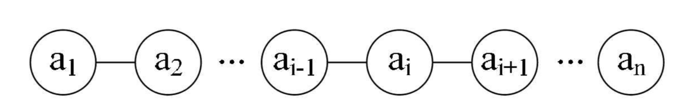

## 一 线性表概念 

线性表（linear_list）：零到多个数据元素组成的有限序列，即线一样性质的表。 

概念的解释：
- 序列：元素之间是有序的，若元素存在多个，则第一个元素无前驱，最后一个元素无后继，其他每个元素都有且只有一个前驱和后继，即相邻元素间是一对一关系  
- 有限：元素的数量是有限的，不过计算机中的对象都是有限的，无限数列只存在于数学概念中 

线性表图示：

线性表的元素的个数为n（n>=0），n即是线性表的长度，n=0时，即为空表。在非空表中，上述的i是元素的位序。  

线性表在日常生活中的案例：幼儿园小朋友手拉手排队过马路：每个人记着自己的前一位和后一位。  

在复杂的线性表中，一个数据元素有多干数据项（item）组成，此时常把数据元素称为记录（record），含有大量记录的线性表又称为文件（file）。比如上述案例中，每个小朋友都其实是一个数据元素，但是这个小朋友本身也拥有很多自己的属性：名字、年龄、性别等。  

注意：同一个线性表中的元素必定有相同的特性，即属于同一数据对象，且响铃数据元素之间存在序偶关系。

## 二 线性表的划分

按照物理存储结构划分，线性表分为:
- 顺序表：顺序结构存储
- 链式表：链式结构存储

链式表按照逻辑存储结构划分，线性表分为：
- 静态链表：有些语言没有指针，或者在不使用指针时，为了描述链表的插入删除操作，使用数组来存储链表数据，这样的链表是静态链表
- 动态链表：包括常见的单链表，双向链表，循环链表等

## 三 线性表与数组的区别

- 在物理上：数组是顺序存储结构，线性表可以使用顺序存储，也可以使用链式存储
- 在逻辑上：数组并不一定是线性的，因为其元素可以是结构，枚举，类等，而线性表在逻辑上必定是线性的（后续各种数据结构大多是基于逻辑而命令）。
- 容量上：数组的长度一般是固定的，而链表的长度支持动态改变，可以随时删减添加，并且能够知道元素个数。
- 维度上：数组是有维度的，二维数组等明显和线性表不同