# 03-单链表

## 一 链表

### 1.1 链表概述

顺序表的底层由数组实现，顺序表逻辑关系上的相邻元素在物理位置上也相邻，这让顺序白可以随机存取表中任一元素，但是在很多编程语言中，数组的长度是固定的，所以当数组已被数据填满时，再要加入新的元素就会非常困难。在数组中，添加和删除元素也很麻烦，因为需要将数组中的其他元素向前或向后移动。

上述问题出现的原因是：所有的元素存储位置都是相邻的，中间没有缝隙，也就不能快速插入，同样，删除后留下的空隙也需要弥补上。

链表：

> 用一组任意的存储单元存储线性表中的数据元素，其存储单元可以是连续的，也可以是不连续的

最简单的链式结构就是单向链表，如图所示：  


对于插入或者删除数据越频繁的操作，链表的效率优势越明显。

### 1.2 链表的节点

链表的定义意味着链表的数据元素可以利用内存中未被占用的任意位置，那么我们需要知道数据元素的前驱、后继时就无法像顺序表那样直接利用索引来查询了，所以在链表的数据结构中，除了要存储数据元素信息外，至少还要存储它的后继元素的存储地址。

结点 node：

> 链表中的每个数据元素 $a_i$，既要存储本身信息，也要存储后继信息，这两部分组成的数据元素 $a_i$ 称为结点（node）

一个结点包含两个域：

- 数据域：存储数据元素信息
- 指针域：存储直接后继的位置，指针域中存储的信息称为指针或者链

n 个节点链结成了一个链表，即是线性表的链式存储结构。

## 二 头指针与头结点

### 2.1 头指针

头指针即是指向链表第一个元素的指针，沿着头指针可以直接查找到链表中的所有元素位置，所以可以在数据结构中使用头指针来表示链表。

如下图所示：



头指针指向第一个节点（首元节点），是链表的标识，常用头指针冠以链表的名字，所以头节点是链表必备的！

### 2.2 头节点

为了方便对链表进行操作，有时候会在链表的第一个节点前附设一个结点，称为头节点。头节点的数据域一般不存储任何信息，或者存储如线性表的长度等附加信息。头节点的指针域存储指向第一个节点的指针。

如图所示：



如果一个链表带有头节点，则头指针指向头节点（因为头节点是第一个节点）。

头节点不是链表必备的，头节点的存在是为了方便操作，如：第一个节点的插入、第一个节点的删除在有头节点时操作更简单。

有些场景下，也会有尾节点，链表最后一个元素指向尾节点 ，尾结点的 next 为空，这样的行为均是为了一些操作的简便。

## 三 单链表

### 3.1 单链表定义

单链表：

> 链表的指针域中只包含一个指针域，即称为线性链表或者单链表

单链表的最后一个元素没有直接后继，即其指针为空，带头节点的单链表如下所示：



但是如果我们不知道第 i 个结点的位置，单链表数据结构在插入和删除操作上，与线性表的顺序存储结构相比没有太大优势。一旦知道精确的位置，无论插入多少个元素，找到第 i 位置的指针复杂度为 O(n)，但是插入只是简单的移动指针，时间复杂度都是 O(1)，而顺序表，每次移动都是 O(n)。

### 3.2 单链表特点总结

1）单链表的数据元素的逻辑顺序与物理顺序可能不一致，只能依靠结点的指针将各个数据元素连接起来

2）单链表的长度是可以扩充的

3）对单链表的遍历、查找只能从头指针指向的首元节点开始，然后逐个访问

4）插入删除很方便，因为只需要修改相关结点的指针域即可

5）由于表内额外存储了指针域，同样的数据，比顺序表占据空间更多

### 3.3 单链表抽象数据类型

定义链单链表每个节点名为 Node，其链表名为 LinkList，这里采用带头结点的做法。

取巧的地方是：LinkList 本身其实可以看做一个 Node，即头结点，内部的指针域是链表的首元节点，数据域是链表的长度。

如下所示：

```c++
typedef int DataType;
typedef struct Node{
    DataType        data;       // 结点存储的书
    struct Node     *next;      // 结点指针
}Node, LinkList;

// 创建节点
Node newNode(DataType data){
    Node *node = malloc(sizeof(Node));
    if(node == NULL){
        printf("申请结点内存失败");
        exit(1);
    }
    node->data = data;
    return *node;
}

// 创建单链表
LinkList newLinkList(){
    // 申请链表内存：其本身其实就是创建了一个头节点
    LinkList *L = newNode(0);
    return *L;
}
```

## 四 单链表 C 实现

这里设计一个带头节点的单链表，便于操作：

```c++

```

## 附 单链表其他语言实现

### Go 实现

```go
/*
 *  单链表：带头节点
 */
package list

import (
 "fmt"
)

// 结点结构体
type LinkedNode struct {
 data interface{}
 next *LinkedNode
}

// 单链表结构体
type LinkedList struct {
 head *LinkedNode  // 头节点，头节点之后的第一个节点可以称呼为首元节点
}

// 构造表
func NewLinkedList() *LinkedList {
 head := &LinkedNode{
  data: 0,    // 这里使用头节点存储链表的长度，不包含头节点
  next: nil,
 }
 return &LinkedList{
  head:  head,
 }
}

func (l *LinkedList)PushBack(e interface{}) {
 // 构造要插入的节点
 insertNode := &LinkedNode{
  data: e,
  next: nil,
 }
 // 当前循环到的节点
 currentNode := l.head
 for currentNode.next != nil {
  currentNode = currentNode.next
 }
 currentNode.next = insertNode
 l.head.data = l.head.data.(int) + 1
}

func (l *LinkedList)PushFront(e interface{}) {
 // 构造要插入的节点
 insertNode := &LinkedNode{
  data: e,
  next: nil,
 }
 insertNode.next = l.head.next
 l.head.next = insertNode
 l.head.data = l.head.data.(int) + 1
}

// 插入元素
func (l *LinkedList)Insert(index int, e interface{}) bool {

 if index < 1 || index > l.Length() + 1 {
  fmt.Println("插入位序不正确")
  return false
 }

 if index == 1 {
  l.PushFront(e)
  return true
 }

 if index == l.Length() + 1 {
  l.PushBack(e)
  return true
 }

 // 构造要插入的节点
 insertNode := &LinkedNode{
  data: e,
  next: nil,
 }

 // 找到要插入位置的前一个节点
 prevNode := l.head
 for i := 1; i <= index - 1; i++ {
  prevNode = prevNode.next
 }

 // 执行插入
 insertNode.next = prevNode.next
 prevNode.next = insertNode
 return true
}

// 删除元素
func (l *LinkedList)Delete(e interface{}) bool {

 // 找到该元素
 delNode := l.curNode(e)
 if delNode == nil {
  fmt.Println("未找到该元素")
  return false
 }

 // 获取前驱：这时候就是单链表的不足了，必须再次循环，或者在查找节点的时候制作多返回值
 prevNode := l.prevNode(e)
 if prevNode == nil {
  fmt.Println("未找到前驱元素")
  return false
 }

 prevNode.next = delNode.next
 l.head.data = l.head.data.(int) - 1
 return true

}

// 根据元素获取节点
func (l *LinkedList)curNode(e interface{}) *LinkedNode {

 if l.Length() <= 0 {
  fmt.Println("链表为空")
  return nil
 }

 currentNode := l.head
 for currentNode.next != nil {
  currentNode = currentNode.next
  if currentNode.data == e {
   return currentNode
  }
 }

 fmt.Println("未找到该元素")
 return nil
}

// 获取前驱节点：注意是节点，不是值，有了节点，再写取值方法、任意位置插入方法也很方便
func (l *LinkedList)prevNode(e interface{}) *LinkedNode {

 if l.Length() <= 0 {
  fmt.Println("链表为空")
  return nil
 }

 // 注意：如果没有头节点，还需要额外判断是否是首元素，因为首元素无前驱
 currentNode := l.head
 var prevNode *LinkedNode
 for currentNode.next != nil {
  prevNode = currentNode
  currentNode = currentNode.next
  if currentNode.data == e {
   return prevNode
  }
 }

 fmt.Println("未查找到当前节点")
 return nil
}

// 获取后继节点：注意是节点，不是值，有了节点，再写取值方法、任意位置插入方法也很方便
func (l *LinkedList)nextNode(e interface{}) interface{}{

 if l.Length() <= 0 {
  fmt.Println("链表为空")
  return nil
 }

 currentNode := l.head
 for currentNode.next != nil {
  currentNode = currentNode.next
  if currentNode.data == e {
   if currentNode.next == nil {
    fmt.Println("末尾元素无后继节点")
    return nil
   } else {
    return currentNode.next
   }
  }
 }
 fmt.Println("未查找到当前节点")
 return nil
}


// 获取长度
func (l *LinkedList)Length() int {
 return l.head.data.(int)
}

// 清空
func (l *LinkedList) Clear() {
 l.head.data = 0
 l.head.next = nil
}
```
