# 04-循环链表

## 一 循环链表

循环链表（circular linked list）是另外一种形式的线性链表，其特征是：最后一个结点的指针域不再指向 NULL，而是指向首元结点，整个链表形成了一个闭合的环。

由上可得知：在循环链表中从任意一个结点出发，均可以找到其他的结点。如图所示一个带头结点的循环链表：



## 二 循环链表制作思路

循环链表的操作和线性表一致，差别进在于算法中循环的条件不再是 `p->next == NULL` ，而是 `p->next == head`。

对于空表来说：首元结点指针域指向自己。

有时，循环链表中还会设定尾指针，可以让一些操作简化，如合并两个链表时，仅需要将一个表的表尾和另一个表的表头相接，如果有尾指针，其时间复杂度就是 O(1)。同样插入头部、尾部的时间复杂度也都降低到了 O(1)。

## 三 循环链表 C 实现

这里为了与其他章节呼应，仍然采用带头结点的循环链表。

头文件：

```c++
/**
 * 循环链表
 */

typedef int DataType;

// 经典教材写法
// typedef struct Node {
//     DataType            data;   // 结点数据
//     struct Node         *next;  // 指向下一个结点的指针
// } Node, *CircleList;

typedef struct Node{
    DataType        data;       // 结点存储的书
    struct Node     *next;      // 结点指针
} Node;

typedef struct{
    Node            *head;      // 头指针
    int             size;     // 元素个数：约定这里排除头结点
} CircleList;


Node* newNode(DataType data);
CircleList* newCircleList();
int insert(CircleList *L, DataType e, int index);
int delete(CircleList *L, int index, DataType *e);
void update(CircleList *L, int index, DataType e);
Node* search(CircleList *L, DataType e);
Node* locate(CircleList *L, int index);
int length(CircleList *L);
void clear(CircleList *L);
void destroy(CircleList *L);
void display(CircleList *L);
```

具体实现：

```c++
/**
 * 循环链表
 */

#include <stdio.h>
#include <stdlib.h>
#include "CircleList.h"

// 创建结点
Node* newNode(DataType data) {
    Node *node = malloc(sizeof(Node));
    if(node == NULL){
        printf("申请结点内存失败\n");
        exit(1);
    }
    node->data = data;
    node->next = NULL;
    return node;
}

// 创建循环链表
CircleList* newCircleList(){
    // 创建头节点，返回头指针
    Node *head = newNode(0);
    head->next = head;  // 循环链表！！！！！

    CircleList *L = malloc(sizeof(CircleList));
    if(L == NULL){
        printf("申请单链表内存失败\n");
        exit(1);
    }

    L->head = head;
    L->size = 0;
    return L;
}

// 增：插入结点
// 约定：插入时，只能在头结点之后插入，也不允许插入超过最大元素个数的位置
int insert(CircleList *L, DataType e, int index){
    if(index < 1 || index > L->size + 1){
        printf("插入位置不合法\n");
        return -1;
    }

    // 找到插入位置前一个位置：也可以使用 locate函数
    Node *p = L->head;
    int k = 0;
    while(p->next != L->head && k < index - 1){
        p = p->next;
        k++;
    }

    // 创建要插入的节点
    Node *q = newNode(e);
    q->next = p->next;
    p->next = q;

    L->size++;
    return 1;
}

// 删：根据位置删除，返回被删除的元素
int delete(CircleList *L, int index, DataType *e){

    if(index < 1 || index > L->size){
        printf("删除位置非法\n");
        return -1;
    }

    // 找到删除位置前一个位置：也可以使用 locate函数
    Node *p = L->head;
    int k = 0;
    while(p->next != L->head && k < index - 1){
        p = p->next;
        k++;
    }

    // 执行删除
    Node *q = p->next;
    *e = q->data;
    p->next = q->next;
    free(q);

    L->size--;  // 不要忘记存储的长度-1
    return 0;
}

// 改
void update(CircleList *L, int index, DataType e){
    Node *p = locate(L, index);
    if(p == NULL){
        return;
    }
    p->data = e;
}

// 查：根据值查询结点地址
Node* search(CircleList *L, DataType e){
    Node *p = L->head;
    while(p->next != L->head){
        if(p->data == e){
            return p;
        }
        p = p->next;
    }
    return NULL;
}

// 定位
Node* locate(CircleList *L, int index){
    if(index < 0 || index > L->size + 1){
        printf("获取位置不合法\n");
        return NULL;
    }

    Node *p = L->head;
    int k = 0;
    while(p->next != L->head && k < index){
        p = p->next;
        k++;
    }
    return p;
}

// 获取表长度:没有头结点一般使用循环获取长度
int length(CircleList *L){
    return L->size;
}

// 清空表:仅保留头结点
void clear(CircleList *L){
    Node *p = L->head;
    while(p->next != L->head){
        Node *q = p->next;
        p->next = q->next;
        free(q);
    }
    L->head->next = L->head;    // 重新指定头结点循环
    L->size = 0;
}

// 销毁表
void destroy(CircleList *L){
    Node *p = L->head;
    while(p->next != NULL){
        Node *q = p->next;
        p->next = q->next;
        free(q);
    }
    free(L);
}

// 显示循环链表
void display(CircleList *L){
    if(L->size == 0){
        printf("空链表\n");
        return;
    }

    Node *p = L->head;
    int pos = 0;
    while(p->next != NULL){
        if(pos == L->size){
            printf("%d->%d->...\n", p->data, L->head->data);
            break;
        }
        printf("%d->", p->data);
        p = p->next;
        pos++;
    }
}
```

## 附 单链表其他语言实现

### Go 实现

```go
/**
 * 循环链表
 */

package list

import (
	"fmt"
)

// 循环链表结点类型
type CircleNode struct {
	data	interface{}
	next 	*CircleNode
}

// 循环链表
type CircleList struct {
	head	*CircleNode
	size  int
}

// 构造Node
func newCircleNode(e interface{}) *CircleNode{
	return &CircleNode {
		data: e,
		next: nil,
	}
}

// 构造循环链表
func NewCircleList() *CircleList{
	p := newCircleNode(0)
	p.next = p 	// 循环链表！！！
	return &CircleList{
		head: p,
		size: 0,
	}
}

// 增：插入结点
// 约定：带头结点的链表，插入时，只能在头结点之后插入，也不允许插入超过最大元素个数的位置
func (l *CircleList)Insert(e interface{}, index int){
	if index < 1 || index > l.size + 1 {
		fmt.Println("插入位置不合法")
		return
	}

	// 找到插入位置前一个位置：也可以使用 Locate函数
	p := l.head
	k := 0
	for p.next != l.head && k < index - 1 {
		p = p.next
		k++
	}

	// 创建要插入的节点
	q := newCircleNode(e)
	q.next = p.next
	p.next = q

	l.size++
}

// 删：根据位置删除，返回被删除的元素
func (l *CircleList)Delete(index int) interface{}{
	if index < 1 || index > l.size {
		fmt.Println("删除位置非法")
		return nil
	}

	// 找到删除位置前一个位置：也可以使用 Locate函数
	p := l.head
	k := 0
	for p.next != l.head && k < index - 1 {
		p = p.next
		k++
	}

	// 执行删除
	q := p.next
	tempData := q.data
	p.next = q.next

	l.size--
	return tempData
}

// 改
func (l *CircleList)Update(index int, e interface{}){
	p := l.Locate(index)
	if p == nil {
		return
	}
	p.data = e
}

// 查
func (l *CircleList)Search(e interface{}) *CircleNode{
	p := l.head
	for p.next != l.head {
		if p.data == e {
			return p
		}
		p = p.next
	}
	return nil
}

// 定位
func (l *CircleList)Locate(index int) *CircleNode{
	if index < 0 || index > l.size + 1 {
		fmt.Println("获取位置不合法")
		return nil
	}

	p := l.head
	k := 0
	for p.next != l.head && k < index {
		p = p.next
		k++
	}
	return p
}

// 获取表长度
func (l *CircleList)Length() int {
	return l.size
}

// 清空表：仅保留头节点
func (l *CircleList)Clear() {
	l.head.next = l.head
	l.size = 0
}

// 显示循环链表
func (l *CircleList)Display(){
	if l.size == 0 {
		fmt.Println("空链表")
		return
	}

	p := l.head
	pos := 0
	for p.next != nil {
		if pos == l.size {
			fmt.Print(p.data, "->", l.head.data, "->...\n", )
			break
		}
		fmt.Print(p.data, "->")
		p = p.next
		pos++
	}
}
```

### JS 实现

```js
/**
 * 循环链表
 */

class Node {
    constructor(data) {
        this.data = data
        this.next = null
    }
}

class CircleList {
    constructor() {
        let p = new Node(0)
        p.next = p
        this.head = p
        this.size = 0
    }
    // 增：插入结点
    // 约定：带头结点的链表，插入时，只能在头结点之后插入，也不允许插入超过最大元素个数的位置
    insert(e, index) {
        if (index < 1 || index > this.size + 1) {
            console.log('插入位置不合法')
            return
        }

        // 找到插入位置前一个位置：也可以使用 Locate函数
        let p = this.head
        let k = 0
        while (p.next != this.head && k < index - 1) {
            p = p.next
            k++
        }

        // 创建要插入的节点
        let q = new Node(e)
        q.next = p.next
        p.next = q

        this.size++
    }
    // 删：根据位置删除，返回被删除的元素
    delete(index) {
        if (index < 1 || index > this.size) {
            console.log('删除位置非法')
            return
        }
        // 找到删除位置前一个位置：也可以使用 Locate函数
        let p = this.head
        let k = 0
        while (p.next != this.head && k < index - 1) {
            p = p.next
            k++
        }
        // 执行删除
        let q = p.next
        let tempData = q.data
        p.next = q.next

        this.size--
        return tempData
    }
    // 改
    update(index, e) {
        let p = this.locate(index)
        if (!p) {
            return
        }
        p.data = e
    }
    // 查
    search(e) {
        let p = this.head
        while (p.next != this.head) {
            if (p.data == e) {
                return p
            }
            p = p.next
        }
    }
    // 定位
    locate(index) {
        if (index < 0 || index > this.size + 1) {
            console.log('获取位置不合法')
            return
        }

        let p = this.head
        let k = 0
        while (p.next != this.head && k < index) {
            p = p.next
            k++
        }
        return p
    }
    // 获取长度
    length() {
        return this.size
    }
    // 清空表
    clear() {
        this.head.next = this.head
        this.size = 0
    }
    // 显示表
    display() {
        if (this.size == 0) {
            console.log('空链表')
            return
        }

        let p = this.head
        let pos = 0
        let res = ''
        while (p.next) {
            if (pos == this.size) {
                res += p.data
                res += '->'
                res += this.head.data
                res += '->...'
                break
            }
            res += p.data
            res += '->'
            p = p.next
            pos++
        }
        console.log(res)
    }
}
```
