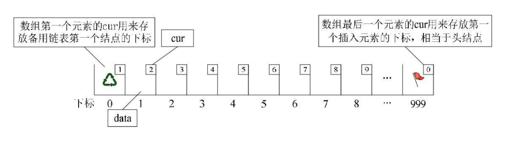

## 一 静态链表概述

在具备指针概念的语言，如Go、C、C++中，由于指针的存在，能够灵活的操作内存中的地址和数据。Java、JavaScript等语言虽然不具备指针，但是其对象引用机制其实也间接具备了指针的很多功能。  

但对于一些上古语言，如Basic、Fortran，完全没有指针的概念，链表的实现就会出现困难。  

我们可以另辟蹊径，使用数组描述单链表及其元素：
- 数组中每个元素可以看做一个节点结构，包含 data 和 cur 
- data：存储该节点存储的数据
- cur：存储该节点的下一个节点结构的索引，相当于链表中的 next指针

这种用数组的游标描述的链表叫做静态链表，也叫链表的游标实现法。  

静态链表需要预先分配一个较大的空间，但是在做插入和删除时无需移动数组内部的元素，仅需要修改元素的游标即可！故仍具有链式存储结构的优点。  

## 二 静态链表的实现解释

静态链表初始化时的结构：  
  

静态链表插入元素的结构(假如存在 以下数据)：  
   

此时“甲”这里就存有下一元素“乙”的游标2， “乙”则存有下一元素“丁”的下标3。 而“庚”是最后一个有值元素， 所以它的cur设置为0。 而最后一个元素的cur则因“甲”是第一有值元素而存有它的下标为1。 而第一个元素则因空闲空间的第一个元素下标为7， 所以它的cur存有7。  

## 三 静态链表的优缺点

优点：
- 在插入和删除时，只需要修改游标，不需要移动元素，改进了顺序存储结构中插入和删除元素需要移动大量元素的缺点

缺点：
- 没有解决连续存储分配带来的表长难以确定问题
- 失去了顺序存储结构随机存取的特性