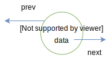

# 05-双向链表

## 一 双向链表

单链表和循环链表的结点都仅仅只有一个指示后继的指针域，查找后继的时间复杂度为 O(1)，而查找前驱的时间复杂度为 O(n)，因为每次都要从头开始遍历查找。

为了解决链表中访问直接前驱问题，单链表中的每个节点可以使用两个指针：

-   next：后继指针，这是单链表节点原有的指针
-   prev：前驱指针，额外引入的指向上一个结点的指针

如图所示：



有了这两个指针的链表可以称为双向链表（简称双链表）。**在双链表中，查找前驱、后继的时间复杂度都为$O(1)$**。

## 二 双向循环链表

双向链表通常使用带头结点的方式实现，为了查找其节点的前驱、后继，首元节点的 prev 指针指向其最后一个元素，最后一个元素的 next 指针指向首元节点。这样的链表称为 双向循环链表。

如图所示：



如果一个双向循环链表为空，则其头节点的前驱、后继都是自己。

**实际开发中，双向循环链表由于各项性能较高，使用较为广泛**。

## 三 双向循环链表的操作实现

由于循环链表比起单链表的改变，大多情况下都是`while()`中判断结点 next 是否为空，改变为结点 next 是否为头结点即可，所以笔者这里就不再书写简单的循环链表等数据结构。

## 四 双向循环链表的 C 语言实现

头文件：

```c++

```

具体实现：

```c++

```

## 附 其他语言的实现

### Go 语言实现

```go
/*
*  双向循环链表：带头结点的双向链表
*/
package list

import (
 "fmt"
)

// 结点结构体
type DCircleNode struct {
 data  interface{}
 next  *DCircleNode
 prev  *DCircleNode
}

// 单链结构体
type DCircleList struct {
 head   *DCircleNode // 该双向循环链表的头结点
 length int    // 笔者这里不再像单向链表那样把元素个数存储在头结点中
}

// 构造表
func NewDCircleList() *DCircleList {
 head := &DCircleNode{
  data: 0,
  next: nil,
  prev: nil,
 }
 head.next = head
 head.prev = head

 return &DCircleList{
  head:   head,
  length: 0,
 }
}

func (l *DCircleList)PushBack(e interface{}) {
 // 构造要插入的结点
 insertNode := &DCircleNode{
  data: e,
  next: l.head,
  prev: nil,
 }
 // 当前循环到的结点
 currentNode := l.head
 for currentNode.next != l.head {   // 循环链表的末尾结束标志是 不等于 l.head
  currentNode = currentNode.next
 }
 currentNode.next = insertNode
 insertNode.prev = currentNode
 l.length++
}

func (l *DCircleList)PushFront(e interface{}) {

 // 构造要插入的结点
 insertNode := &DCircleNode{
  data: e,
  next: nil,
  prev: l.head,
 }

 if l.Length() == 0 {
  insertNode.next = l.head
  l.head.prev = insertNode
  l.head.next = insertNode
  l.length++
  return
 }

 // 插入位置的后继结点更改
 nextNode := l.head.next
 nextNode.prev = insertNode
 insertNode.next = nextNode

 // head结点更改
 l.head.next = insertNode
 l.length++
 return
}

// 插入元素
func (l *DCircleList)Insert(index int, e interface{}) bool {

 if index < 1 || index > l.length + 1 {
  fmt.Println("插入位序不正确")
  return false
 }

 if index == 1 {
  l.PushFront(e)
  return true
 }

 if index == l.Length() + 1 {
  l.PushBack(e)
  return true
 }

 // 常规插入:先获取插入位子
 currentNode := l.head
 for i := 1; i <= index; i++ {
  currentNode = currentNode.next
 }
 prevNode := currentNode.prev

 // 执行插入
 insertNode := &DCircleNode{
  data: e,
  next: currentNode,
  prev: prevNode,
 }
 currentNode.prev = insertNode
 prevNode.next = insertNode
 l.length++
 return true
}

// 获取长度
func (l *DCircleList)Length() int {
 return l.length
}

// 清空
func (l *DCircleList)Clear() {
 l.head.next = l.head
 l.head.prev = l.head
 l.length = 0
}
```

### JS 实现
