# 06-静态链表

## 一 静态链表概述

在具备指针概念的语言，如 Go、C、C++中，由于指针的存在，能够灵活的操作内存中的地址和数据。Java、JavaScript 等语言虽然不具备指针，但是其对象引用机制其实也间接具备了指针的很多功能。但对于一些上古语言，如 Basic、Fortran，完全没有指针的概念，链表的实现就会出现困难。

我们可以另辟蹊径，使用数组描述单链表及其元素，即：数组中每个元素可以看做一个结点结构，包含数据 data 与指针 cur：

- data：存储该结点存储的数据
- cur：其实就是数组下标，表示直接后继元素所在数组中的位置

这种用数组的游标描述的链表叫做**静态链表**，也叫链表的**游标实现法**。

静态链表需要预先分配一个较大的空间，但是在做插入和删除时无需移动数组内部的元素，仅需要修改元素的游标即可！故仍具有链式存储结构的优点。

## 二 静态链表的实现解释

### 2.1 静态链表基本结构

静态链表结构如图：



解释如下：

- 通常静态链表会将第一个数据元素放到数组下标为 1 的位置中
- 数组索引 0 位置的 cur 存储的是没有存放数据的第一个元素，即下标为 4 的元素
- 其他元素的游标都是直接指向它的下一个元素的下标
- 末尾元素的 cur 可以存放首个有值数据的索引

### 2.2 备用链表

静态链表中，除了数据本身通过游标组成的链表外，还需要有一条连接各个空闲位置的链表，称为备用链表。备用链表的作用是回收数组中未使用或之前使用过（目前未使用）的存储空间，留待后期使用。

也就是说，静态链表使用数组申请的物理空间中，存有两个链表，一条连接数据，另一条连接数组中未使用的空间。

通常，备用链表的表头位于数组下标为 0 的位置，而数据链表的表头位于数组下标为 1 的位置。

### 2.3 静态链表初始化与数据变更

在数据链表未初始化之前，数组中所有位置都处于空闲状态，因此都应被链接在备用链表上，当向静态链表中添加数据时，需提前从备用链表中摘除节点，以供新数据使用。

备用链表摘除节点最简单的方法是摘除 索引 0 的直接后继节点；同样，向备用链表中添加空闲节点也是添加作为 索引 0 新的直接后继节点。因为 索引 0 是备用链表的第一个节点，我们知道它的位置，操作它的直接后继节点相对容易，无需遍历备用链表，耗费的时间复杂度为 O(1)。

### 2.4 静态链表实际演示

假设现在要存储 `{'A', 'B'}`：

第一步：初始化一个静态链表，其实是创建了一个长度为 7 的备用链表，用于存储 5 个数据。如图：



第二步：插入元素 'A'，第一个元素位于数组索引 1 上，如图修改备用链表表头索引：



第三步：插入元素 'B'：



## 三 静态链表的优缺点

优点：在插入和删除时，只需要修改游标，不需要移动元素，改进了顺序存储结构中插入和删除元素需要移动大量元素的缺点

缺点：

- 没有解决连续存储分配带来的表长难以确定问题
- 失去了顺序存储结构随机存取的特性

## 四 静态链表的 C 语言实现

头部：

```c++
/**
 * 静态链表
 */

typedef int DataType;
#define MAX_SIZE 6

typedef struct {
    int data;
    int cur;
} component;
```

实现：

```c++
/**
 * 静态链表
 */
#include <stdio.h>
#include <stdlib.h>
#include "StaticList.h"

//将结构体数组中所有分量链接到备用链表中
void reserveArr(component *array);
//初始化静态链表
int initArr(component *array);
//输出函数
void displayArr(component * array, int body);
//从备用链表上摘下空闲节点的函数
int mallocArr(component * array);
int main() {
    component array[MAX_SIZE];
    int body = initArr(array);
    printf("静态链表为：\n");
    displayArr(array, body);
    return 0;
}
//创建备用链表
void reserveArr(component *array) {
    int i = 0;
    for (i = 0; i < MAX_SIZE; i++) {
        array[i].cur = i + 1;//将每个数组分量链接到一起
        array[i].data = 0;
    }
    array[MAX_SIZE - 1].cur = 0;//链表最后一个结点的游标值为0
}
//提取分配空间
int mallocArr(component * array) {
    //若备用链表非空，则返回分配的结点下标，否则返回 0（当分配最后一个结点时，该结点的游标值为 0）
    int i = array[0].cur;
    if (array[0].cur) {
        array[0].cur = array[i].cur;
    }
    return i;
}
//初始化静态链表
int initArr(component *array) {
    int tempBody = 0, body = 0;
    int i = 0;
    reserveArr(array);
    body = mallocArr(array);
    //建立首元结点
    array[body].data = 1;
    array[body].cur = 0;
    //声明一个变量，把它当指针使，指向链表的最后的一个结点，当前和首元结点重合
    tempBody = body;
    for (i = 2; i < 4; i++) {
        int j = mallocArr(array); //从备用链表中拿出空闲的分量
        array[j].data = i;      //初始化新得到的空间结点
        array[tempBody].cur = j; //将新得到的结点链接到数据链表的尾部
        tempBody = j;             //将指向链表最后一个结点的指针后移
    }
    array[tempBody].cur = 0;//新的链表最后一个结点的指针设置为0
    return body;
}
void displayArr(component * array, int body) {
    int tempBody = body;//tempBody准备做遍历使用
    while (array[tempBody].cur) {
        printf("%d,%d\n", array[tempBody].data, array[tempBody].cur);
        tempBody = array[tempBody].cur;
    }
    printf("%d,%d\n", array[tempBody].data, array[tempBody].cur);
}
```

## 附 静态链表的其他语言实现

## Go 语言实现静态链表

```go
/**
 *  静态链表：StaticList
 * 链表内部结构应该杜绝指针，因为静态链表本就是为了无指针场景
 *  一般静态链表内部的数组第一个元素、最后一个元素不存储数据
 *  游标cur为0时，表示无指向
 *  下标为0的元素的cur存放备用链表的第一个结点的下标（备用链表即未被使用的数组元素）
 */

package staticlist

import (
 "errors"
 "fmt"
)

// 静态链表中元素结点
type node struct {
 data  interface{}
 cur   int
}

// 静态链表结构体
type StaticList struct {
 size  int
 length  int
 arr   []node
}

 // 构造实例：其实是构造一个备用链表
func NewStaticList(size int) *StaticList {

 if size < 3 {
  fmt.Println("数组长度最少为3")
  panic("数组长度最少为3")
 }

 arr := make([]node, size)
 for i := 0; i < size - 1; i++ {
  arr[i].cur = i + 1
 }
 // 数组的最后一位的cur为0
 arr[size - 1].cur = 0

 return &StaticList{
  size:  size,
  length: 0,
  arr: arr,
 }
}

// 打印线性表
func (l *StaticList) Display() {

 fmt.Printf("数据结构长度：%d，容量：%d\n", l.length, l.size)

 if l.length == 0 {
   return
 }

 fmt.Printf("数据元素显示：")
 for i := 1; i <= l.length; i++ {
  fmt.Printf("%d ", l.arr[i].data)
 }
 fmt.Println("")
}

// 增：任意位置插入元素
func (l *StaticList) Insert(index int, e interface{}) error {

 if index < 1 || index > l.length + 1 {
  fmt.Println("位序不合法")
  return errors.New("位序不合法")
 }

 // 获取空闲分量的下标:取出一个元素，并将数组第一位的cur修改为数组的下一个元素的cur
 freeIndex := l.arr[0].cur
 l.arr[0].cur = l.arr[freeIndex].cur  // 必须用下一个分量作为备用


 // 将数据赋值给取出的这个分量
 l.arr[freeIndex].data = e

 // 找到第index个元素之前的位置
 var updIndex = l.size - 1
 for preIndex := 1; preIndex <= index - 1; preIndex++ {
  updIndex = l.arr[updIndex].cur
 }

 // 把第i个元素之前的cur赋值给新元素的cur
 l.arr[freeIndex].cur = l.arr[updIndex].cur
 l.arr[updIndex].cur = freeIndex

 l.length++
 return nil

}

// 删除
func (l *StaticList)Delete(index int) error {

 if index < 1 || index > l.length {
  fmt.Println("位序不合法")
  return errors.New("位序不合法")
 }

 i := l.arr[l.size - 1].cur
 j := 1
 for i > 0 && j < index - 1 {
  j++
  i = l.arr[i].cur
 }

 temp := l.arr[i].cur
 l.arr[i].cur = l.arr[temp].cur

 // 回收链表
 // 把第一个元素的cur值付给要删除的分量cur
 l.arr[temp].cur = l.arr[0].cur
 // 把要删除的分量下标赋值给第一个元素的cur
 l.arr[0].cur = temp


 l.length--
 return nil
}
```

### JS 实现静态链表
