## 一 队列概述

> 队列（queue）：只允许在一端进行插入操作，在另一端进行删除操作的线性表，队列也是特殊的线性表，遵循FIFO（先进先出，First In First Out）规则，即在尾部添加元素，并从顶部移除元素，最新添加的元素必须排在队列的末尾。 

队列一般包含两个索引/指针：
- front：表示队首
- rear：表示队尾

  

由于队列也是线性表，队列也有两种存储方式：
- 顺序存储：使用数组存储数据
- 链式存储：其实就是一个单链表，只不过只能尾进头出，称之为链队列。

## 二 队列的存储

### 2.1 链式存储

笔者这里使用的是不带头节点的链表来实现的队列，其特点有：
- 空队列时，front和rear都指向nil。  
- 入队即链表尾部插入节点
  - 若是第一次入队，则front和rear同时指向第一个元素
- 出队即将量表第一个元素删除，将其后继元素作为front节点
  - 若链表只有一个节点时，则需将rear指向front节点

### 2.2 顺序存储

顺序存储的操作复杂度：
- 入队：只是给数组数据最后一位添加一个元素，时间复杂度为O(1)
- 出队：为了保证队头正确性，需要将当前头部及以后所有元素向后移动，时间复杂度为O(n)

顺序存储的出队性能很差，在实际开发中，其实不一定必须移动队列元素，只要将队头的位置后移一位即可，此时出队性能将会大幅增加：    
   

在出队时，front索引位置会不断后移，那么此时会产生新的问题：当front索引后的位置都被占满，新插入的元素该往哪存放？明明数组在front之前还有空位，但是造成了数组满的假象，我们称之为假溢出！  

假溢出问题如果不能得到解决，那么栈的顺序存储就没有任何意义，所以一般情况下顺序存储用于实现循环队列，见第三节。

## 三 循环队列

> 循环队列：CircleQueue，底层一般使用数组实现，可以解决顺序存储队列的不足。假溢出的解决办法就是：后面满了，再从头开始，也就是头尾相接的循环，这种头尾相接的顺序存储结构队列即循环队列。  

如图所示，当a7入队时，rear指针到达索引0位置：  
 

如果在a7入队后，再次入队1个元素，则空间被占满，front和rear紧紧相邻。  

很显然在入队出队的时候，我们需要重新计算其真实索引：
- 入队时，rear的计算公式：`rear = (front + length) % cap`
- 出队时，front的计算公式：`front = (front + 1) % cap`

最终可以得到一个通用公式：
```
realIndex = (front + i) % cap 
```

## 四 双端队列

> 双端队列：Double Ended Dqueue，能够在头尾两端添加、删除元素的队列