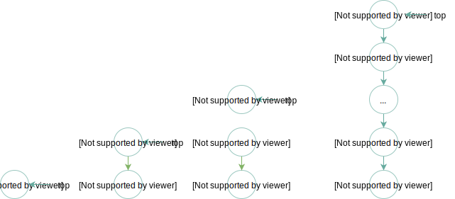

## 一 栈简介  

从数据结构角度看，栈和队列也是线性表，其特殊性在于栈和队列的基本操作都是线性表操作的子集，它们是受限的线性表。  

栈（stack）是一种后进先出（LIFO）的有序集合。新添加的或者待删除的元素都保存在栈顶，在栈里，新元素靠近栈顶，旧元素都接近栈低。那么这也造成了任何不在栈顶的元素都无法访问，为了得到栈低的元素，必须先拿掉上面的元素。  

浏览器中的历史记录回退、编程语言中变量的存储、方法顺序调用的实现都可以使用栈来实现。   

对于栈来说，表尾端叫做栈顶(top)，表头称为栈底(bottom)。不含元素的栈称为空栈。  

栈的插入操作，常称为压栈或者入栈。栈的删除操作常称为出栈或者弹栈。  

一般来说，栈具备的基本操作有：栈初始化、栈顶插入（入栈/压栈）、栈顶删除（出栈/弹栈）、判断空、取栈顶元素等。  

## 二 栈的存储结构

和线性表一样，栈同样存在顺序存储和链式存储两种方式。  

### 2.1 顺序栈 

> 顺序栈：利用一组地址连续的存储单元依次存放自栈底到栈顶的数据元素，同时指定top指针指向栈顶元素位置  

如图所示： 
  

通常做法是 top=0 表示空栈，下标从0开始。如果设定了栈底指针 base ，那么 top=base 则记为空栈。  

初始化时不推荐限定栈的最大容量，应该先分配基本容量，在使用过程中，如果栈的空间不够大，再逐渐扩大。  

插入新元素时，top指针+1，删除时-1

### 2.2 链栈

> 链栈：  使用链表来实现的栈

由于是链式存储，链栈基本不存在栈满的情况，除非内存不足！  

链栈为空其实就是 top 为空的时候。  

  


## 三 两栈共享空间概述

栈的顺序存储结构只允许栈顶进出元素，不存在线性表中插入、删除数据时需要移动数据的问题，但是必须预设一个数组的存储空间。虽然golang的切片的容量是动态的，但是变更容量带来的内存拷贝消耗也是可观的。如果数组容量过大，又容易出现利用率不足问题。   

对于两个相同类型的栈，可以通过一个数组来最大限度的利用已经开辟号的空间来进行操作。  

设计思路：数组有两个端点， 两个栈有两个栈底， 让一个栈的栈底为数组的始端， 即下标为 0 处，另一个栈为数组的末端，即下标为 数组容量size-1 处。 这样， 两个栈如果增加元素， 就是两端点向中间延伸。  

即：两个栈在数组的两端，向中间靠拢，top1 和 top2 是栈顶指针，只要他们不见面，两个栈就可以一直使用。  

一些边界情况:
- 栈1为空，即 top1 = -1
- 栈2为空，即 top2 = size
- 栈1满，即 top1 = size-1，且栈2为空
- 栈2满，即 top2 = 0，且栈1为空
- 栈满，即 top+1==top2，也即两个栈见面，两个指针之间相差1

注意：两栈共享空间的数据结构，通常用于两栈空间需求相反(此消彼长)，且数据类型一致！！！   

数据结构如图所示： 


## 四 为什么引入栈

数组和链表基本可以完整实现栈的功能，但是计算机中额外引入了栈。原因是栈的引入简化了程序设计的问题， 划分了不同关注层次， 使得思考范围
缩小，更加聚焦于我们要解决的问题核心。反之像数组等，因为要分散精力去考虑数组的下标增减等细节问题， 反而掩盖了问题的本质。  

## 五 栈与递归

递归是栈的重要应用。在以前澳洲的兔子泛滥成灾，因为兔子具有惊人的繁殖能力，一对兔子每个月能生出一对兔子，以这对父母为开始，总共生出的后代数目：第一个月小兔子没有繁殖能力，所以还是一对； 两个月后， 生下一对小兔子数共有两对； 三个月以后，老兔子又生下一对， 因为小兔子还没有繁殖能力， 所以一共是三对，依次类推：  
  

这就是递归现象，用数学公式演示：  

   

如果用计算机中的for循环来打印前40次递归的数据，如下所示：
```go
var arr [40]int
for i := 2; i < 40; i++ {
    arr[i] = arr[i - 1] + arr[i - 2]
    fmt.Println("%d ", arr[i])
}
```

但是用递归实现起来则更加形象： 
```go
func Fbi(int i) int {

    if i == 0 {
        return 0
    }

    if i < 2 {
        return 1
    }

    return Fbi(i - 1) + Fbi(i - 2)
}

func main() {
    for i := 0; i < 40; i++ {
        fmt.Println("%d ", Fbi(i))
    }
}
```

在上述案例中，最重要的思想就是斐波那契函数Fbi()调用了自己，这便是递归。  

递归最需要注意的地方时，必须给递归制作一个退出条件，否则无限循环下去，将会是一场噩梦。  

对比了两种实现斐波那契的代码。 迭代和递归的区别是： 迭代使用的是循环结构， 递归使用的是选择结构。 递归能使程序的结构更清晰、 更简洁、 更容易让人理解， 从而减少读懂代码的时间。 但是大量的递归调用会建立函数的副本， 会耗费大量的时间和内存。 迭代则不需要反复调用函数和占用额外的内存。 因此我们应该视不同情况选择不同的代码实现方式。  

递归过程退回的顺序是它前行顺序的逆序。 在退回过程中， 可能要执行某些动作，包括恢复在前行过程中存储起来的某些数据。这种存储某些数据， 并在后面又以存储的逆序恢复这些数据， 以提供之后使用的需求， 显然很符合栈这样的数据结构， 因此 编译器使用栈实现递归就没什么好惊讶的了。  

简单的说， 就是在前行阶段， 对于每一层递归， 函数的局部变量、参数值以及返回地址都被压入栈中。 在退回阶段， 位于栈顶的局部变量、 参数值和返回地址被弹出， 用于返回调用层次中执行代码的其余部分， 也就是恢复了调用的状态。  

对于现在的高级语言， 这样的递归问题是不需要用户来管理这个栈的， 一切都由系统代劳了。  
