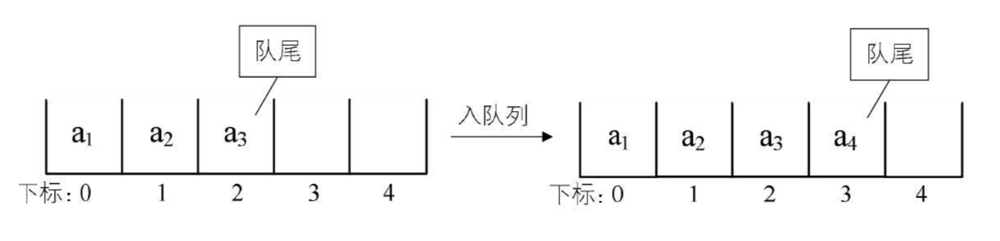
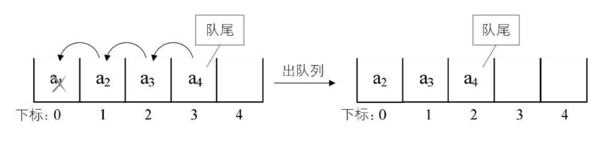

## 一 队列

> 队列（queue）：只允许在一端进行插入操作，在另一端进行删除操作的线性表

队列也是特殊的线性表，遵循FIFO（先进先出，First In First Out）规则，即在尾部添加元素，并从顶部移除元素，最新添加的元素必须排在队列的末尾。  


在现实中最常见的队列就是排队，键盘的输入到显示器上的输出等。  

## 二 队列的顺序存储

### 2.1 顺序存储的不足

由于队列也是线性表，队列也有顺序存储和链式存储两种方式。  

顺序存储的入队操作：只是给数组数据最后一位添加一个元素，不需要移动任何数据，时间复杂度是O(1)  
  

顺序存储的出队操作：队列所有元素都要往前移动，以保证队头正确性，此时时间复杂度为O(n)
  

上述思想和现实生活的表现也一致，比如一群人排队买票，前面的人买好了离开，则后面的人都要向前移动一步，补充空位。然而在开发中，出队时，队列的元素其实并不一定要移动，只要将队头的位置移动下即可，此时出队性能将会大幅增加：    
   

为了避免当只有一个元素时，队头和队尾会重合，处理起来变得很麻烦，引入两个指针，front指向队头，rear指向队尾，当front等于rear时，队列不是还剩一个元素，而是空队列，如下图  
  

但是随之而来诞生了新问题：出队a1，a2，移动front指针即可，如果再入队a5，rear指针就会移动到数组之外了....  
 

在上述案例中，还有更崩溃的问题：接着入队时，数组就要越界了，但是明明数组的0和1索引位置是空的，我们称这个现象是假溢出。  

### 2.2 循环队列

为了解决顺序存储队列的不足，推荐使用循环队列。假溢出的解决办法就是：后面满了，再从头开始，也就是头尾相接的循环，这种头尾相接的顺序存储结构队列即循环队列。  

如图所示，当a5入队时，rear指针到达索引0位置：  
 

接着入队a6，如下左侧所示，入队a7，则rear指针和front指针重合，即front=rear，如图所示：
 

在这个条件下，我们如何判定数组是满了还是空队列呢？  
答案：我们给队列保留一个元素空间，当front=rear时，队列为空，当队列满时，数组中还有一个空闲单元，也就是说我们不允许上图出现的情况，而是将队列变满的情况设定为下图：  

 

在这种情况下，rear可能比front大，也可能比front小，其相差一个位置就是满的情况，但是也有可能是相差整个一圈，那么如果队列最大尺寸为size，队列满的条件就是：

```
(rear + 1) % size == front
```

现在计算队列的长度：
- rear > front 时，队列长度是 rear-front
- rear < front 时，队列长度是 (size-front) + (0 + rear)

因此通用长度公式为：
```
(rear - front + size) % size
```

## 三 链式存储队列

队列的链式存储结构，其实就是线性表的单链表，只不过它只能尾进头出，称之为链队列。一般可以将队头指针指向连队列的头节点，队尾指针指向终端节点。  

空队列时，front和rear都指向头结点。  


其特点有：
- 空队列时，front和rear都指向头节点。  
- 入队即链表尾部插入节点
- 出队即头节点的后继节点出队，将头节点的后继改为它后面的节点，若链表除头结点外只剩一个元素时， 则需将rear指向头结点

出队图示：  

