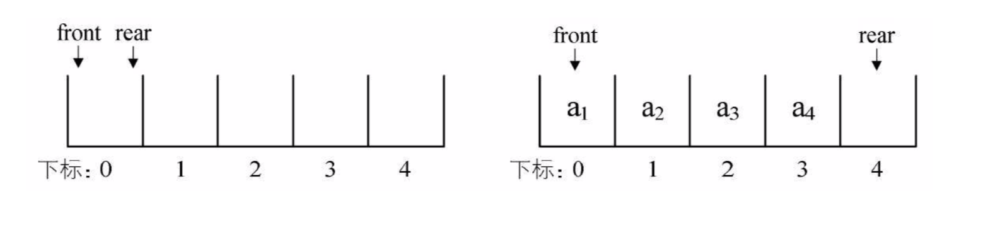
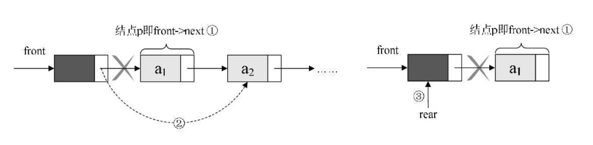

## 一 队列概述

> 队列（queue）：只允许在一端进行插入操作，在另一端进行删除操作的线性表，队列也是特殊的线性表，遵循FIFO（先进先出，First In First Out）规则，即在尾部添加元素，并从顶部移除元素，最新添加的元素必须排在队列的末尾。 

队列一般包含两个索引/指针：
- head：表示队首
- tail：表示队尾

  

由于队列也是线性表，队列也有两种存储方式：
- 顺序存储：使用数组存储数据
- 链式存储：其实就是一个单链表，只不过只能尾进头出，称之为链队列。

## 二 队列的存储

### 2.1 顺序存储

顺序存储的操作复杂度：
- 入队：只是给数组数据最后一位添加一个元素，时间复杂度为O(1)
- 出队：为了保证队头正确性，需要将当前头部及以后所有元素向后移动，时间复杂度为O(n)

顺序存储的出队性能很差，在实际开发中，其实不一定必须移动队列元素，只要将队头的位置后移一位即可，此时出队性能将会大幅增加：    
   

为了避免当只有一个元素时，队头和队尾会重合，处理起来变得很麻烦，引入两个指针，head指向队头，tail指向队尾，当head等于tail时，队列不是还剩一个元素，而是空队列，如下图  
  

但是随之而来诞生了新问题：出队a1，a2，移动head指针即可，如果再入队a5，tail指针就会移动到数组之外了....  
 

在上述案例中，还有更崩溃的问题：接着入队时，数组就要越界了，但是明明数组的0和1索引位置是空的，我们称这个现象是假溢出。  


### 2.2 链式存储

 
空队列时，head和tail都指向头结点。  


其特点有：
- 空队列时，head和tail都指向头节点。  
- 入队即链表尾部插入节点
- 出队即头节点的后继节点出队，将头节点的后继改为它后面的节点，若链表除头结点外只剩一个元素时， 则需将tail指向头结点

出队图示：  




## 三 循环队列

为了解决顺序存储队列的不足，推荐使用循环队列。假溢出的解决办法就是：后面满了，再从头开始，也就是头尾相接的循环，这种头尾相接的顺序存储结构队列即循环队列。  

如图所示，当a5入队时，tail指针到达索引0位置：  
 

接着入队a6，如下左侧所示，入队a7，则tail指针和head指针重合，即head=tail，如图所示：
 

在这个条件下，我们如何判定数组是满了还是空队列呢？  
答案：我们给队列保留一个元素空间，当head=tail时，队列为空，当队列满时，数组中还有一个空闲单元，也就是说我们不允许上图出现的情况，而是将队列变满的情况设定为下图：  

 

在这种情况下，tail可能比head大，也可能比head小，其相差一个位置就是满的情况，但是也有可能是相差整个一圈，那么如果队列最大尺寸为size，队列满的条件就是：

```
(tail + 1) % size == head
```

现在计算队列的长度：
- tail > head 时，队列长度是 tail-head
- tail < head 时，队列长度是 (size-head) + (0 + tail)

因此通用长度公式为：
```
(tail - head + size) % size
```
