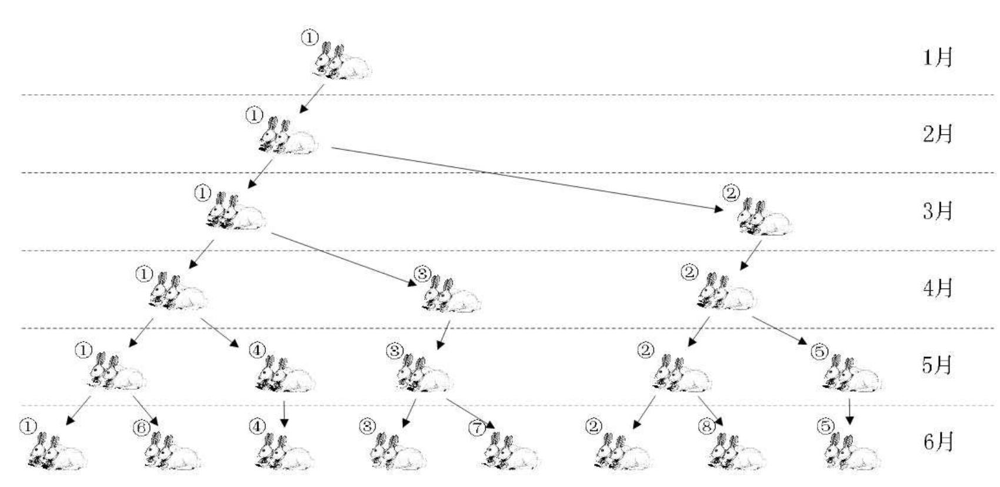

## 一 栈的应用

### 1.1 函数调用栈

栈最经典的应用场景是函数调用栈。操作系统为每个线程分配了一块独立内存空间，该内存内部会被构建为类似栈的结构，用于存储函数调用时的临时变量。每进入一个函数，就会将临时变量作为一个栈帧入栈，当被调用函数执行完成，返回之后，将这个函数对应的栈帧出栈。  

### 1.2 表达式求值

对于常见的四则运算，如：34+13*9+44-12/3，计算机是很难理解的。编译器通常通过两个栈来实现：
- 一个栈用来保存操作数
- 一个栈用来保存运算符

从左向右遍历表达式，当遇到数字，会直接压入操作数栈；当遇到运算符，就与运算符栈的栈顶元素进行比较。如果比运算符栈顶元素的优先级高，就将当前运算符压入栈；如果比运算符栈顶元素的优先级低或者相同，从运算符栈中取栈顶运算符，从操作数栈的栈顶取 2 个操作数，然后进行计算，再把计算完的结果压入操作数栈，继续比较。  

### 1.3 栈匹配括号

栈还用于表达式、代码中的括号匹配。  

假设表达式中只包含三种括号，圆括号 ()、方括号 [] 和花括号{}，并且它们可以任意嵌套。比如，{[{}]}或 [{()}([])] 等都为合法格式，而{[}()] 或 [({)] 为不合法的格式。那我现在给你一个包含三种括号的表达式字符串，如何检查它是否合法呢？  

栈来保存未匹配的左括号，从左到右依次扫描字符串。当扫描到左括号时，则将其压入栈中；当扫描到右括号时，从栈顶取出一个左括号。如果能够匹
配，比如“(”跟“)”匹配，“[”跟“]”匹配，“{”跟“}”匹配，则继续扫描剩下的字符串。如果扫描的过程中，遇到不能配对的右括号，或者栈中没有数据，则说明为非法格式。  

当所有的括号都扫描完成之后，如果栈为空，则说明字符串为合法格式；否则，说明有未匹配的左括号，为非法格式。

### 1.4 浏览器历史记录

使用两个栈，X 和 Y，我们把首次浏览的页面依次压入栈 X，当点击后退按钮时，再依次从栈 X 中出栈，并将出栈的数据依次放入栈 Y。当我们点击前进按钮时，我们依次从栈Y 中取出数据，放入栈 X 中。当栈 X 中没有数据时，那就说明没有页面可以继续后退浏览了。当栈 Y 中没有数据，那就说明没有页面可以点击前进按钮浏览了。

### 1.5 栈与递归

递归是栈的重要应用。在以前澳洲的兔子泛滥成灾，因为兔子具有惊人的繁殖能力，一对兔子每个月能生出一对兔子，以这对父母为开始，总共生出的后代数目：第一个月小兔子没有繁殖能力，所以还是一对；两个月后， 生下一对小兔子数共有两对； 三个月以后，老兔子又生下一对， 因为小兔子还没有繁殖能力， 所以一共是三对，依次类推。这就是递归现象，用数学公式演示：  

   

使用递归实现： 
```go
func Fbi(int i) int {

    if i < 0 {
        panic("非法参数")
    }

    if i < 2 {
        return i
    }

    return Fbi(i - 1) + Fbi(i - 2)
}

func main() {
    for i := 0; i < 40; i++ {
        fmt.Println("%d ", Fbi(i))
    }
}
```

在上述案例中，最重要的思想就是斐波那契函数Fbi()调用了自己，这便是递归。递归最需要注意的地方是，必须给递归制作一个退出条件，否则无限循环下去，将会是一场噩梦。  

递归的代码一般都可以无缝转化为迭代方式实现。  

递归虽然让程序的结构更清晰、简洁，但是大量的递归调用会建立函数的副本，会耗费大量的时间和内存。迭代则不需要反复调用函数和占用额外的内存。因此我们应该视不同情况选择不同的代码实现方式。  

## 二 队列的应用 

### 2.1 阻塞对垒

阻塞队列其实就是在队列基础上增加了阻塞操作。简单来说，就是在队列为空的时候，从队头取数据会被阻塞。因为此时还没有数据可取，直到队列中有了数据才能返回；如果队列已经满了，那么插入数据的操作就会被阻塞，直到队列中有空闲位置后再插入数据，然后再返回。该定义其实就是一个“生产者 - 消费者模型”。这种基于阻塞队列实现的“生产者 - 消费者模型”，可以有效地协调生产和消费的速度。当“生产者”生产数据的速度过快，“消费者”来不及消费时，存储数据的队列很快就会满
了。这个时候，生产者就阻塞等待，直到“消费者”消费了数据，“生产者”才会被唤醒继续“生产”。   

而且不仅如此，基于阻塞队列，我们还可以通过协调“生产者”和“消费者”的个数，来提高数据的处理效率。比如前面的例子，我们可以多配置几个“消费者”，来应对一个“生产者”。

### 1.2 并发队列

线程安全的队列我们叫作并发队列。最简单直接的实现方式是直接在 enqueue()、dequeue() 方法上加锁，但是锁粒度大并发度会比较低，同一时刻仅允许一个存或者取操作。实际上，基于数组的循环队列，利用 CAS 原子操作，可以实现非常高效的并发队列。这也是循环队列比链式队列应用更加广泛的原因。

### 1.3 线程池实现

线程池没有空闲线程时，新的任务请求线程资源时，线程池该如何处理？各种处理策略又是如何实现的呢？  

我们一般有两种处理策略。第一种是非阻塞的处理方式，直接拒绝任务请求；另一种是阻塞的处理方式，将请求排队，等到有空闲线程时，取出排队的请求继续处理。那如何存储排队的请求呢？  

我们希望公平地处理每个排队的请求，先进者先服务，所以队列这种数据结构很适合来存储排队请求。我们前面说过，队列有基于链表和基于数组这两种实现方式。这两种实现方式对于排队请求又有什么区别呢？  

基于链表的实现方式，可以实现一个支持无限排队的无界队列（unbounded queue），但是可能会导致过多的请求排队等待，请求处理的响应时间过长。所以，针对响应时间比较敏感的系统，基于链表实现的无限排队的线程池是不合适的。  

而基于数组实现的有界队列（bounded queue），队列的大小有限，所以线程池中排队的请求超过队列大小时，接下来的请求就会被拒绝，这种方式对响应时间敏感的系统来说，就相对更加合理。不过，设置一个合理的队列大小，也是非常有讲究的。队列太大导致等待的请求太多，队列太小会导致无法充分利用系统资源、发挥最大性能。  

除了前面讲到队列应用在线程池请求排队的场景之外，队列可以应用在任何有限资源池中，用于排队请求，比如数据库连接池等。实际上，对于大部分资源有限的场景，当没有空闲资源时，基本上都可以通过“队列”这种数据结构来实现请求排队。  

## 三 为什么引入栈与队列这样的数据结构

数组和链表基本可以完整实现栈/队列的功能，但是计算机中额外引入了这些受限的数据结构。原因是这样做简化了程序设计的问题，划分了不同关注层次，使得思考范围缩小，更加聚焦于我们要解决的问题核心。反之像数组等，因为要分散精力去考虑数组的下标增减等细节问题，反而掩盖了问题的本质。  