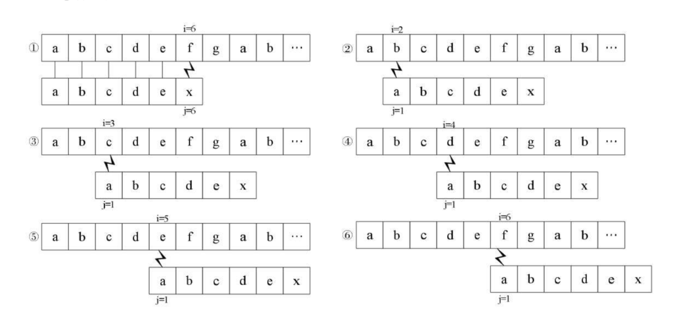
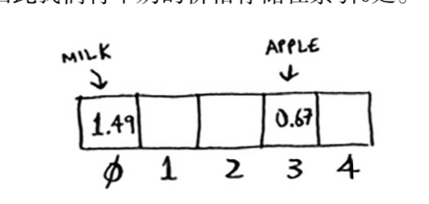

##  一 朴素匹配算法的缺陷

经典模式匹配算法缺陷是，每次匹配失败后都要回溯到主串中i的位置，例如：主串为“000000000000000000001”，模式串为“0001”时，匹配正确之前的每次匹配都要到模式串的最后一个字符，才会回溯，这其中浪费的时间不容小觑。  

KMP算法（克努特-莫里斯-普拉特算法）解决了上述问题，告别了回溯，KMP算法可以使事件复杂度从O(n*m)转变为O(n+m)。

## 二 理解KMP模式匹配算法

#### 2.1 理解精髓

假如现在有字符串`S="abcdefgab"`，以及子串`T="abcdex"`，如果采用朴素匹配，那么匹配步骤如图：  

   

上图比较中，前五位字符都是相等的，到了第6位才不相等。  

子串T中，第一个字母a与后续所有字母都不同，那么当子串的a既然与字符串S第一位相等，那么其自然也与后续的四个字符也是不相等的，那么后续的四次比较也就没有了意义，即图中2，3，4，5步骤都是多余的。  

指针回溯解决：i在第一次循环时候，到达了图中的字符f处，而f之前的字符被上述理解判定为无需再次比较，i在到达f后可以直接继续往下比较，无需回退了。  

这是KMP算法的核心，即：首先看子串中首位开始没有出现重复的部分，首位如果与主串某个字符相等，那么其后未重复部分都无需再次回溯。

#### 2.2 子串存在重复字符

在2.1的案例中，如果子串T的后面也有字符a，则情况变得复杂了，比如：`S="abcdefgab"`，子串`T="abcabx"`，朴素算法如图所示：  

  

在上述朴素算法步骤中，第一次比较发现，在第6位置不同，需要回溯，但是子串abc三个字符互不相等，也就是说图中的步骤2和步骤3的回溯是多余的。此时我们认为i只用回溯到第4位即可。    

在步骤1中，4号位与5号位做过了比较是相等的，步骤4和步骤5也可以省略。  

在KMP算法中，由于主串不能出现回溯，所以始终是子串的索引位置在发生变化，子串T的首字符与自身后面字符如果出现相等，则j的值就会出现变化，即j的值只和子串有关，和主串无关，即取决于子串是否有重复的字符。

`T=abcdex`，没有重复字符，j就会从6变成1；  

`T=abcabx`，前缀ab和后缀x之前的串的后缀ab相等，j就会从6变成3； 

即j的值取决于当前字符之前的串的前后缀的相似度。  

#### 2.3 next函数推理

**前缀、后缀**：对子串的分解，比如字符串 `"abc"`，前缀是 `a, ab`， 后缀是 `c, bc`。  

**next数组**：
- next数组是什么：将子串各个位置的索引值变化记录到一个数组中
- next数组的长度：即子串的长度
- value值：从左到当前索引值截取到的一个新的字符串，这个字符串的前缀、后缀最长交集的长度
- next元素的值：value值-1，为了和代码对应

示例：当`T="ababaca"`
| 模式串T | a | b | a | b | a | c | a |
| ------ | ------ | ------ | ------ | ------ | ------ | ------ | ------ |
| 索引j | 0 | 1 | 2 | 3 | 4 | 5 | 6 | 
| value] | 0 | 0 | 1 | 2 | 3 | 0 | 1 |
| next[j] | -1 | -1 | 0 | 1 | 2 | -1 | 0 |

对于目标字符串`T=ababaca`，长度是7，所以`next[0]，next[1]，next[2]，next[3]，next[4]，next[5]，next[6]`分别计算的是 `a，ab，aba，abab，ababa，ababac，ababaca`的相同的最长前缀和最长后缀的长度。由于`a，ab，aba，abab，ababa，ababac，ababaca`的相同的最长前缀和最长后缀是`“”，“”，“a”，“ab”，“aba”，“”，“a”`,所以next数组的值是`[-1,-1,0,1,2,-1,0]`


## 三 KMP算法示例

```go
func kmp(haystack string, needle string) int {
    //when needle is empty,return 0 is available
	if len(needle) == 0 {
		return 0
	}

	next := getNext(needle)

	i := 0
	j := 0
	for i < len(haystack) && j < len(needle) {
		if j == -1 || haystack[i] == needle[j] {
			i++
			j++
		} else {
			j = next[j]
		}
	}

	if j == len(needle) {
		return i - j
	}

	return -1
}

//original getNext function
func getNextBetter(str string) []int {
	var next = make([]int, len(str))
	next[0] = -1

	i := 0
	j := -1
	for i < len(str) - 1 {
		if j == -1 || str[i] == str[j] {
			i++
			j++
			next[i] = j
		} else {
			j = next[j]
		}
	}

	return next
}

//better getNext function
func getNext(str string) []int {
	var next = make([]int, len(str))
	next[0] = -1

	i := 0
	j := -1
	for i < len(str) - 1 {
		if j == -1 || str[i] == str[j] {
			i++
			j++
			if str[i] == str[j] {
				next[i] = next[j]
			} else {
				next[i] = j
			}
		} else {
			j = next[j]
		}
	}

	return next
}
```


KMP解释：
https://blog.csdn.net/starstar1992/article/details/54913261/  
https://www.cnblogs.com/yjiyjige/p/3263858.html  
https://blog.csdn.net/v_july_v/article/details/7041827  
