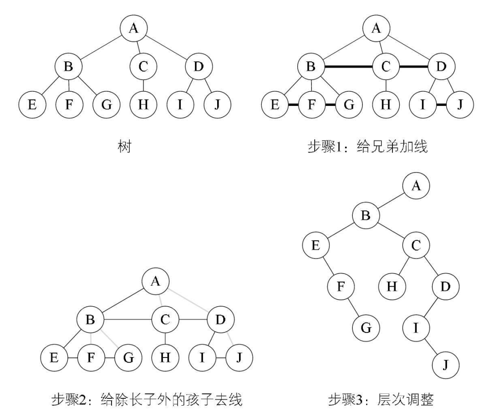
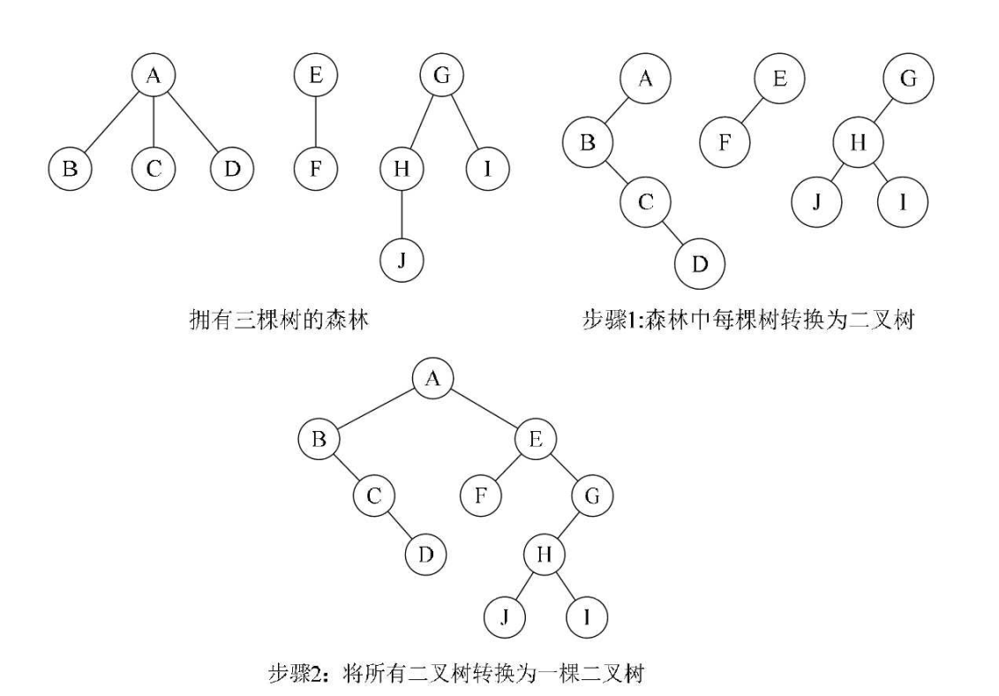
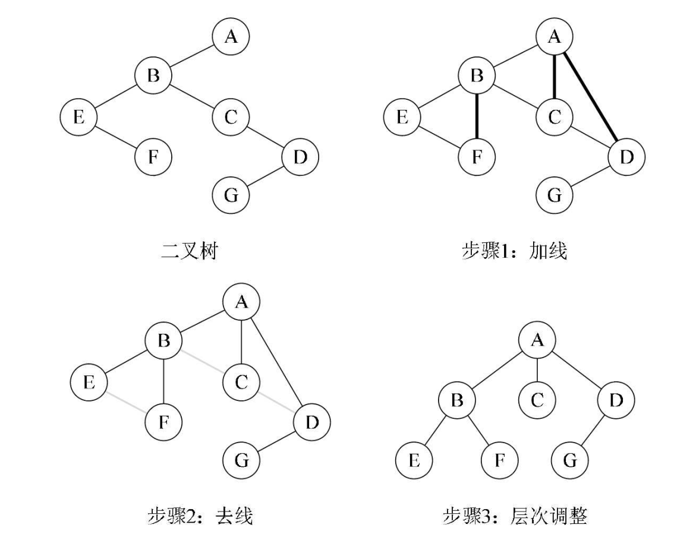
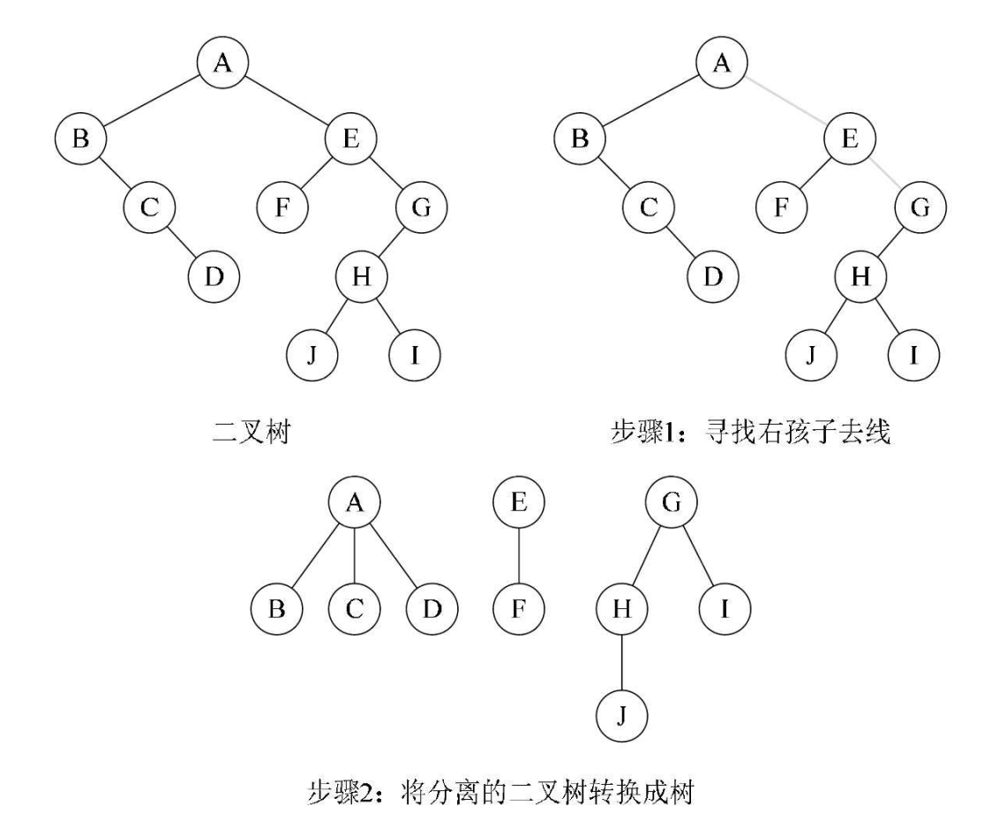

## 一 树与森林

树的孩子兄弟法可以将一棵树用二叉链表进行存储。借助二叉链表， 树和二叉树可以相互进行转换。 从物理结构来看， 它们的二叉链表也是相同的， 只是解释不太一样而已。因此， 只要我们设定一定的规则， 用二叉树来表示树， 甚至表示森林都是可以的， 森林与二叉树也可以互相进行转换。  

### 1.1 树转换为二叉树

将树转换为二叉树的步骤如下：
- 1.加线。 在所有兄弟结点之间加一条连线。 
- 2.去线。 对树中每个结点， 只保留它与第一个孩子结点的连线， 删除它与其他孩子结点之间的连线。 
- 3.层次调整。 以树的根结点为轴心，将整棵树顺时针旋转一定的角度， 使之结构层次分明。 注意第一个孩子是二叉树结点的左孩子， 兄弟转换过来的孩子是结点的右孩子。  

如下所示： 一棵树经过三个步骤转换为一棵二叉树。初学者容易犯的错误就是在层次调整时，弄错了左右孩子的关系。 比如图中F、 G本都是树结点B的孩子， 是结点E的兄弟， 因此转换后， F就是二叉树结点E的右孩子， G是二叉树结点F的右孩子：  

 

### 1.2 森林转换为二叉树

森林是由若干棵树组成的， 所以完全可以理解为， 森林中的每一棵树都是兄弟， 可以按照兄弟的处理办法来操作。 步骤如下： 
- 1.把每个树转换为二叉树。 
- 2.第一棵二叉树不动， 从第二棵二叉树开始， 依次把后一棵二叉树的根结点作为前一棵二叉树的根结点的右孩子， 用线连接起来。
- 3.当所有的二叉树连接起来后就得到了由森林转换来的二叉树。  

 

### 1.3 二叉树转换为树

二叉树转换为树是树转换为二叉树的逆过程， 也就是反过来做而已：
- 1.加线。 若某结点的左孩子结点存在， 则将342这个左孩子的右孩子结点、 右孩子的右孩子结点、 右孩子的右孩子的右孩子结点……将该结点与这些右孩子结点用线连接起来。 
- 2.去线。 删除原二叉树中所有结点与其右孩子结点的连线。 
- 3.层次调整。 使之结构层次分明。  

 

### 1.4 二叉树转换为森林

判断一棵二叉树能够转换成一棵树还是森林， 标准很简单， 那就是只要看这棵二叉树的根结点有没有右孩子， 有就是森林， 没有就是一棵树。步骤如下： 
- 1.从根结点开始， 若右孩子存在，则把与右孩子结点的连线删除， 再查看分离后的二叉树， 若右孩子存在， 则连线删除……， 直到所有右孩子连线都删除为止， 得到分离的二叉树。
- 2.再将每棵分离后的二叉树转换为树即可。

   

## 二 树与森林的遍历

树的遍历分为两种方式。 
- 1.一种是先根遍历树， 即先访问树的根结点，然后依次先根遍历根的每棵子树。 
- 2.另一种是后根遍历， 即先依次后根遍历每棵子树， 然后再访问根结点。 

森林的遍历也分为两种方式：
- 1.前序遍历： 先访问森林中第一棵树的根结点， 然后再依次先根遍历根的每棵子树， 再依次用同样方式遍历除去第一棵树的剩余树构成的森林。
- 2.后序遍历： 是先访问森林中第一棵树， 后根遍历的方式遍历每棵子树， 然后再访问根结点， 再依次同样方式遍历除去第一棵树的剩余树构成的森林。 

当以二叉链表作树的存储结构时， 树的先根遍历和后根遍历完全可以借用二叉树的前序遍历和中序遍历的算法来实现。 