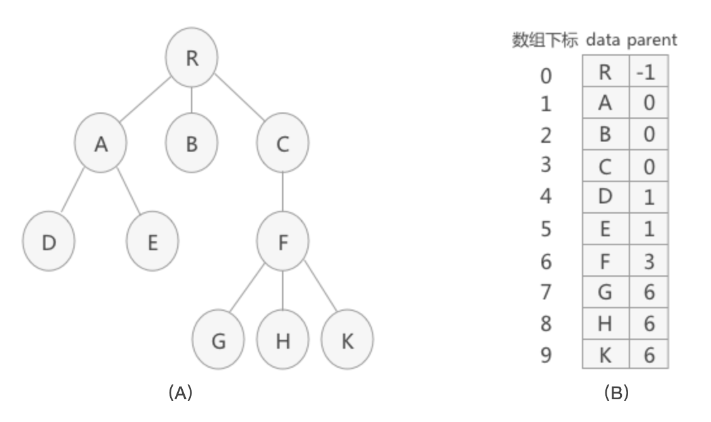
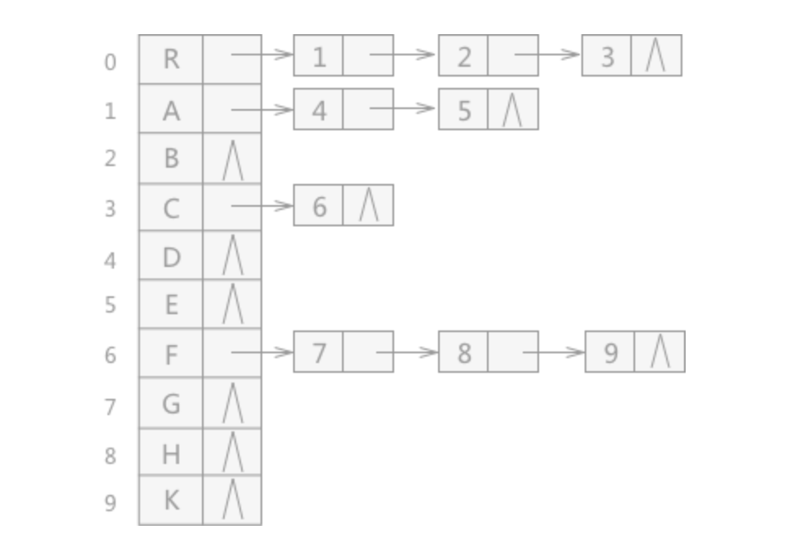
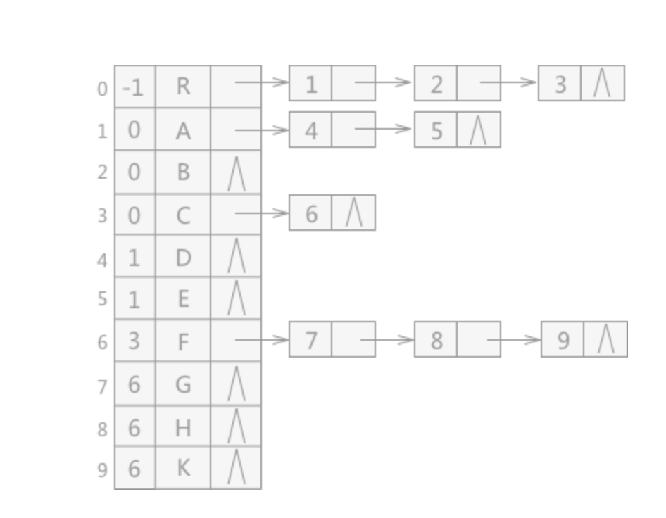
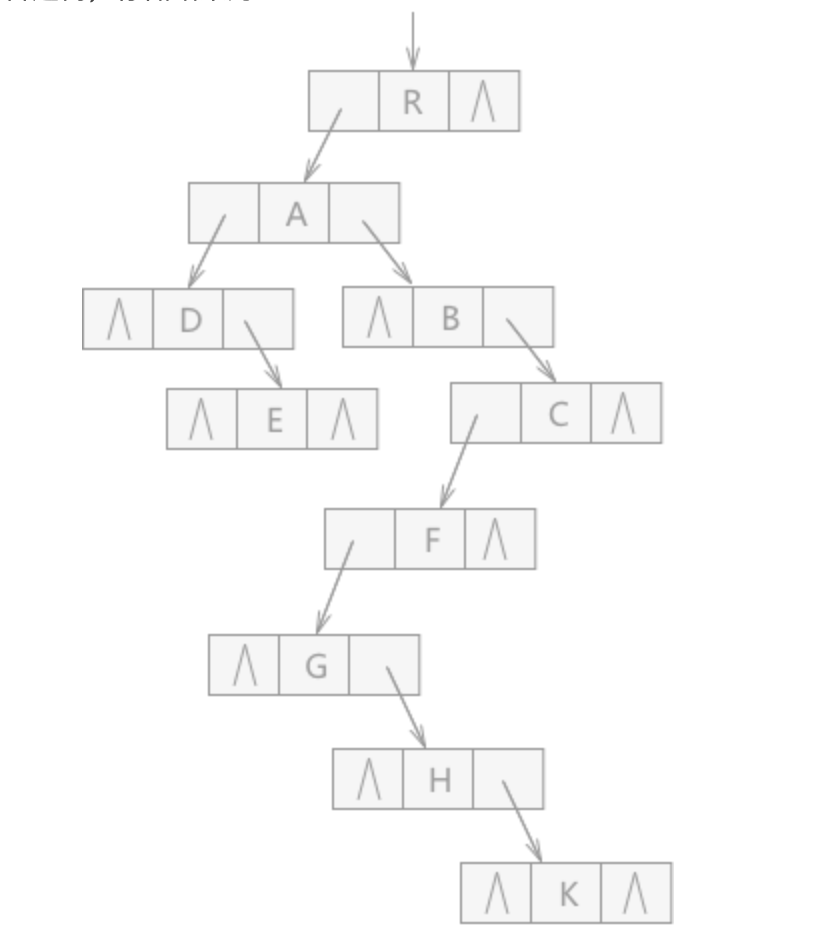

## 一 树的简介

### 1.1 树形结构

现实中，有很多一对多的情况，如公司的行政架构图，文件系统中不同层级的文件，如果用链表这样的线性结构存储，显然很难做到，此时可以用树来表示。 

树（Tree）是一种非线性数据结构，经常用来存储具有层级关系的数据，它是 n（n>=0）个节点的有限集，n=0 时称为空树。  

在任意一棵非空的树中：
- 有且仅有一个特定的根节点(Root)
- 当 n>1 时，其余节点可分为 m（m>0）个树，可以称为根的子树（SubTree）

如图所示:   


### 1.2 树的理解

树的定义其实采用了递归的方法，如图所示，两个子树其实是根节点A的子树，当然D,G,H,I组成的树又是B为根节点的子树，以此类推：  


除了要主要根节点的唯一性以外，子树之间一定是互不相交的，如下所示并不符合树的定义：


树的相关术语：
- 父节点：下方连接多个节点
- 子节点：父节点下的节点
- 节点的度(De-gree)：拥有的子树数。
- 叶节点(Leaf)：没有子节点的节点，即度为0，也称为终端节点
- 非叶节点：度不为0的节点，也称为分支节点，也可以称为内部节点（根节点除外）
- 树的深度：从上往下定义，为叶节点所在最大层数


节点的层次（Level）：根节点作为第一层，其孩子为第二层。  


有序树与无序树：
- 有序树：树中的节点的各个子树看成从左至右有次序不可互换
- 无序树：与有序树相反

## 二 树的存储结构

###  2.0 树的三种结构

由于树中的节点具备父子关系，使用顺序存储实现比较困难。树的存储结构主要有三种：
- 双亲表示法
- 孩子表示法
- 孩子兄弟表示法。 

### 2.1 双亲表示法

树的每个节点不一定有孩子，但是一定有且仅有一个双亲节点（根节点除外），所以可以通过其双亲表示一个完整的树。    

```go
// 树种的节点
type node struct {           
    data    interface{}         // 数据域：存储节点中的数据
    parent  int                 // 指针域：存储双亲在数组中的下标
}
// 树
type Tree struct {
    nodes   []*node             // 节点指针数组
    root    int                 // 根节点位置
    num     int                 // 节点数
}
```

其存储的数据格式如下：
  

双亲表示法的优点：可以迅速找到当前节点的父节点，当parent为-1时，是根节点。

双亲表示法的缺点：查找当前节点的子节点时，必须遍历整个树。  

缺点的解决：增加一个节点的最左孩子的域，这样就能轻易得到节点的孩子，如果没有子节点，整个最左孩子域设置为-1。但是如果孩子很多，超过2个，又需要关注节点的双亲、孩子、兄弟，那么需要不断的扩展结构，添加其他的域，比如：双亲域、左右兄弟域等等。  

### 2.2 孩子表示法

把每个节点的孩子节点排列起来，以链表存储，如果树有 n 个节点，就会有 n 个链表，如果是叶节点，则此单链表为空链表，然后链表的头指针放在一个数组中。  

```go
// 链表中的每个节点存储的不再是数据本身，而是数据在数组中的下标
type node struct {
    child   int                 // 数据域：数组下标
    next    *node              // 指针域：指向该节点的下一个孩子节点的指针
}

// 表头结构
type first struct {
    data    interface{}        // 数据域：存储节点数据
    first   *node              // 头指针域：存储该节点的孩子链表的头指针
}

// 树结构
type Tree struct {
    nodes []*node
    root int
    num int
}
```

孩子表示法如图所示：  
  

适用于查找某结点的孩子结点，不适用于查找其父结点。可以将两种表示方法合二为一，存储效果如图：  

  


### 2.3 孩子兄弟表示法

任意一棵树，它的节点的第一个孩子如果存在就是唯一的，它的右兄弟如果存在也是唯一的，因此设置两个指针，分别指向该节点的第一个孩子和此节点的右兄弟即可。  

```go
type node struct {
    data interface{}
    firstchild *node
    rightchild *node
}
```

如图所示： 

  

上述的表示方法，给查找某个节点的某个孩子带来了方便，只需要通过firstchild找到此节点的长子，然后再通过长子节点的rightsib找到它的二弟，依次类推，直到找到具体的孩子。当然如果要找到双亲，依然有困难（添加parent指针域可以解决）。孩子兄弟表示法其实是将一棵复杂的树表示为了二叉树。  
