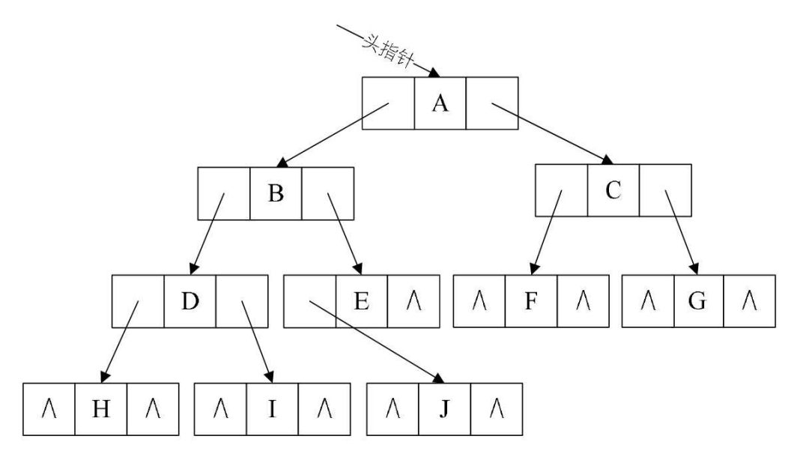

## 一 二叉树定义

> 二叉树（Binary Tree）： 树的每个结点的度最大为 2，即最多拥有 2 棵子树

二叉树有五种形态：

-   空二叉树
-   只有一个根结点
-   根结点只有左子树
-   根结点只有右子树
-   根结点既有左子树又有右子树

注意：二叉树的左子树和右子树是有顺序的，不能任意颠倒，即使树种某个结点只有一棵子树，也要区分它是左子树还是右子树。交换左右子树后生成的新二叉树就不再是以前的二叉树了！！所以二叉树是有序树！

一些特殊的二叉树：

-   斜树：斜树看起来类似线性结构，有左斜树（只有左侧结点），右斜树（只有右侧结点），此时结点的个数就是二叉树的深度。
-   真二叉树：所有结点的度要么为 0，要么为 2，英文名 Proper Binary Tree。
-   满二叉树：所有结点的度要么为 0，要么为 2，且叶结点都在最后一层。英文名 Full Binary Tree。（其实是在真二叉树基础上添加了限制）

## 二 非空二叉树的特性

-   每层结点数：二叉树的第 i 层上至多有 2<sup>i-1</sup>个 结点（i>=1）
-   全部结点数：高度为 h 的二叉树至多有 2<sup>k</sup>-1 个结点（h>=1，也是叶结点所在的最大层数）。相应的高度 h = log$_2$n+1
-   叶结点数与度关系：叶结点数 = 度为 2 结点数 + 1

叶结点与度关系推导：

```
    n0 是叶结点数，n1 是度为1的结点数，n2 是度为2的结点数，T为二叉树的结点连线总数：
    T = 1*n1 + 2*n2
    T = n - 1
    n = n0 + n1 + n2
```

其实还可以得到一个公式： n = 2n0 + n1 - 1

如图所示：  


## 三 完全二叉树

### 3.1 完全二叉树概述

> 完全二叉树：叶子结点只会出现在最后 2 层，且最后 1 层的叶子结点都靠左对其。英文名 Complete Binary Tree。

完全二叉树如图：  


注意：完全二叉树不一定是满的，但是只要将完全二叉树补充上对应子结点，就是一棵满二叉树。

也可以推理出：

-   满二叉树一定是完全二叉树
-   完全二叉树的根结点到倒数第二层之间的树是一棵满二叉树

### 3.2 完全二叉树特性

完全二叉树（Complete Binary Tree）的特点：

-   度为 1 的结点只有左子树
-   度为 1 的结点要么是 1 个，要么是 0 个
-   同样结点数的二叉树，完全二叉树深度最小
-   如果结点度为 1，则该结点只有孩子结点，不存在只有右子树的情况

假设完全二叉树的高度为 h ，h >= 1，则：

-   则至少有 2<sup>h-1</sup> 个结点（2$^0$ + 2$^1$ + ... + 2$^h$$^-$$^2$ + 1）
-   则最多有 2<sup>h</sup> - 1 个结点 (2$^0$ + 2$^1$ + ... + 2$^h$$^-$$^1$，满二叉树)

总结点数量 n ：

-   则：2<sup>h - 1</sup> <= b < 2<sup>h</sup>，
-   也即 h - 1 <= log$_2$n < h，由于 h 是整数，h = floor(log$_2$n) + 1 (向下取整)

n0 是叶结点数，n1 是度为 1 的结点数，n2 是度为 2 的结点数：

```
# 二叉树本身的规律
n = 2n0 + n1 - 1
# 完全二叉树的n1要么是1，要么是0
```

一颗有 n(n>0)个结点的完全二叉树，从上到下，从左到右，给结点从 1 编号，则第 i 个结点有：

-   i=1，是根结点
-   i>2，其父结点编号是 floor(i/2)
-   2i<=n，其左子结点编号为 2i
-   2i>n，则其无左子结点
-   2i+1<=n，则其右子结点编号为 2i+1
-   2i+1>n,则其无右子结点

## 四 二叉树存储结构

树使用顺序存储是非常困难的，但是二叉树结构特殊，使用顺序存储也能实现。即：用一维数组存储二叉树中的结点和结点关系。


图中 4，6，8，9 结点不存在。顺序存储虽然能够表述二叉树，但是实用性不强，比如一种极端的情况，树的深度为 k，但是是右倾斜树，只有 k 个结点，却需要分配 2k-1 个存储单元，造成了空间的极大浪费。

推荐使用链式存储，即二叉链表：每个结点最多有两个孩子，结点分别设计一数据域、两个指针域，即可表示一个结点。这样的链表叫做二叉链表。

```go
type node struct {
    data        interface{}
    lchild      *node
    rchild      *node
}
```

二叉链表示意图：  


## 五 最后的注意事项

一些国外的书籍翻译有所不同：

-   Full Binary Tree：完满二叉树，即给国内的真二叉树
-   Perfect Binary Tree：完美二叉树，即国内的满二叉树
-   Complete Binary Tree：完全二叉树，与国内翻译一致
