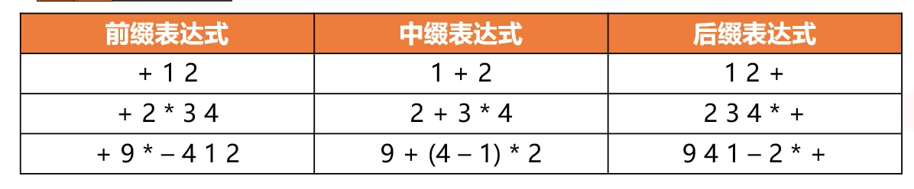
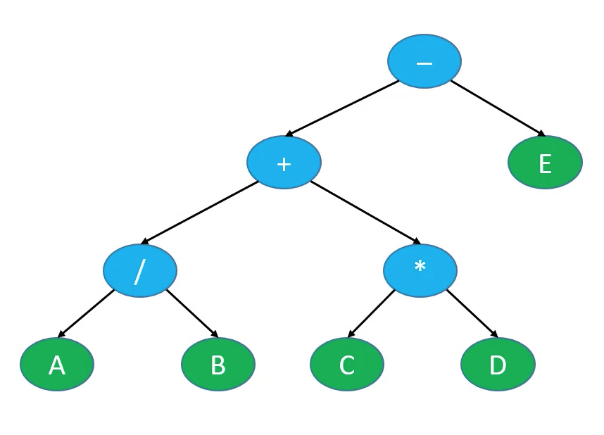

## 一 二叉树的遍历

### 1.1 二叉树的四种遍历方式

如图的二叉树要对其遍历：


遍历一般是从根结点开始，当然我们也可以限制左右顺序遍历是从左开始，主要遍历方法有下列多种：

-   前序遍历（Preorder Traversal）：根结点 -> 前序遍历左子树 -> 前序遍历右子树，结果为 `A->BDGH->CEIF`
-   中序遍历（Inorder Traversal）：中序遍历左子树 -> 根结点 -> 中序遍历右子树，结果为 `GDHB->A->CEIF`
-   后序遍历（Postorder Traversal）：从左到右遍历左子树叶结点 -> 从左到右遍历右子树叶结点 -> 根结点，结果为 `GHDB->IEFC->A`
-   层序遍历（Level Order Traversal）：根结点 -> 第一层 -> 第二层 -> ... 依次类推，结果为 `A->BC->DEF->GHI`

### 1.2 遍历算法的实现

二叉树的定义和遍历都需要利用递归原理。

```go
import (
	"container/list"
	"fmt"
)

// 对于所有的树来说，遍历都是通用的

// 前序遍历
func PreOrderTraverse(node *Node) {
	if node == nil {
		return
	}
	fmt.Printf("%v ", node.data)			// 前序遍历就是从node开始遍历，所以要先打印
	PreOrderTraverse(node.left)
	PreOrderTraverse(node.right)
}

// 中序遍历
func InOrderTraverse(node *Node) {
	if node == nil {
		return
	}
	// 会产生式升序结果
	InOrderTraverse(node.left)
	fmt.Printf("%v ", node.data)
	InOrderTraverse(node.right)

	// 会产生降序结果
	//InOrderTraverse(node.right)
	//fmt.Printf("%v ", node.data)
	//InOrderTraverse(node.left)
}

// 后序遍历
func PostOrderTraverse(node *Node) {
	if node == nil {
		return
	}
	PostOrderTraverse(node.left)
	PostOrderTraverse(node.right)
	fmt.Printf("%v ", node.data)
}

// 层序遍历
/**
实现思路：无法用递归实现
1 将各结点入队
2 循环执行以下操作，直到队列为空
	取出队头结点出队，进行访问
	将队头结点的左子结点入队
	将队头结点的右子结点入队
*/
func LevelOrderTraverse(node *Node) {

	if node == nil {
		return
	}

	queue := list.New()		// 制作一个队列
	queue.PushBack(node)

	for queue.Len() != 0 {
		queueHead := queue.Remove(queue.Front())	// 队首出队
		tempNode := queueHead.(*Node)				// 类型断言
		fmt.Printf("%v ", tempNode.data)
		if tempNode.left != nil {
			queue.PushBack(tempNode.left)
		}
		if tempNode.right != nil {
			queue.PushBack(tempNode.right)
		}
	}

}
```

### 1.3 遍历的应用

层序遍历可以用来：

-   计算二叉树的高度
-   判断一棵树是否为完全二叉树

通过前序/后续遍历+中序遍历的结果也可以推导出唯一的一棵二叉树：

-   前序遍历总是从 root 结点开始：根结点->左子树->右子树，此时可以找到其根结点
-   中序遍历从是从左子树开始：左子树->根结点->右子树，从前序遍历已经知道了根结点位置，依据中序就能知道其左右子结点

### 1.4 二叉树与四则运算

四则运算（+、-、\*、/）一般有三种：

-   前缀表达式（prefix expression），也称为波兰表达式
-   中缀表达式（infix expression），该方式符合人类的视觉思维
-   后缀表达式（postfix express），又称为逆波兰表达式

所谓的前缀、后缀、中缀指的是运算的位置是在两个操作数的左中右位置，如下所示：  


如果将四则运算表达式的操作数作为叶子结点，运算符作为父结点，则可组成一棵二叉树，如 `A / B + C * D - E`：



如果对该二叉树进行前序遍历，就会生成前缀表达式。如果进行中序遍历，则会生成中缀表达式，同理进行后序遍历，则生成后缀表达式！

### 1.5 二叉树的非递归遍历实现

每次递归调用都会开辟一个函数栈空间，递归次数很多时，就会出现内存的急剧消耗，所以最好的遍历方式仍然是迭代方式遍历。
迭代方式实现遍历与层序遍历的思路相似，都需要借助一个数据结构来实现，一般是栈。
