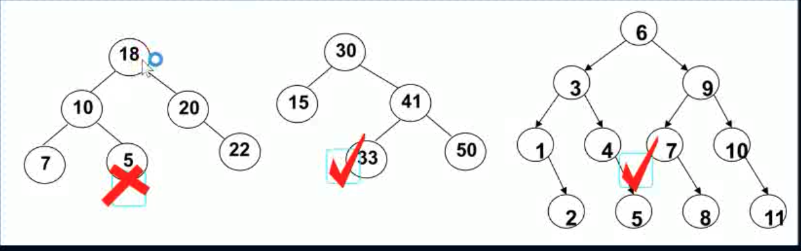
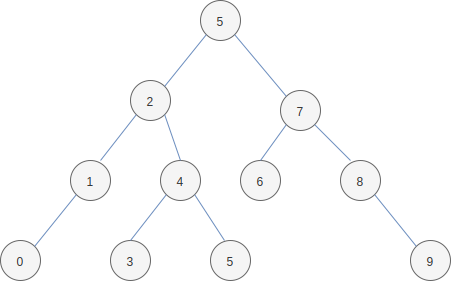
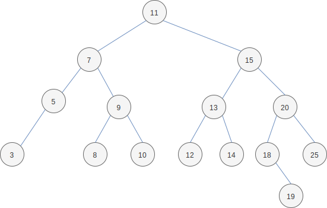

## 一 二叉搜索树概念

二叉搜索树（BST，Binary Search Tree），也称为二叉排序树，二叉查找树。

二叉搜索树可以为空。如果不为空，则满足：

-   非空左子树的所有键值小于其根结点的键值
-   非空右子树的所有键值大于其根结点的键值
-   左、右子树本身也都是二叉搜索树

如图所示，红勾表示的即是二叉搜索树：  


## 二 二叉搜索树查找思想

如其名称定义，二叉搜索树的查找很便利。如果要对下列混乱的数据进行查找 7 是否在数据中：`{1,3,6,7,9,0,4,2,5,8}`。对这种无序的数据，我们可以使用循环操作挨个遍历，或者使用哈希表方式。

如果现在要对一个有序的数据进行查找`{0,1,2,3,4,5,6,7,8,9}`，可以使用二分查找即可快速找出 7 是否在数据中。

其实这和二叉搜索树的概念是一致的，利用二分查找的思想，这个数据序列转换为二叉搜索树后如图：



二叉搜索树与哈希表作为查找时的对比：

-   哈希表需要一个很大的数组，会造成一定的空间浪费
-   哈希表的数据是无序的，二叉搜索树其实是有序数据利用二分查找思想的转换

二叉搜索树在插入结点的时候，也需要一层层比较大小。由此也带来新的特性：`很容易获取最大值，最小值`

注意：其实二叉搜索就是二分搜索法的是数据结构实现，其中序遍历可以得到从小到大的结果！！（当然中序遍历时如果从右侧往左侧遍历，则会产生从小到大的结果）

## 三 二叉搜索树的 ADT

对于二叉搜索树来说，只需要保存根结点即可，因为其他结点都可以通过根结点找到。

二叉树的结点内部必须保留左右子结点信息，笔者这里也保留了父结点信息，这样便于删除操作。笔者也额外提供了无父结点的二叉搜索树。

## 三 二叉搜索树的缺陷

在数据进行插入时，如果相继插入的数据都是有序的，会造成树形成一个类似链表的结构，这会引起查找的极大性能缺失。这种插入连续数据后，分布不均匀的树称为非平衡树。

-   对于一棵平衡二叉树，查找操作效率是 O(logn)
-   对于一棵非平衡二叉树，相当于编写了一个链表，查找效率上升为 O(n)

为了避免这种现象，即保证树是平衡的，就要让树的每个结点的左边子孙结点个数尽量等于右边的子孙结点的个数。

AVL 树是早起的平衡树，可以实现树的平衡，因为其每个结点多存储了一个额外的数据，但是其却显示插入/删除效率不及红黑树，所以整体效率不及红黑树。

## 四 二叉搜索树一些操作

### 4.1 查找结点的前驱

前驱结点其实就是中序遍历时，当前结点的前一个结点，即从左侧找，会找到小一点的数据，该数据一定是删除结点左子树的最大值，称之为前驱。

假设要当前结点为 n ，则查找时有三种情况：

-   `node.left == nil && node.parent == nil`
    -   前驱为：无前驱结点
-   `node.left == nil && node.parent != nil`
    -   前驱为：node.parent.parent.parent....
    -   终止条件为：node 在 parent 的右子树中
-   `n.left != nil`
    -   前驱为：node.left.right.right.right...
    -   终止条件为：right 为 nil

### 4.2 查找结点的后继

后继结点其实就是中序遍历时，当前结点的后一个结点，即从右侧找，会找到大一点的数据，该数据一定是删除结点右子树的最小值，称之为后继。

假设当前结点为 n ，则查找有三种情况：

-   终止条件为：node 在 parent 的左子树中
-   `node.right == nil && node.parent == nil`
    -   后继为：无后继结点
-   `node.right == nil && node.parent != nil`
    -   后继为：node.parent.parent.parent....
    -   终止条件为：node 在 parent 的左子树中
-   `n.right != nil`
    -   后继为：node.right.right.right.right...
    -   终止条件为：left 为 nil

### 4.3 删除结点

删除结点对应需要先确定结点是否存在，即找到值对应的结点，然后依据找到的结点的不同，执行不同的操作：

-   度为 0 结点： 直接删除即可，如果删除的结点也是根结点，则还需要将根结点掷空
-   度为 1 结点： 使用子结点替换原结点，如果删除的结点也是根结点，则还需将根结点指针指向子结点
    -   如果删除的结点只有左子结点：`child.parent = node.parent node.parent.left = child`
    -   如果删除的结点只有右子结点：`child.parent = node.parent node.parent.right = child`
-   度为 2 结点： 使用期前驱/后继替换当前结点，然后删除刚才替换的前驱/后继

对于度为 2 的结点，其左子树的结点都小于它，右子树的结点都大于它！！按照二叉搜索树这个特性，取代被删除结点位置的结点值必须仍然比左子树都大，并比右子树都小，这样的结点正好是其前驱/后继。删除度为 2 结点的问题到这里就演变为了：找到要删除结点的前驱来替换掉当前位置，或者找到后继来替换掉当前位置，最后删除前驱或者后继。其前驱、后继结点的度必定为 0 或者 1，此时再删除前驱、后继就变得简单了！

如图所示的二叉搜索树：



如果不是叶结点，那么会有相当多的麻烦，尤其是被删除结点拥有多个子结点：

-   删除结点 9：将 8 替换到 9，或者将 10 替换到 9 即可
-   删除结点 7：有两种方式
    -   左侧查找，用 5 替换位置 7，此时 3 依然指向 5，5 的 right 需要指向 9
    -   右侧查找，用 8 替换位置 7，此时 8 的 left 是 5，right 是 9
-   删除结点 15：也有从左侧、右侧查找两种方式
    -   右侧查找：用 18 替换位置 15，20 的 left 指向 19

## 三 二叉搜索树的时间复杂度与平衡

二叉搜索树其实就是 二分查找法 的数据结构实现，其时间复杂度大致为：O(logn)。

但是如果二叉搜索树在插入时，按照下列规则添加：

```
9,8,7,6,5,4,3,2,1
```

那么此时二叉搜索树就会像链表一样存在，其查找速度也会变化为 O(n)，我们称这样的二叉树不是平衡（Balance）的了。只有平衡的二叉搜索树才能更加符合实际的业务需求。

如果要让链表一样的二叉搜索树恢复平衡，其做法一般是缩小树的高度，即让左右子树的高度都尽量接近或者一致。这样达到平衡的二叉搜索树，我们称之为平衡二叉搜索树（Ballanced Binary Search Tree）

常见的平衡二叉搜索树有：

-   AVL 树：windows 操作系统常用
-   B+树：数据库索引使用
-   红黑树：最重要的平衡二叉搜索树，C++的 STL 库，Java 中的哈希表（碰撞超过 8 个时，链表转换为红黑树）
