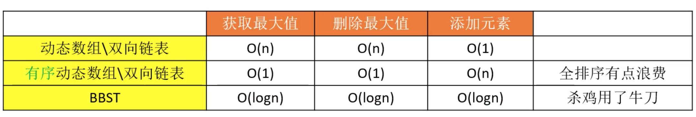
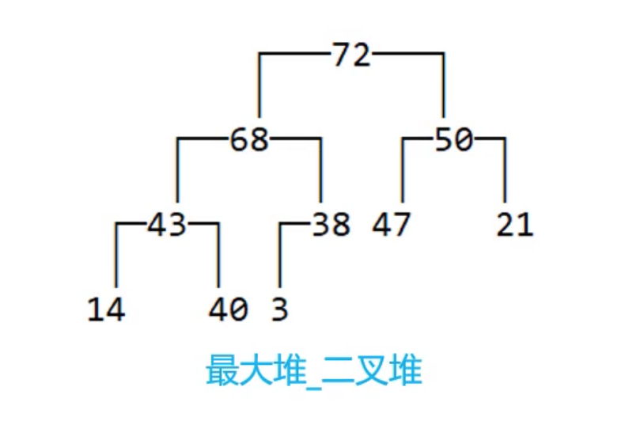
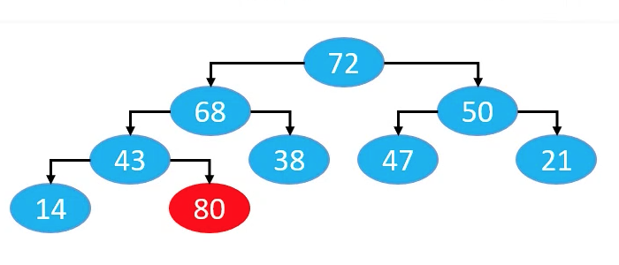

## 一 堆的引入

如果一个数据结构只需要提供：添加元素、获取最大值、删除最大值这样的操作，如果我们使用数组、链表、红黑树实现，则：

| 数据结构              | 添加元素 | 获取最大值 | 删除最大值 | 说明                               |
| --------------------- | -------- | ---------- | ---------- | ---------------------------------- |
| 无序双向链表/动态数组 | O(1)     | O(n)       | O(n)       | 效率不高                           |
| 有序双向链表/动态数组 | O(n)     | O(1)       | O(1)       | 只要最大值，却全部排序，造成了浪费 |
| 红黑树                | O(logn)  | O(logn)    | O(logn)    | 过于复杂                           |

我们发现上面的数据结构或多或少都有瑕疵，数据结构 `堆` 就是专门为了解决上述问题而设计的，又不失简单性。

堆还能解决一个重要的大数据问题：Top K 问题，即从海量数据中找出前 K 个数据!

## 二 堆概念

堆是一种树状的数据结构，常见的堆实现有：

-   二叉堆：Binary Heap，也称为完全二叉堆
-   多叉堆：D-heap、D-ary Heap
-   索引堆：Index Heap
-   二项堆：Binomial Heap
-   斐波那契堆：Fibonacci Heap

堆最重要的性质是：

-   如果任意结点的值总是 >= 子结点的值，称为 最大堆、大根堆、大顶堆
-   如果任意结点的值总是 <= 子结点的值，称为 最小堆、小根堆、小顶堆

堆的时间复杂度可实现：

-   获取最大值：O(1)
-   删除最大值：O(logn)
-   添加元素：O(logn)

## 三 二叉堆

二叉堆的本质是一种完全二叉树，鉴于完全二叉树的一些特性，二叉堆的底层物理结构一般使用数组来实现即可，如图所示：

二叉堆的数组有如下规律：

-   数组索引等于 0，即为根结点，堆顶
-   数组索引大于 0，则其父结点的编号为 floor((i-1)/2)

假设二叉堆的数组有 n 个元素，当前结点索引为 i：

-   如果：2i + 1 <= n - 1， 则其左子结点编号为 2i+1
-   如果：2i + 1 > n - 1， 则其无左子结点
-   如果：2i + 2 <= n - 1， 则其右子结点编号为 2i+2
-   如果：2i + 2 < n - 1， 则其无右子结点

## 四 二叉堆的一些实现

### 4.1 添加

添加元素时，将元素直接放置在数组的最后一位，但是会造成如下现象：

所以还要额外进行元素数据的比较：

-   如果插入的数据大于父结点数据，则与父结点交换数据
-   依次循环，直到插入的数据小于父结点，或者遇到空父结点，退出循环

上述过程称为 上滤（Sift Up），时间复杂度为 O(logn)。

### 4.2 删除

-   1 利用最后一个结点覆盖根结点
-   2 删除最后一个结点
-   3 循环下列步骤：
    -   如果删除结点值小于子结点，则与最大的子结点交换位置
    -   如果删除结点值大于等于子结点，或者没有子结点，则退出循环

上述过程称为 下滤（Sift Down），时间复杂度为 O(logn)。
