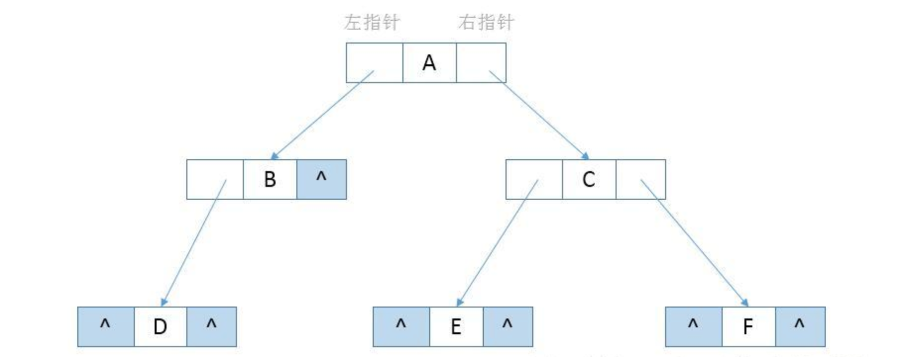
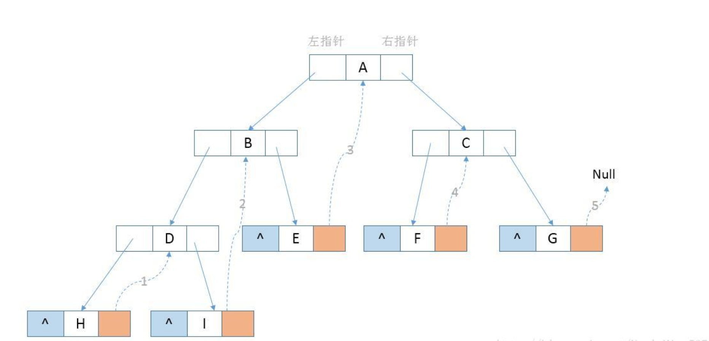
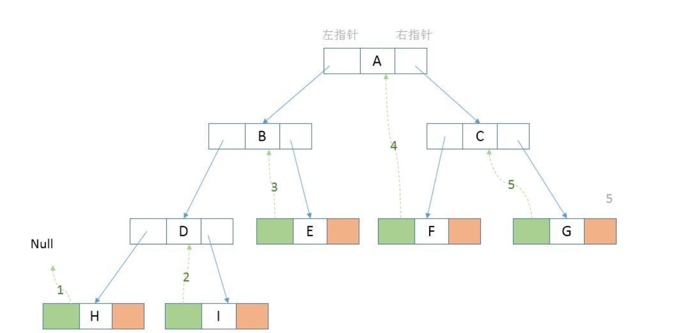
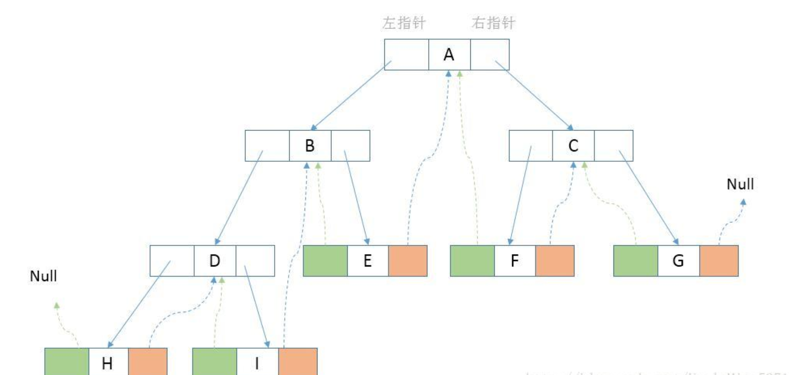
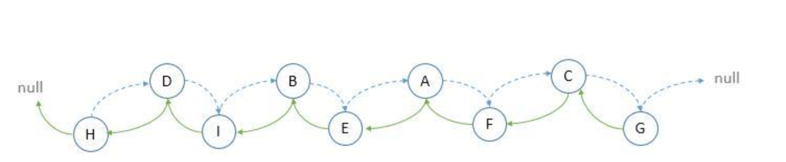
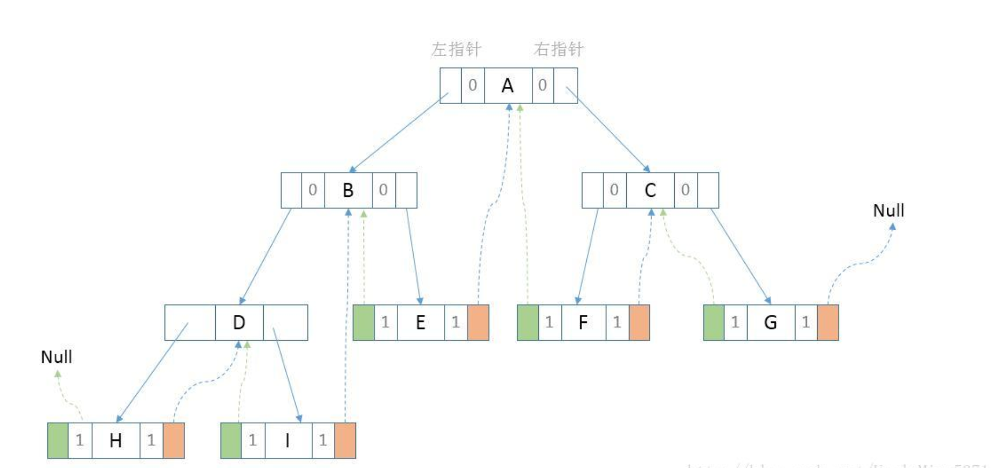

## 一 线索二叉树概述

二叉树中如果有一些结点不存在，依然会占据额外的空间，如图所示：



通过观察上面的二叉链表，深色区域存在着若干个没有指向的空指针域。

对于一个有 n 个结点的二叉链表，每个结点有指向左右结点的 2 个指针域，整个二叉链表存在 2n 个指针域。而 n 个结点的二叉链表有 n-1 条分支线，那么空指针域的个数=2n-(n-1) = n+1 个空指针域，从存储空间的角度来看，这 n+1 个空指针域浪费了内存资源。

从另外一个角度来说，上图做中序遍历后能够得到：DBAECF，D 的后继是 B，C 的前驱是 E，如果想要知道结点的前驱、后继时，必须对二叉树进行中序遍历。每次要查找前驱后继都需要进行一次遍历，是否可以考虑提前存储这种前驱和后继的关系来提高时间效率呢？

利用二叉链表中的空指针域来存放结点在某种遍历方式下的前驱和后继结点的指针，就能解决上述两个角度的问题。

我们把这种指向前驱和后继的指针成为线索，加上线索的二叉链表成为线索链表，对应的二叉树就成为“线索二叉树(Threaded Binary Tree)”。

## 二 生成线索步骤

### 2.1 中序遍历 设置后继

在中序遍历过程中，将所有的结点右子结点为空的指针域指向它的后继结点：



通过中序遍历得到 H 的 right 指针为空，并且 H 的后继结点为 D（如上图第 1 步），I 的 right 指针为空，并且 I 的后继结点为 B（如上图第 2 步），以此类推，知道 G 的后继结点为 null，则 G 的 right 指针指向 null。

### 2.2 设置前驱

接下来将这颗二叉树的所有结点左指针域为空的指针域指向它的前驱结点：



如上图，H 的 left 指针域指向 Null（如第 1 步），I 的前驱结点是 D，则 I 的 left 指针指向 D，以此类推。

### 2.3 完成后的图示

通过上面两步完成了整个二叉树的线索化，最后结果如下图：



通过观察上图（蓝色虚线代表后继、绿色虚线代表前驱），可以看出，线索二叉树，等于是把一棵二叉树转变成了一个“特殊的双向链表“(后面会解释为什么叫特殊的双向链表），这样对于我们的新增、删除、查找结点带来了方便。所以我们对二叉树以某种次序遍历使其变为线索二叉树的过程称做是线索化。如下图：



仔细分析上面的双向链表，与线索化之后的二叉树相比，比如结点 D 与后继结点 I，在完成线索化之后，并没有直接线索指针，而是存在父子结点的指针；结点 A 与结点 F，在线索化完成之后，结点 A 并没有直接指向后继结点 F 的线索指针，而是通过父子结点遍历可以找到最终的结点 F，前驱结点也存在同样的问题，正因为很多结点之间不存在直接的线索，所以我将此双向链表称做“特殊的双向链表”，再使用过程中根据指针是线索指针还是子结点指针来分别处理，所以在每个结点需要标明当前的左右指针是线索指针还是子结点指针，这就需要修改结点的数据结构。

### 2.3 结点的表示方式

此时一个结点将会这样表示：

```go
type node struct {
    data    interface{}
    lchild  *node
    rchild  *node
    ltag    int
    rtag    int
}
```

-   ltag 为 0 时指向该结点的左孩子，1 时指向该结点的前驱线索
-   rtag 为 0 时指向该结点的右孩子，1 时指向该结点的后继线索

最终的线索二叉树如图：

