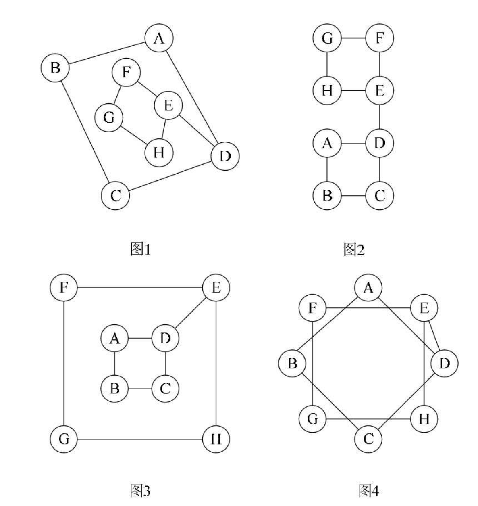

## 一 图的抽象数据类型

```
ADT 图(Graph)
Data
    顶点的有穷非空集合和边的集合。
Operation
    NewGraph(*G, V, VR):    按照顶点集V和边弧集VR的定义构造图G。
    DestroyGraph(*G):       图G存在则销毁。
    LocateVex(G, u):        若图G中存在顶点u， 则返回图中的位置。
    GetVex(G, v):           返回图G中顶点v的值。
    PutVex(G, v, value):    将图G中顶点v赋值value。
    FirstAdjVex(G, *v):     返回顶点v的一个邻接顶点， 若顶点在G中无邻
    NextAdjVex(G, v, *w):   返回顶点v相对于顶点w的下一个邻接顶点，若w是v的最后一个邻接点则返回“空”。
    InsertVex(*G, v):       在图G中增添新顶点v。
    DeleteVex(*G, v):       删除图G中顶点v及其相关的弧。
    InsertArc(*G, v, w):    在图G中增添弧<v,w>， 若G是无向图， 还需要增
    DeleteArc(*G, v, w):    在图G中删除弧<v,w>， 若G是无向图， 则还删除
    DFSTraverse(G):         对图G中进行深度优先遍历， 在遍历过程对每个
    HFSTraverse(G):         对图G中进行广度优先遍历， 在遍历过程对每个
endADT
```

## 二 图存储结构概述

图的“顶点的位置”或“邻接点的位置”只是一个相对的概念，从图的逻辑结构定义来看， 图上任何一个顶点都可被看成是第一个顶点， 任一顶点的邻接点之间也不存在次序关系。   

下图中的四张图其实都是同一个图：  

  

由上可知，传统的存储结构在实现图时都有弊端：
- 顺序存储：基本上很难实现图的结构
- 多重链表：一个数据域和多个指针域组成的结点表示图中的一个顶点， 此时图的各个顶点度数相差很大，按度数最大的顶点设计结点结构会造成很多存储单元的浪费， 而若按每个顶点自己的度数设计不同的顶点结构， 又带来操作的不便。 

常用的图的存储方式有5种：
- 邻接矩阵
- 邻接表
- 十字链表
- 邻接多重表
- 边集数组