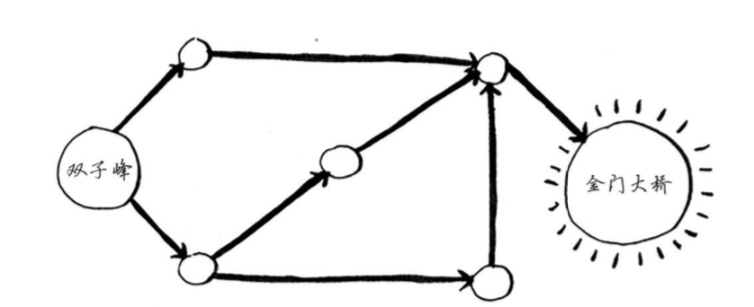
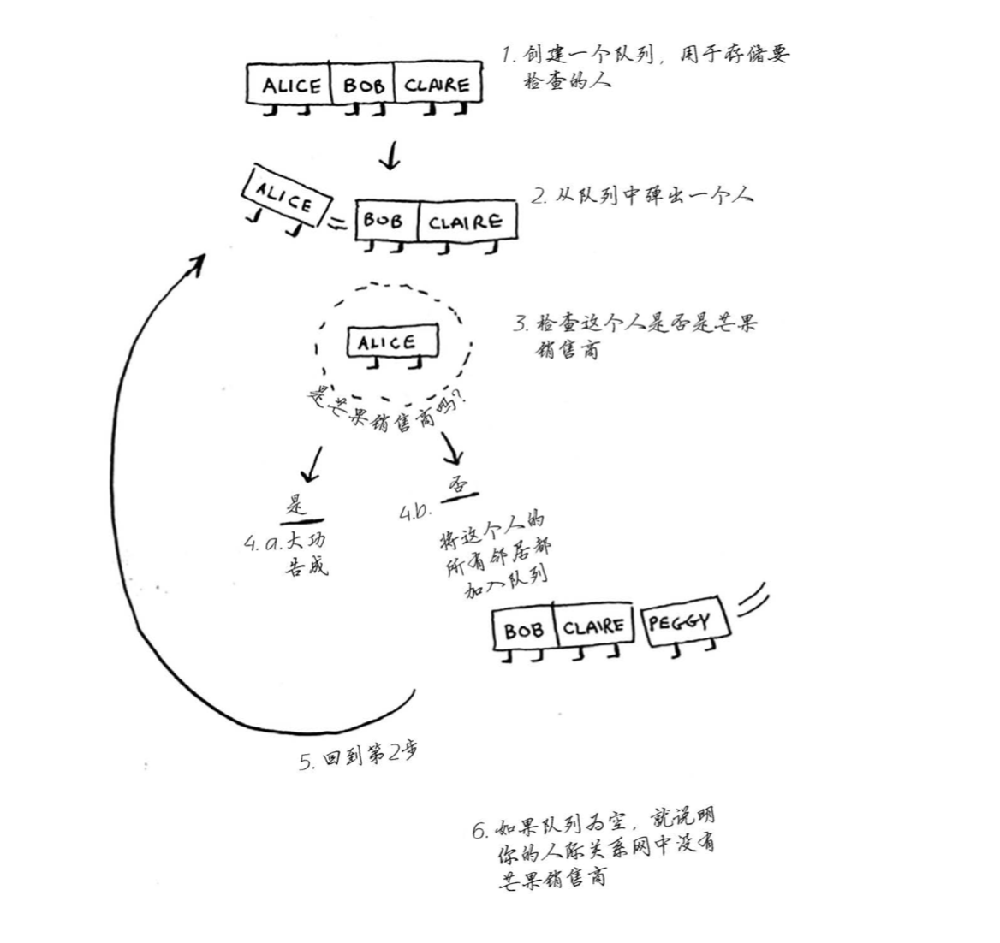
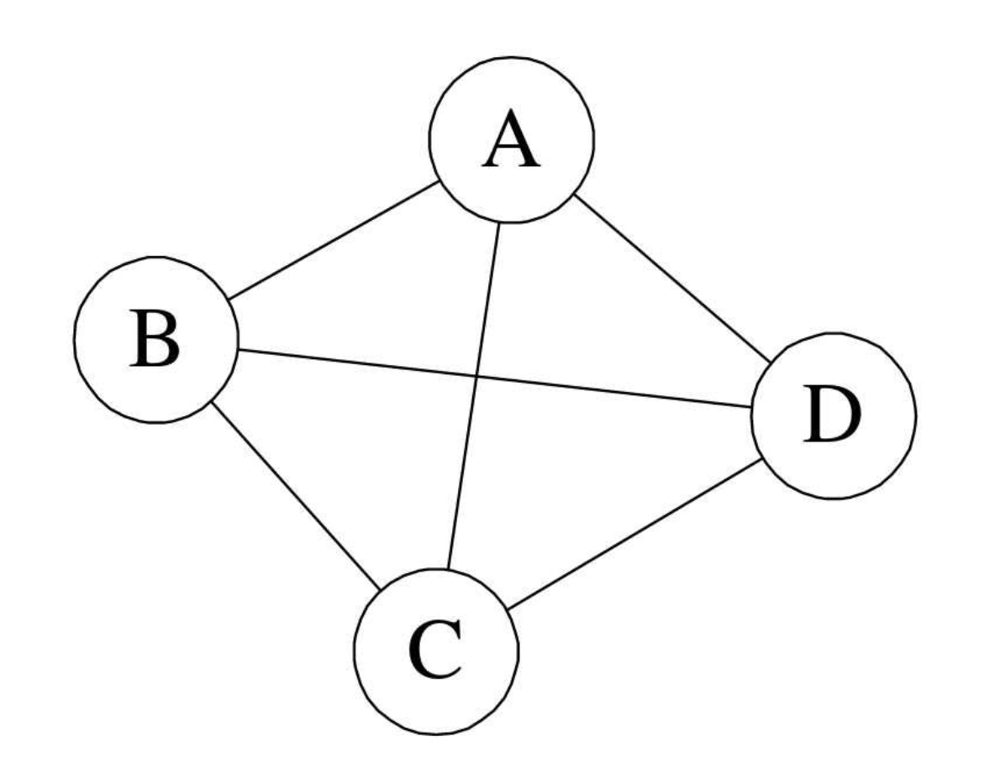
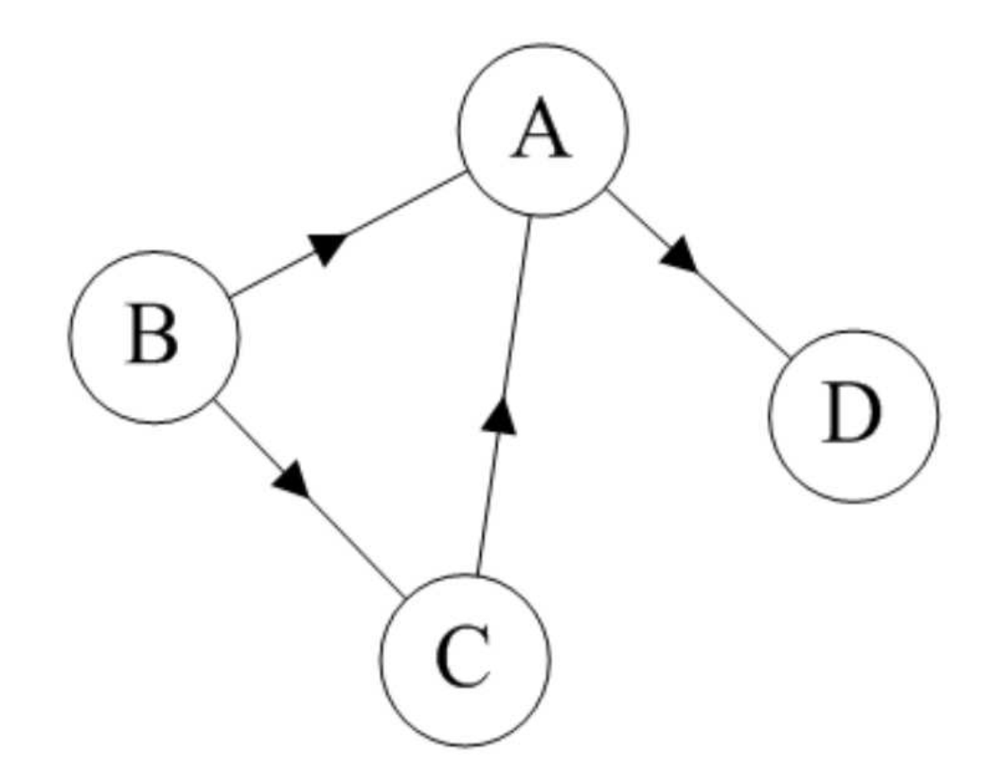
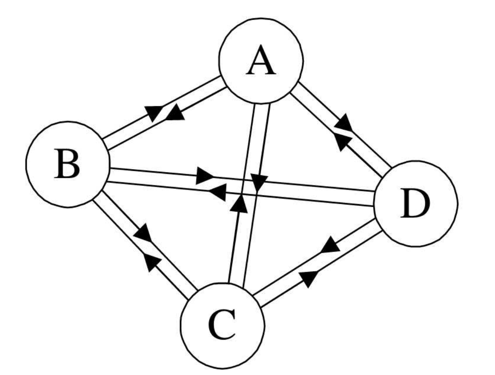
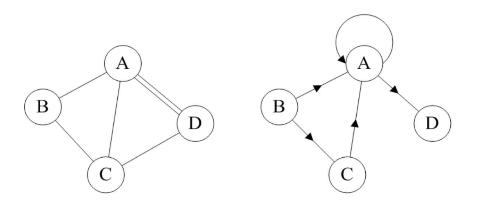
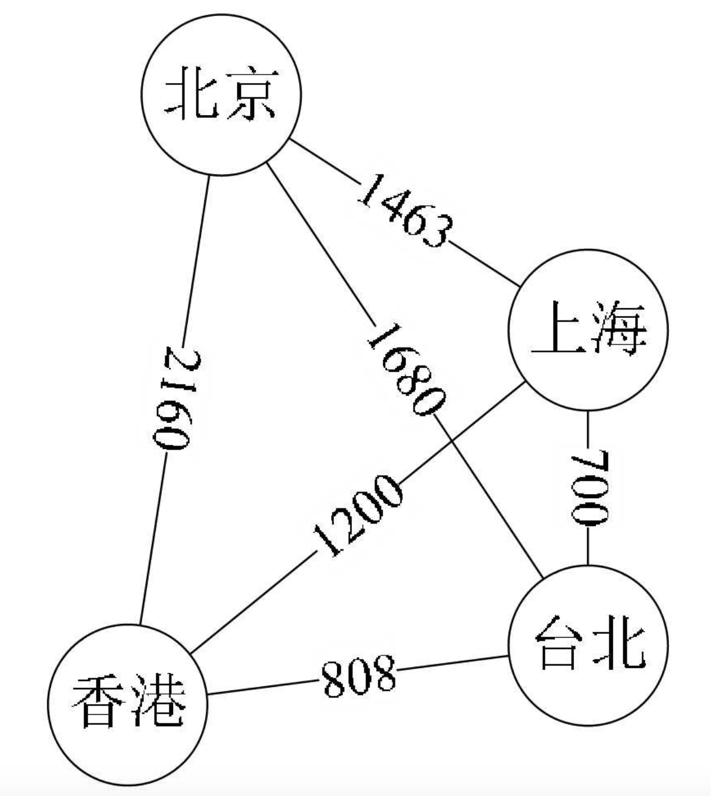

## 一 图定义

> 图（Graph）：由顶点（vertex）和边（edge）组成，通常表示为：G(V, E)
> V：顶点集，是有穷、非空的
> E：边集，表示顶点与顶点之间的关系，可以为空

如图所示：

注意：图必须有顶点！而且在线性表中一般称为元素，树中称为结点。

## 二 无向图

### 2.1 无向图定义

> 无向图：图中任意两个顶点之间都是无向边，则称图为无向图（Undirected graphs）

无向边：顶点$v_i$与顶点$v_j$之间没有方向，则称为无向边(Edge)。此时用无序偶对$(v_i,v_j)$表示。

如图所示：

由于是无方向的， 连接顶点 A 与 D 的边， 可以表示成无序对`(A,D)`， 也可以写成`(D,A)`。

把图命名为 `G1` ，则 `G1=(V1,{E1})`， 其中顶点集合`V1= {A,B,C,D}`； 边集合`E1={(A,B),(B,C),(C,D),(D,A),(A,C)}`。

### 2.2 完全无向图

> 完全无向图：如果无向图的任意两个顶点之间都存在边， 则称该图为无向完全图。

完全无向图如果有 n 个顶点，则会有 `n(n-1)/2`个边。

如图所示：

## 三 有向图

### 3.1 有向图定义

> 有向图：如果图中任意两个顶点之间的边都是有向边，则称图为有向图（Directed graphs）

有向边：顶点$v_i$与顶点$v_j$之间有方向，则称为有向边，也称为弧（Arc），此时用有序偶对$<v_i,v_j>$表示。

如图所示：

连接顶点 A 到 D 的有向边就是弧， A 是弧尾， D 是弧头， `<A,D>`表示弧，顺序不可更改！

把图命名为 `G2`，则` G2=(V2,{E2})`， 其中顶点集合`V2={A,B,C,D}`； 弧集合`E2={<A,D>,<B,A>,<C,A>,<B,C>}`。

有向图顶点的出度和入度：

-   出度：Out-degree，指有多少条边以该顶点为起点
-   入度：In-degree，指有多少条边以该顶点为终点

### 3.2 有向完全图

> 有向完全图：如果有向图的任意两个顶点之间都存在方向互为相反的两条弧，则为有向完全图。

有向完全图含有 n 个顶点时，有 n(n-1) 条边。

### 3.3 有向无环图

在有向图中，从任一顶点出发都无法回到该顶点，则该图示个有向无环图。

## 四 稀疏图与稠密图

很多场景中，无向图的实际边数、有向图的实际弧数，并没有达到完全图的数量。即具有 n 个顶点和 e 条边数的图， 无向图 `0≤e≤n(n-1)/2`， 有向图`0≤e≤n(n-1)`。

有很少条边或弧的图称为稀疏图， 反之称为稠密图。 这里稀疏和稠密是
模糊的概念， 都是相对而言的。

## 五 简单图

> 简单图：图中不存在顶点到自身的边，且同一条边不重复出现，则称为简单图。

1.2 与 1.3 中示例的图都是简单图，而下方所示的图则不是简单图，非简单图不是数据结构重点讨论的结构：

上图中每个顶点都与除自身以外的顶点有连线，顶点 A 与 BCD 三个顶点连线，共有四个顶点， 自然是 4×3， 但由于顶点 A 与顶点 B 连线后，计算 B 与 A 连线就是重复， 因此要整体除以 2， 共有 6 条边。

## 六 权

有些图的边或弧具有与它相关的数字， 这种与图的边或弧相关的数叫做权（Weight）。

这些权可以表示从一个顶点到另一个顶点的距离或耗费。 这种带权的图通常称为网（Network）。

如下图所示，权即网中的各个顶点之间的距离：

