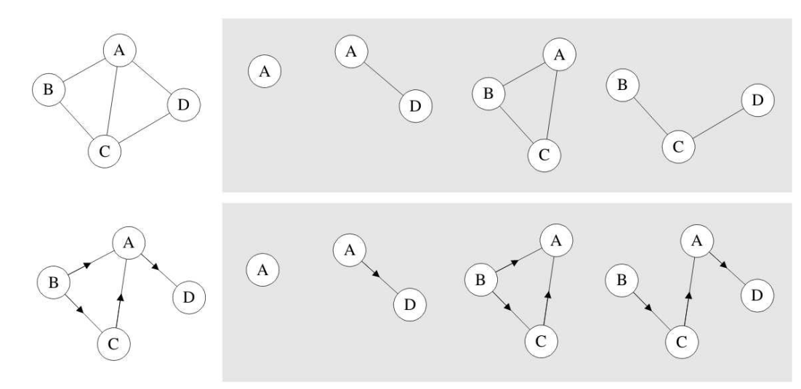
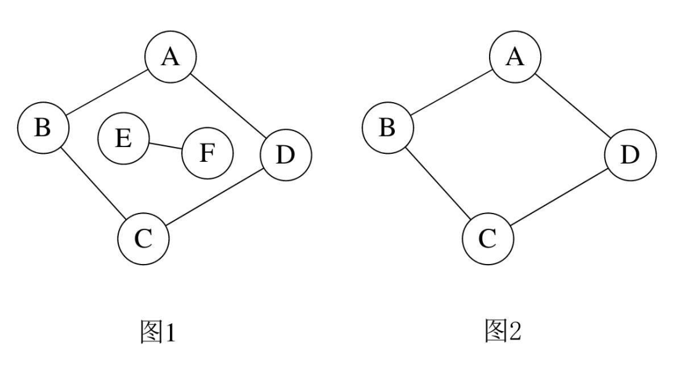
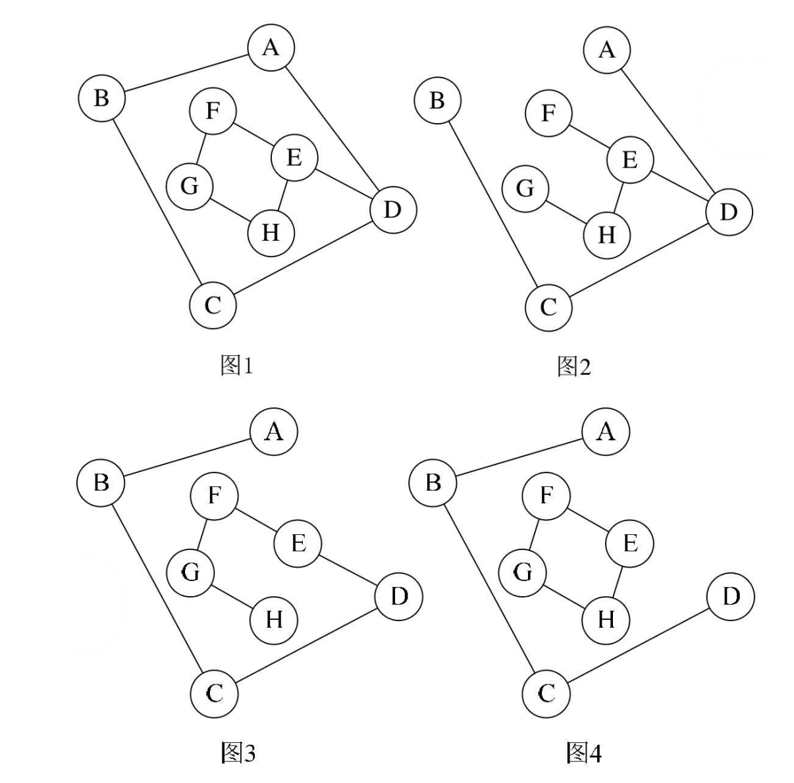
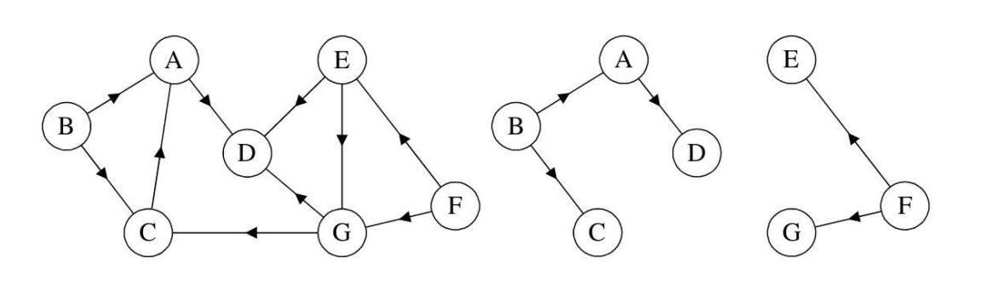

## 一 子图

假设有两个图 $G=(V,{E})$ 和 $G'=(V',{E'})$ ， 如果
$V'\subset V$ 且$E'\subset E$， 则称G'为G的子图（Sub-graph）。  

如图所示：右侧的各种不同的图都是左侧的子图。  
 


## 二  图顶点与边之间的关系

对于无向图G=(V,{E})， 如果边(v,v')∈ E， 则称顶点v和v'互为邻接点（Adjacent），即v和v'相邻接。 顶点v的度（Degree）是和v相关联的边的数目， 记为TD(v)。无向图的边数其实各顶点度数和的一半。  

对于有向图G=(V,{E})， 如果弧 <v,v'>∈ E， 则称顶点v邻接到顶点v'， 顶点v'邻接自顶点v。以顶点v为头的弧的数目称为v的入度（InDegree），记为ID(v)； 以v为尾的弧的数目称为v的出度（OutDegree），记为OD(v)； 顶点v的度为TD(v)=ID(v)+OD(v)。  

树中根结点到任意结点的路径是唯一的， 但是图中顶点与顶点之间的路径却是不唯一的。路径的长度是路径上的边或弧的数目。  

第一个顶点和最后一个顶点相同的路径称为回路或环（Cycle）。序列中顶点不重复出现的路径称为简单路径。 除了第一个顶点和最后一个顶点之外， 其余顶点不重复出现的回路， 称为简单回路或简单环。   


## 三 连通图

> 连通图：在无向图G中， 如果从顶点v到顶点v'有路径， 则称v和v'是连通的。 如果对于图中任意两个顶点$v_i、 v_j∈ V$， $v_i$和$v_j$都是连通的， 则称G是连通图（Connected Graph） 。 

下列图示中，图1 EF之间无法连通，则图1不是连通图，图2是连通图。  

  

无向图中的极大连通子图称为连通分量。 注意连通分量的概念， 它强调：
- 要是子图；
- 子图要是连通的；
- 连通子图含有极大顶点数；
- 具有极大顶点数的连通子图包含依附于这些顶点的所有边

在有向图G中，如果对于每一对$v_i、 v_j∈ V, v_i≠v_j$， 从$v_i$到$v_j$和从$v_j$到$v_i$都存在路径， 则称G是强连通图。   

有向图中的极大强连通子图称做有向图的强连通分量。   

> 连通图的生成树：是一个极小的连通子图， 它含有图中全部的n个顶点， 但只有足以构成一棵树的n-1条边。  

下图图1是一普通图， 但显然它不是生成树， 当去掉两条构成环的边后， 比如图2或图3， 就满足n个顶点n-1条边且连通的定义了。 它们都是一棵生成树。从这里也可知道， 如果一个图有n个顶点和小于n-1条边， 则是非连通图， 如果它多于n-1边条， 必定构成一个环， 因为这条边使得它依附的那两个顶点之间有了第二条路径。 比如图2和图3， 随便加哪两顶点的边都将构成环。 不过有n-1条边并不一定是生成树， 比如图4。  

  


如果一个有向图恰有一个顶点的入度为0， 其余顶点的入度均为1， 则是一个有向树。 对有向树的理解比较容易， 所谓入度为0其实就相当于树中的根结点， 其余顶点入度为1就是说树的非根结点的双亲只有一个。一个有向图的生成森林由若干棵有向树组成， 含有图中全部顶点， 但只有足以构成若干棵不相交的有向树的弧。 如图7-2-15的图1是一棵有向图。 去掉一些弧后， 它可以分解为两棵有向树， 如图2和图3， 这两棵就是图1有向图的生成森林。   

  

总结：
```
图中顶点间存在路径， 两顶点存在路径则说明是连通的  
如果路径最终回到起始点则称为环，当中不重复叫简单路径。  
若任意两顶点都是连通的，则图就是连通图，有向则称强连通图。 
图中有子图， 若子图极大连通则就是连通分量， 有向的则称强连通分量。
无向图中连通且n个顶点n-1条边叫生成树。 
有向图中一顶点入度为0其余顶点入度为1的叫有向树。 
一个有向图由若干棵有向树构成生成森林。
```