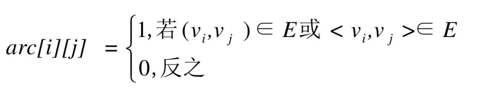
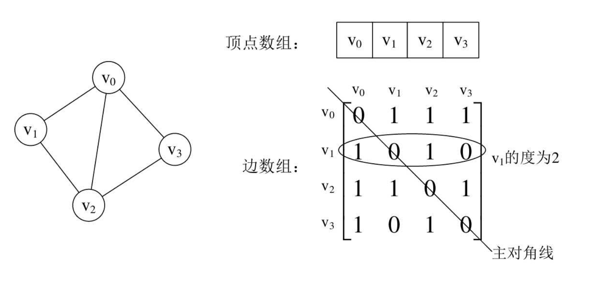
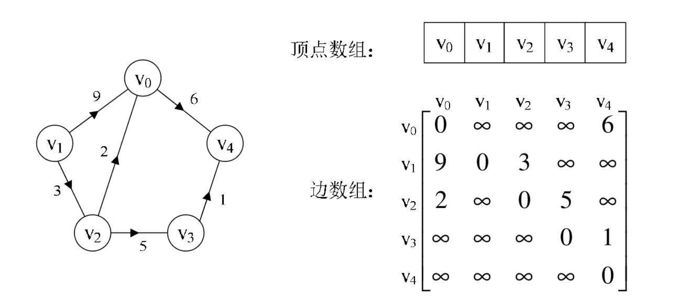

## 一 邻接矩阵

### 1.0 邻接矩阵定义

图是由顶点与边/弧两部分组成。顶点不分主次、大小，边/弧需要维护顶点之间的关系。所以可以将其分开存储。

> 图的邻接矩阵（Adjacency Matrix）存储方式：使用两个数组表示图，一个一维数组存储图中顶点信息， 一个二维数组（称为邻接矩阵） 存储图中的边或弧的信息。

设图G有n个顶点， 则邻接矩阵是一个 n*n 的方阵， 定义为：  

  

### 1.1 无向图邻接矩阵表示法

如下列的无向图，使用邻接矩阵方式表示后的效果：  

    

> 对称矩阵：n阶矩阵的元满足 $a_i$$_j$=$a_j$$_i$,（0$\leq$i，j$\leq$n）。即满足从矩阵的左上角到右下角的主对角线为轴，右上角的元与左下角相对应的元全是相等的

从上图的无向图可以看出，无向图的边数组是一个对称的矩阵。  

无向图的邻接矩阵存储可以容易得到：
- 判断任意两顶点之间是否有无边（值是否为1）
- 获取顶点的度，即其所在行的数值之和。图中v1的度=1+0+1+0=2
- 获取顶点的所有邻接点，即将其所在行元素循环一遍，值为1即是其邻接点

### 1.2 有向图邻接矩阵表示法

如下列的有向图，使用邻接矩阵方式表示后的效果：  

  

有向图讲究入度与出度， 顶点v1的入度为1， 正好是第v1列各数之和。顶点v1的出度为2， 即第v1行的各数之和。   

与无向图同样的办法， 判断顶点vi到vj是否存在弧， 只需要查找矩阵中arc[i][j]是否为1即可。 要求vi的所有邻接点就是将矩阵第i行元素扫描一遍， 查找arc[i][j]为1的顶点。   

### 1.3 网的邻接矩阵表示

网（边有权的图）具有权的概念，这里w$_i$$_j$表示（v$_i$,v$_j$） 或<v$_i$,v$_j$>上的权值。 ∞表示一个计算机允许的、 大于所有边上权值的值， 也就是一个不可能的极限值。  

如下所示：  

    

## 二 图的邻接矩阵实现

由下方的代码得知：邻接矩阵表示法的时间复杂度是O(n$^2$)

```go
package adjgraph

import "fmt"

type VertexType string 			// 顶点类型
type EdgeType 	int   			// 权值类型
const INFINITY EdgeType = 65535		// 最大权

type Graph struct {
	vexs		[]VertexType	// 顶点表
	arc   		[][]EdgeType	// 邻接矩阵
	numVertexes	int				// 图的顶点数
	numEdges	int				// 边数
}

// 创建无向网图
func NewMGraph(numVertexes int, numEdges int) *Graph{

	// 记录顶点数和边数
	g := &Graph{
		vexs:        make([]VertexType, numVertexes),
		arc:         make([][]EdgeType, numVertexes),
		numVertexes: numVertexes,
		numEdges:    numEdges,
	}
	for k,_ := range g.arc {
		tempS := make([]EdgeType, numVertexes)
		g.arc[k] = tempS
	}

	// 记录顶点表
	fmt.Printf("请输入 %v 个顶点数据\n", numVertexes)
	for k,_ := range g.vexs {
		fmt.Scanf("%v", &g.vexs[k])
	}
	fmt.Println("g.vexs = ", g.vexs)

	// 记录边表
	for i := 0; i < g.numVertexes; i++ {
		for j := 0; j < g.numVertexes; j++ {

			// 对称位置值为0
			if i == j {
				g.arc[i][j] = 0
			} else {

				// 有权的位置记录权
				var w EdgeType
				fmt.Printf("当前位置为：[%v, %v]，请输入权(输入0或回车表示无权)： \n", i, j)
				fmt.Scanf("%v", &w)
				if w != 0 {
					g.arc[i][j] = w					// 手动记录权
				} else {
					g.arc[i][j] = INFINITY			//  记录默认权，即最大值
				}

			}

		}
	}
	fmt.Println("g.arc = ", g.arc)


	return g
}
```


