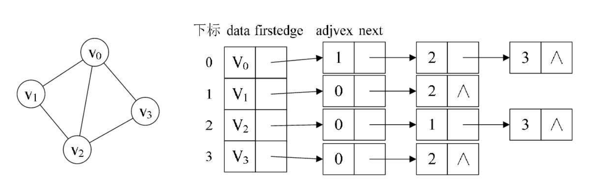
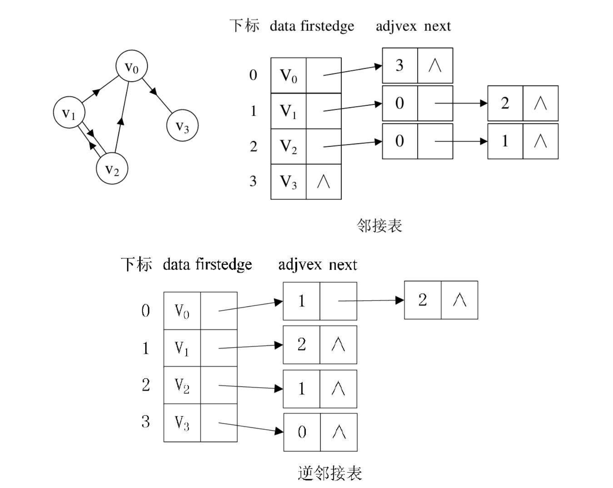

## 一 邻接表

邻接矩阵方式表示图会浪费大量的存储空间，比如一个有向图图有10个顶点，1个边，那么存储的数组中，只有一个节点的值有意义。  

引起该现象的原因是邻接矩阵的底层是数组，数组需要预先申请空间。如果改用链式存储就不会有这个浪费了。 

> 图的邻接表表示法（Ad-jacency List）：使用数组与链表结合的方式存储图，数组用于存储顶点，链表用于存储边/弧。

具体实现方式：
- 图中的顶点使用一维数组存储。链表方式也可以，但是数组可以方便的读取顶点信息
- 图中的每个顶点所有的邻接点构成一个线性表，由于邻接点的个数不定，所以用单链表存储。无向图称为顶点vi的边表，有向图则称为顶点vi作为弧尾的出边表。  

无向图实现如图所示：  

    

从图中我们知道， 顶点表的各个结点由data和firstedge两个域表示，data是数据域， 存储顶点的信息， firstedge是指针域， 指向边表的第一个结点， 即此顶点的第一个邻接点。 边表结点由adjvex和next两个域组成。 adjvex是邻接点域， 存储某顶点的邻接点在顶点表中的下标， next则存储指向边表中下一个结点的指针。 比如v1顶点与v0、 v2互为邻接点， 则在v1的边表中， adjvex分别为v0的0和v2的2。  

有向图与无向图的做法类似，有向图由于有方向， 我们是以顶点为弧尾来存储边表的， 这样很容易就可以得到每个顶点的出度。但也有时为了便于确定顶点的入度或以顶点为弧头的弧， 我们可以建立一个有向图的逆邻接表， 即对每个顶点vi都建立一个链接为vi为弧头的表。   

有向图如图所示：  
    

对于带权值的网图， 可以在边表结点定义中再增加一个weight的数据域， 存储权值信息即可。 

## 二 邻接表实现

```go
package listgraph

import "fmt"

// 顶点
type vertex struct {
	data 		interface{}			// 顶点存储的数据
	head 		*node				// 顶点的边表头指针
}

// 边节点类型
type node struct {
	adjvex		int				// 邻接点域，即在顶点数组中的索引
	weight		int				// 权
	next 		*node			// 链表域
}

// 图
type Graph struct {
	vexs		[]vertex		// 顶点数组
	numVertexes	int 			// 当前定点数
	numEdges	int				// 当前边数
}

// 创建无向网图
func NewLGraph(numVertexes int, numEdges int) *Graph{

	// 记录顶点数和边数
	g := &Graph{
		vexs:        make([]vertex, numVertexes),
		numVertexes: numVertexes,
		numEdges:    numEdges,
	}

	// 记录顶点表
	fmt.Printf("请输入 %v 个顶点数据\n", numVertexes)
	for k,_ := range g.vexs {
		var e int
		fmt.Scanf("%v", &e)
		g.vexs[k].data = e
		g.vexs[k].head = nil
	}
	fmt.Println("g.vexs = ", g.vexs)

	// 记录边表：每条边对应2个顶点，用户手动输入这2个顶点序号
	for k := 0; k < numEdges; k++ {

		var w int
		fmt.Println("输入当前边的权")
		fmt.Scanf("%d", &w)

		fmt.Printf("输入第 %d 条边的两个顶点序号：\n", k + 1)
		var i,j int
		fmt.Scanf("%d %d", &i, &j)

		// 生成第一个链表节点
		nodeI := &node{
			adjvex:		j,
			weight: 	w,
			next:   	g.vexs[i].head,
		}
		// 将当前顶点的指针指向 node
		g.vexs[i].head = nodeI

		// 生成第二个链表节点
		nodeJ := &node{
			adjvex:		i,
			weight: 	w,
			next:   	g.vexs[j].head,
		}
		// 将当前顶点的指针指向 node
		g.vexs[j].head = nodeJ
	}

	return g
}

// 显示图
func (g *Graph)Display(){

	for i := 0; i < g.numVertexes; i++ {
		currentNode := g.vexs[i].head
		fmt.Printf("%v：", g.vexs[i].data)
		for currentNode.next != nil {
			fmt.Printf("%v ", g.vexs[currentNode.adjvex].data)
			currentNode = currentNode.next
		}
		fmt.Println(g.vexs[currentNode.adjvex].data)
	}

}
```
