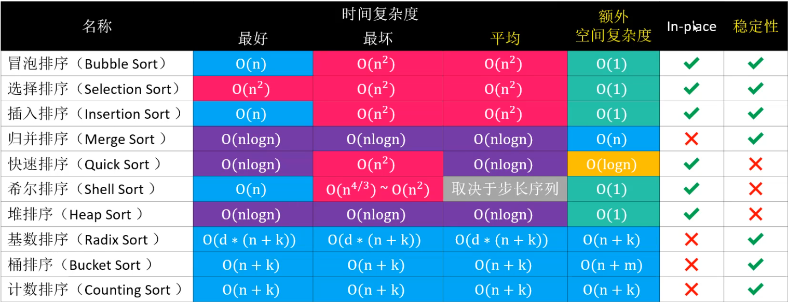

## 一 排序概述

### 1.1 排序概念

假设含有n个记录的序列为{r1,r2,......,rn}， 其相应的关键字分别为{k1,k2,......,kn}， 需确定1,2,......,n的一种排列p1,p2,......,pn， 使其相应的关键字满足k<sub>p1</sub>≤k<sub>p2</sub>≤......≤k<sub>pn</sub>（非递减或非递增） 关系， 即使得序列成为一个按关键字有序的序列{rp1,rp2,......,rpn}， 这样的操作就称为排序。 

在排序问题中，通常将数据元素称为记录。 显然我们输入的是一个记录集合， 输出的也是一个记录集合， 所以说， 可以将排序看成是线性表的一种操作。  

排序的依据是关键字之间的大小关系， 那么， 对同一个记录集合， 针对不同的关键字进行排序， 可以得到不同序列。这里关键字ki可以是记录r的主关键字， 也可以是次关键字， 甚至是若干数据项的组合。 比如给成绩排序，可以按照单科排序，也可以是总成绩排序。  

多个关键字的排序最终都可以转化为单个关键字的排序，因此，排序主要讨论单个关键字的排序。  

### 1.2 排序稳定性

如果相等的2个元素，在排序前后的相对位置保持不变，则是稳定的排序算法。  

如排序前{5, 1, 3$_a$, 4, 7, 3$_b$}，该数据中有两个相同数据3，当排序完成后，3$_a$还在3$_b$之前，那么称为稳定的排序算法。  

### 1.3 内排序与外排序

根据在排序过程中待排序的记录是否全部被放置在内存中， 排序分为：
- 内排序：排序过程中，待排序的所有记录都被放置在内存中
- 外排序：排序记录个数很多时，不能同时放置在内存，整个排序过程需要在内外存之间多次交换数据才能进行

## 二 最简单的排序

```go
package main

import "fmt"

func SimpleSort(arr []int) {

	if arr == nil || len(arr) < 2 {
		fmt.Println("数组不满足要求")
		return
	}

	count := 0
	for i := 0; i <= len(arr) - 1; i++ {
		for j := 0; j <= len(arr) - 1; j++ {
			count++
			if arr[j] > arr[i] {
				temp := arr[j]
				arr[j] = arr[i]
				arr[i] = temp
			}
		}
	}

	fmt.Println("运行次数：", count)
	fmt.Println("运行结果：", arr)
}

func main() {
	arr := []int{7, 6, 1, 2, 3, 8, 5, 4, 0, 9}
	SimpleSort(arr)
}
```

最简单的排序，即从0号位开始，取出一个数，与数组中所有数据进行一次比较，上述代码中，正好10$^2$次，时间复杂度是O(n$^2$)。

## 三 常用排序算法

常用排序算法：
- 交换排序：冒泡排序、快速排序
- 选择排序：简单选择排序、堆排序
- 插入排序：直接插入排序、希尔排序
- 归并排序：归并排序

时间复杂度如图：  
  

从算法的简单性来看， 我们将7种算法分为两类：
- 简单算法： 冒泡、 简单选择、 直接插入
- 改进算法： 希尔、 堆、 归并、 快速

从平均情况来看， 显然最后3种改进算法要胜过希尔排序， 并远远胜过前3种简单算法。  

## 四 原地算法

> 原地算法：不依赖或者依赖很少的额外资源来实现的算法，其中空间复杂度为O(1)的算法都是原地算法
> 非原地算法：Not-in-place或者 Out-of-place