## 一 冒泡排序

### 1.1 冒泡排序概念

冒泡排序（Bubble Sort）是一种交换排序，基本思想是：两两比较相邻记录的关键字，如果反序则交换，直到没有反序记录位置。  

假设要对无序数列{2,3,4,5,6,7,8,1}排序：  



冒泡排序规律：每一轮排序两两比较都会把最大的值移动到最后一位，最大值就像在不断的冒泡一样。  

### 1.2 冒泡算法

```go
package main

import "fmt"

func BubbleSort(arr []int) {

	if arr == nil || len(arr) < 2 {
		fmt.Println("数组不满足要求")
		return
	}

	count := 0
	for i := 1; i <= len(arr) - 1; i++ {
		//  - i 的原因是后面的元素已经被排序过了
		for j := 0; j <= len(arr) - 1 - i; j++ {
			count++
			if arr[j] > arr[j + 1] {
				temp := arr[j]
				arr[j] = arr[j + 1]
				arr[j + 1] = temp
			}
		}
	}

	fmt.Println("运行次数：", count)
	fmt.Println("运行结果：", arr)
}

func main() {
	arr := []int{1, 0, 2, 3, 6, 4, 5, 7, 8, 9}
	BubbleSortOpt(arr)
}
```

### 1.3 冒泡算法优化

上述给出的数组是 `{1, 0, 2, 3, 6, 4, 5, 7, 8, 9}`，循环体会执行45次，显然比上一节提到的最简单排序要优化了很多次。但是该算法还有一点瑕疵：无论给出的数组是什么样的，永远都会执行45次，其实案例中很多地方都无需比较交换，下列代码可以将45次优化到17次：
```go
func BubbleSortOpt(arr []int) {

	if arr == nil || len(arr) < 2 {
		fmt.Println("数组不满足要求")
		return
	}


	flag := true
	count := 0
	for i := 1; i <= len(arr) - 1 && flag; i++ {
		flag = false
		//  - i 的原因是后面的元素已经被排序过了
		for j := 0; j <= len(arr) - 1 - i; j++ {
			count++
			if arr[j] > arr[j + 1] {
				temp := arr[j]
				arr[j] = arr[j + 1]
				arr[j + 1] = temp
				flag = true
			}
		}
	}

	fmt.Println("运行次数：", count)
	fmt.Println("运行结果：", arr)
}
```

继续优化：冒泡排序时，如果最后几个元素都已经是排好的，那么就无需再排了，下列代码可以将17次优化到14次：
```go
func BubbleSortOpt2(arr []int) {

	if arr == nil || len(arr) < 2 {
		fmt.Println("数组不满足要求")
		return
	}

	end := len(arr) - 1
	endIndex := 0
	flag := true
	count := 0
	for i := 1; i <= end && flag; i++ {
		flag = false
		//  - i 的原因是后面的元素已经被排序过了
		for j := 0; j <= end - i; j++ {
			count++
			if arr[j] > arr[j + 1] {
				temp := arr[j]
				arr[j] = arr[j + 1]
				arr[j + 1] = temp
				flag = true
				endIndex = j + 1		// 记录最后一次交换的位置
			}
		}
		end = endIndex
	}

	fmt.Println("运行次数：", count)
	fmt.Println("运行结果：", arr)
}
```

### 1.4 冒泡排序时间复杂度

- 最好情况：数据本身是有序的，那么其时间复杂度应该是O(n)
- 最坏情况：表中所有的元素都是逆序的，此时需要比较sigma(i=2, n, i-1)=1+2+3+...+(n-1)=n(n-1)/2次，并作等数量级的记录移动。 因此总的时间复杂度为O(n$^2$)。

## 二 扩展：鸡尾酒排序

冒泡排序的每一轮都是从左到右比较，进行单向的位置交换。鸡尾酒排序则可以让比较和交换的过程是双向的。  

对1.1图中的序列进行冒泡排序会造成大量浪费，鸡尾酒排序则很容易实现：  

  

也就是说鸡尾酒的排序过程像钟摆一样，奇数轮和偶数轮来回排序，第1轮从左往右，第2轮从右往左，第3轮再从左往右，直到有一轮排序时没有发生交换，则退出循环。  

我们也不难发现：当一个无需数列中，大多元素都有序的时，使用鸡尾酒排序则能达到很好的效果。  