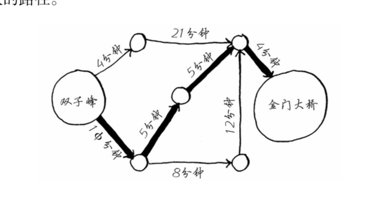
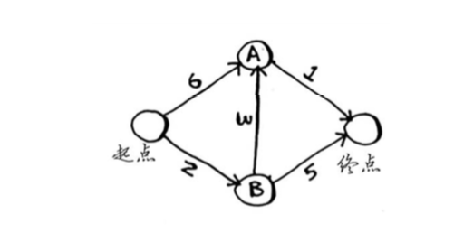

## 一 初识狄克斯特拉算法

使用广度优先搜索，能够找出段数最少的路径，如果每段路径耗费的时间不一样，如图所示：  

  

为了找出最快（最快）的路径，需要使用狄克斯特拉算法（Dijkstra’s algorithm），包含四个步骤：
- 找出最短时间内到达的节点
- 更新开节点邻居的开销
- 重复上述过程，直到图结构中每个节点都这样做了一遍
- 计算最终路径

权重（weight）：图中每条边关联的数字即可称为权重。带权重的图也称为加权图（weighted graph），不带权重的图称为非加权图（unweighted graph）。那么这里也可以得出，计算非加权图中的最短路径，可以使用广度优先搜索算法，计算加权图中的最短路径，需要使用狄克斯特拉算法。  

在无向图中，每条边都是一个环。狄克斯特拉算法只适用于有向无环图(directed acyclic graph，DAG)。  

在具体的实际开中，也会遇到负权边的情况，比如多个物品交换场景中，以物易物需要额外支付一些钱数，但是有时候也需要别人支付给自己一定的钱数，这就是负权边。  

## 二 迪克斯特拉算法实现  

解决下图中的最短路径问题：  
  

在上图示例中，既可以前往节点A，也可以前往节点B，开销分别是6和2，那么如果从B走，B也可以到达A，从B到达A开销是2+3=5，那么此时可以更新从起点到达A的开销为5，依次类推。  

需要三个散列表，如图所示：  
  

- gpath：图的总表，记录图结构中所有的节点，以及节点对应的权边权重
- costs：存储每个节点的开销（起点出发到达该点的时间，不知道的时间设置为无穷大），随着算法进行，不断更新该表
- parents：存储所有结点的父节点，随着算法进行，不断更新该表


```go
package main

import (
	"fmt"
)


func keysToArray(m map[string]map[string]int) []string{

	j := 0
	keys := make([]string, len(m))

	for key := range m {
		keys[j] = key
		j++
	}

	return keys
}

func isInProcessed(s string, processed []string) (b bool) {

	b = false

	for _, v := range processed {
		if v == s {
			b = true
		}
	}

	return
}

func findLowestCostNode( costs map[string]int, processed []string) string{

	lowCostNode := ""			// 开销最小的节点的名称
	lowCost := 1000				// 开销最小的节点的开销

	for k, v := range costs {
		if v < lowCost && !isInProcessed(k, processed){
			lowCostNode = k
			lowCost = v
		}
	}

	return lowCostNode
}

func main() {

	// 声明一个图结构，存储所有的节点
	var graph map[string]map[string]int
	graph = make(map[string]map[string]int)
	graph["start"] = map[string]int{
		"a": 5,
		"b": 2,
	}
	// fmt.Println(graph["start"]["a"])	// 5
	graph["a"] = map[string]int {
		"final": 1,
	}
	graph["b"] = map[string]int {
		"a": 3,
		"final": 5,
	}
	graph["final"] = map[string]int{}
	fmt.Println("所有节点是：", keysToArray(graph))		// 注意：map结构的key是无序的
	fmt.Println("graph：", graph)

	// 创建散列表存储每个节点的开销
	var costs map[string]int
	costs = make(map[string]int)
	costs["a"] = 6
	costs["b"] = 2
	costs["final"] = 1000			// 为了简便，这里这里设置到终点的无穷大值为1000

	// 存储所有结点的父节点
	var parents map[string]string
	parents = make(map[string]string)
	parents["a"] = "start"
	parents["b"] = "start"
	parents["final"] = "none"

	// 记录已处理过的节点的数组
	processed := make([]string, 1000)	// 假设只有1000个节点

	// 业务处理部分
	// 在未处理的节点中找出开销最低的节点
	lowNode := findLowestCostNode(costs, processed)
	fmt.Println("第一次开销最低节点是：", lowNode)

	for {
		if lowNode == "" {
			break
		}

		cost := costs[lowNode]
		neighbors := graph[lowNode]
		for k, v := range  neighbors{
			newCost := cost + v
			if costs[k] > newCost {
				costs[k] = newCost
				parents[k] = lowNode
			}
		}

		processed = append(processed, lowNode)
		lowNode = findLowestCostNode(costs, processed)
		fmt.Println("下一次开销最低节点是：", lowNode)
	}

	fmt.Println("最终各个节点开销为：", costs)

}
```


