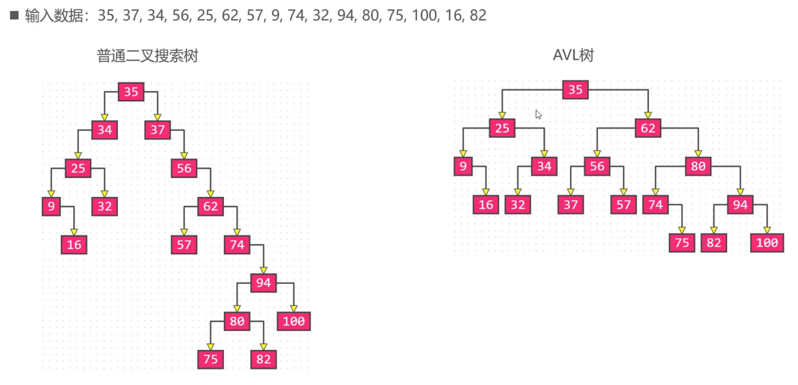
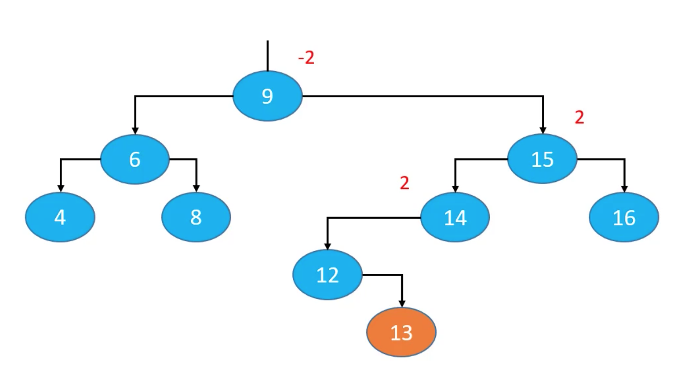
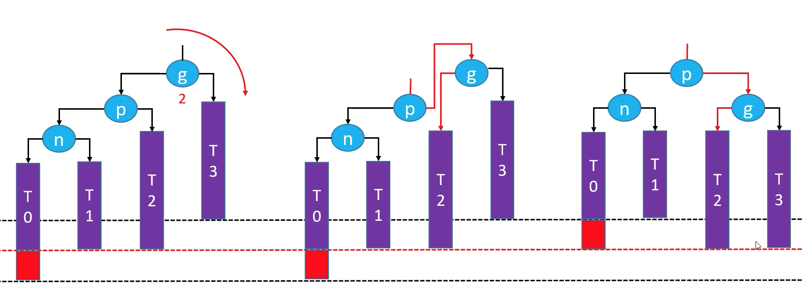

## 一 平衡二叉树简介

AVL 树是最早的自平衡二叉搜索树之一，其每一个结点的左子树和右子树的高度差至多等于 1。

> 平衡因子：Balance Factor，结点的左右子树的高度差

平衡二叉树上所有结点的平衡因子只可能是-1、0、1，只要二叉树上有一个结点的平衡因子的绝对值大于 1， 则此二叉树就是不平衡的（失衡）。在平衡的情况下，其搜索、添加、删除的时间复杂度都是 O(logn)。

下图即是一串数据在添加时，二叉搜索树与 AVL 树生成的区别（图片来自李明杰 PPT）：  

## 二 AVL 树解决失衡的方案

### 2.1 失衡产生的原因

失衡产生的原因：添加元素会导致祖先结点失衡，但是父结点、非祖先结点不会失衡，如下图所示，蓝色部分是平衡的，但是假如添加结点 13 后，就会导致祖先结点的失衡：

解决失衡的办法有：

-   LL_RR-右旋转
-   LR_RL-左旋转

### 2.2 LL-右旋转（单旋）

如图在 T0 子树位置添加元素就会导致结点 g 失衡，此时只需要将 g 的右子树旋转即可实现平衡:

旋转的过程：

-   g.left = p.right
-   p.right = g
-   p 成为该子树的根结点

旋转之后与旋转之前仍然满足二叉搜索树的特点：T0 < n < T1 < p < T2 < g < T3，因为旋转之后其高度没有发生变化，高度不变，该树的其他先祖结点的平衡因子都不会发生改变。

**=======TODO=======**
